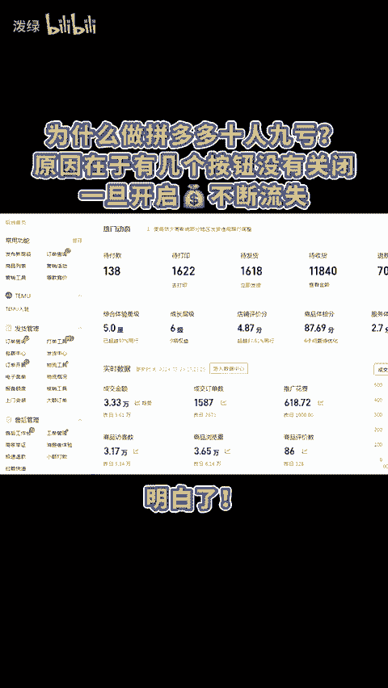
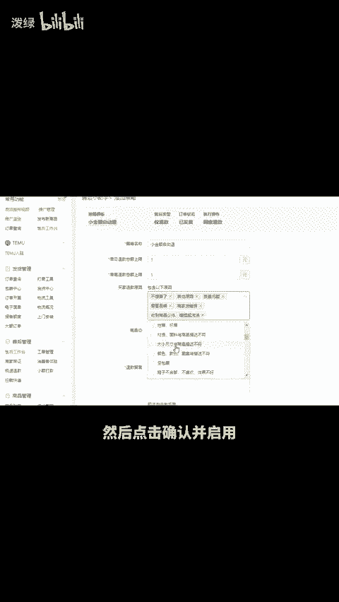

# 为什么做拼多多十人九亏？原因在于有几个按钮没有关闭！ - P1 - 泼绿 - BV1zexgeDEMf

为什么做拼多多使人酒亏？原因在于，有几个按钮没有关闭，一旦开启钱袋不断流失。明白，首先是运费险，如今也叫消费者服务体验，售后问题越多，每单扣费越高，其次是自动跟价，这东西会自动给你报活动。

而且报出的价格可能低于市场价格直接就出售了。如果你哪天发现链接，突然报单亏损，一定要去关闭这个功能。在营销活动这里找到后点击关闭自动跟价即可。最后是仅退款问题，虽然无法彻底解决。但有方法降低其概率。

在售后工作台有一个售后小助手，点击立即使用。在此处选择小金额自动退，将金额都改成1元，把原因全部选上，然后点击确认并启用，这样仅退款的概率就会变小，还有不会的点左下角。😊。

