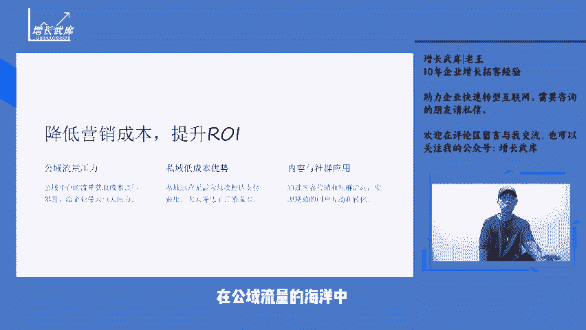
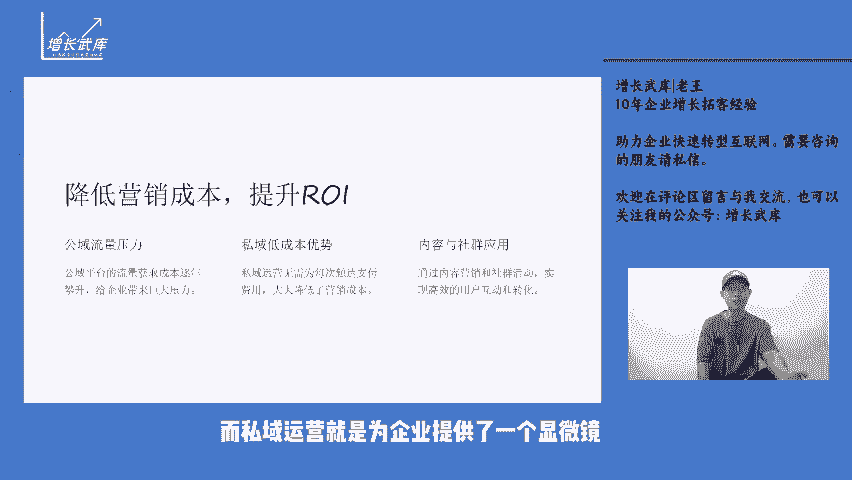
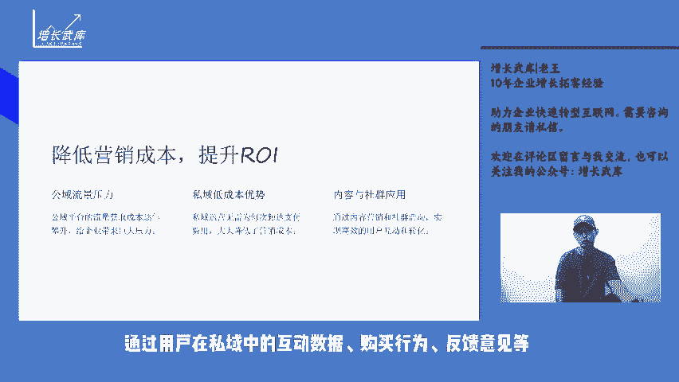
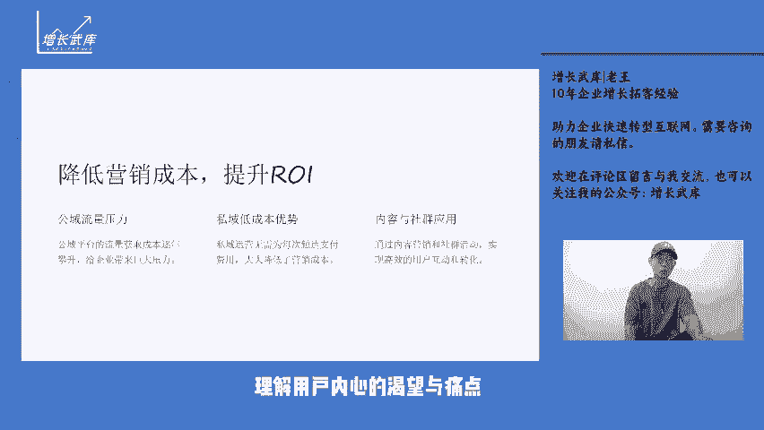
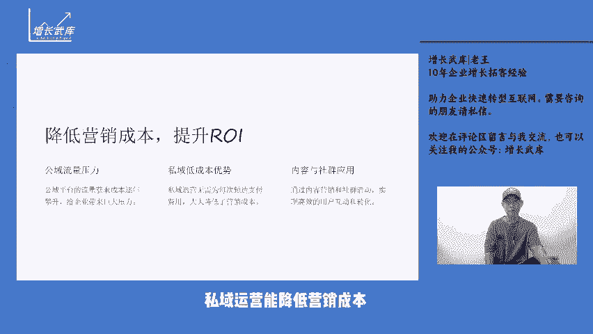
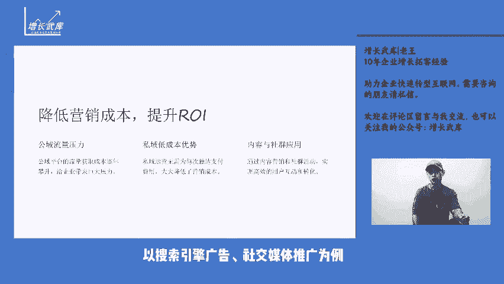
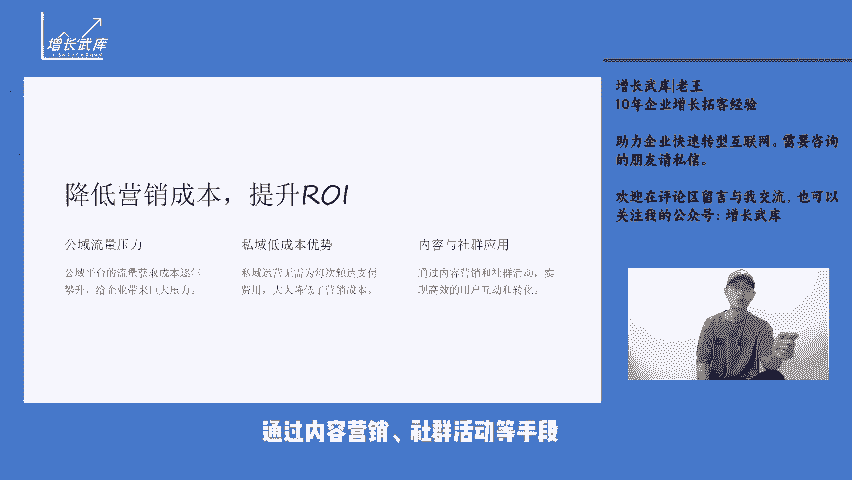

# 为什么私域运营变得越来越重要？ - P1 - 增长武库-老王 - BV1jaYQeUEMJ

大家好，我是你们的废物朋友老王。今天讲私域营销系列的第二讲。为什么私域运营变得越来越重要？私域运营之所以关键原因在于能够洞察用户需求。在公域流量的海洋中，企业难以精准触达目标用户更难以了解其个性化需求。

而私域运营就是为企业提供了一个显微镜，让企业近距离全方位的观察用户，通过用户在私域中的互动数据购买行为反馈意见的企业能够勾勒出清晰且细致的用户画像，理解用户内心的渴望与痛点。

为产品优化和服务升级提供依据。私域运营能降低营销成本，公寓平台的流量获取成本逐年攀升，压得企业喘不过期，以搜索引擎广告社交媒体推广为例。每次点击每次曝光都需要企业支付费用。然而，在私域中。

企业与用户已经建立了联系，无需再为触达支付费用。通过内容营销社群活动等手段，企业能够以较低成本实现高效的用户互动和转化。私域运营有助于增强用户粘性和忠诚度，在私域空间里。

企业可以与用户进行高频次、深层次的沟通交流，不仅仅是推销产品，更是传递价值，建立情感连接，通过关怀问候优惠。

福利个性化服务体验，让用户感受到被重视被尊重，愿意长期留在企业的私域圈子里，成为品牌的拥护者。私域运营能够实现用户分层和精细化运营。根据用户的行为数据、消费习惯等因素，将用户分为不同的层级和类别。

针对每一类用户制定专属的运营策略。比如对于高价值用户提供服务和定制化产品，对于潜在用户通过有针对性的营销活动进行培育和转化。私域运营有利于口碑传播和社交裂变，满意的用户在私域中会主动分享自己的体验。

吸引身边的朋友和家人加入，这种基于信任关系的口碑传播，其效果远胜于传统的广告宣传，同时，通过设计合理的社交裂变机制，如邀请好友得奖励、团购优惠的，能够快速扩大私域用户规模。

私域运营还能为企业提供数据资产的沉淀和积累，在私域运营过程中所产生的大量用户数据，是企业宝贵的财富。这些数据不仅可以用于当下的运营决策，还能为企业的长远发展提供战略指导，帮助企业预测市场趋势。

优化产品布局。私域运营已成为现代企业在市场竞争中脱颖而出的重要利器。企业应重视私域运营不断优。化策略和方法，充分发挥其优势，实现可持续的增长和发展。如果您对私域运，如果您对私域运营还有更多的想法和见解。

欢迎在评论区留言与我交流，也可以关注我的公众号，增长五库，获取更多相关内容。