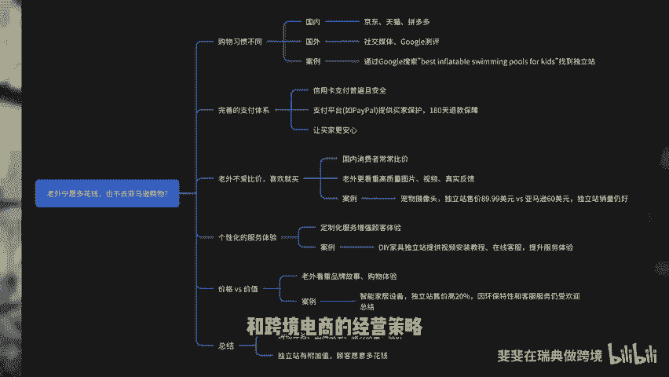

# 为什么老外宁愿多花钱，也不在亚马逊上购物？揭秘老外的购物思维！ - P1 - 斐斐在瑞典做跨境 - BV1bg2bYQEa5

老外宁愿多花钱，也不去亚马逊购物，这是个什么逻辑，到底是什么让他们愿意选择独立站？今天我来给你解秘，一定要看到最后。我把今天的内容归纳成为思维导图。老规矩点赞、关注、收藏，以免以后找不到。大家好。

我是菲菲。今天我们要聊一个非常有趣且常见的问题，为什么老外宁愿多花钱也不在亚马逊上购物，这背后可不仅仅是价格的问题哦。让我给你逐步剖析一下，看看老外的购物思维究竟哪里与我们不一样。第一。购物习惯不同。

国内消费者买东西，更多时候会去京东、天猫、拼多多等平台。图的是一站式购物的便利，而老外呢更多的是依赖社交媒体，或者通过搜索引擎找独立站进行购买。比如我老公夏天想给孩子们买个充气水池，他并没有去亚马逊。

而是通过谷歌搜索best inflatable swimmingwi pools for kids，看了一些测评文章和博客推荐的独立站，最终在一家评价很高的独立站购买，通过测评和推荐的方式。

帮他找到他认为最合适的产品，而不是单纯在亚马逊比较。第二，完善的支付体系，让卖家更安心。在国外。信用卡支付普遍且安全，而且很多支付平台如paypal会给买家提供保护政策。买家对于独立站支付不太担心。

因为他们知道在遇到问题时可以得到保障，甚至在180天内都能申请退款。第三，老外不爱比价。喜欢就买了。我们国内的消费者很多的时候会花大量时间在不同的平台上比较。但老爱呢只要喜欢觉得符合预期。

基本上不会再去比价。甚至有时候看到某些独立站的高质量图片或视频就会直接下单。我有学员做一款宠物摄像头，独立站售价89。99美元。而他在亚马逊上却只能卖60多美元，独立站的销量不下于亚马逊，这是为什么？

因为它的独立站不仅有高清产品视频，还有客户的真实使用反馈和精心设计的用户指南。让客户在购买前就对产品的使用有了清晰的了解，这种体验感使亚马逊产品页面无法提供的。第四，个性化的服务体验是独立站的优势。

老外重视购物过程中的服务体验，在独立站上，你可以通过定制化的服务，给客户提供更好的购买体验。就像高端化妆品专柜，虽然价格高，但体验感强，客户愿意为服务买单。我还有个学员做家居产品。

他们的产品主要是DIY家具。虽然同样的产品在亚马逊上也有销售，但独立站上提供了独家视频安装教程，并且还有在线客服帮助客户解答安装过程中的任何问题。顾客能够感受到更贴心的服务，所以愿意支付更高的价格。

享受从购买到使用的全程服务体验。调。价格 versus价值，老外看重的是整体体验，而不是最低价格。很多国内卖家会误认为价格越低，越容易吸引客户。但老外往往愿意为更好的购物体验和品牌故事买单。

如果你的独立站能够提供有价值的品牌故事和专业的售后服务，他们不会指定着价格。我还曾经帮助管理过一个电子产品的独立站，他们售卖的是智能家具设备，价格要比亚马逊高出20%左右，即便如此。

通过讲述产品的创新性和环保特性，再加上及时的客服服务，老外们愿意为这个品牌支付溢家。他们购买的不仅是一个设备，更是对品牌的信任，以及对未来可持续发展的认可。老外的购物逻辑远远不止哪里便宜，哪里买。

他们更在意购物的体验、品牌的故事和服务质量。如果你独立站能够提供这些附加值，即使价格高于亚马逊，他们依然愿意在你的独立站购物。关注我，了解更多关于老外的购物习惯和跨境电商的经营策略。

如果你喜欢今天的分享，一定要点赞、收藏、转发。我是菲菲，跨境路上来飞。

