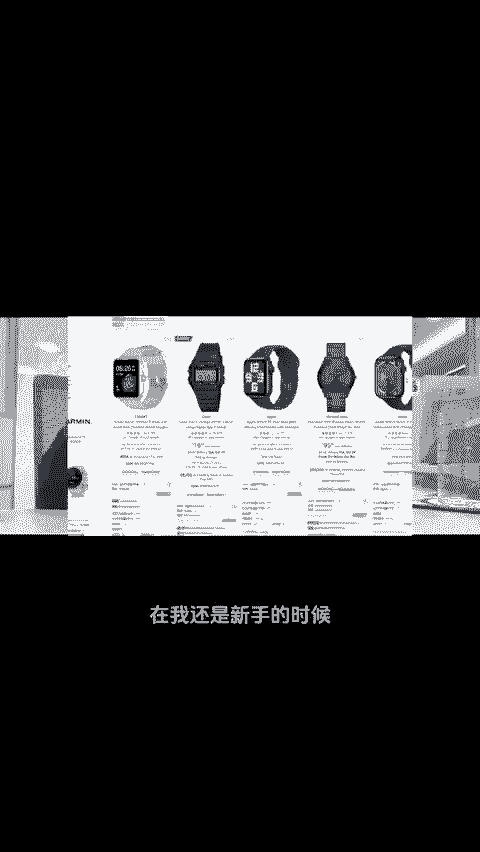
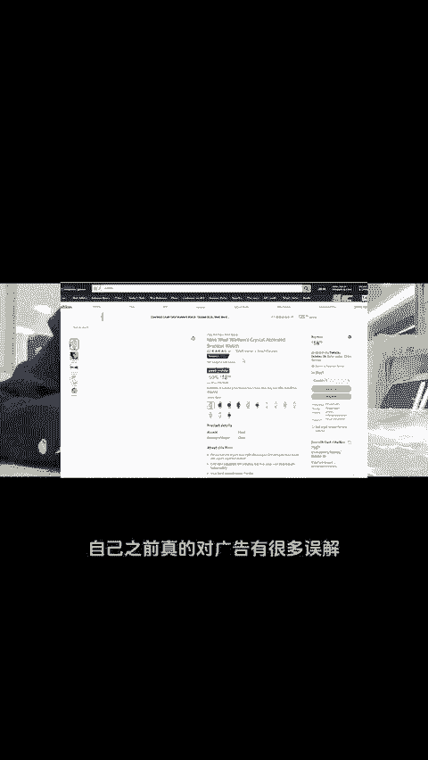
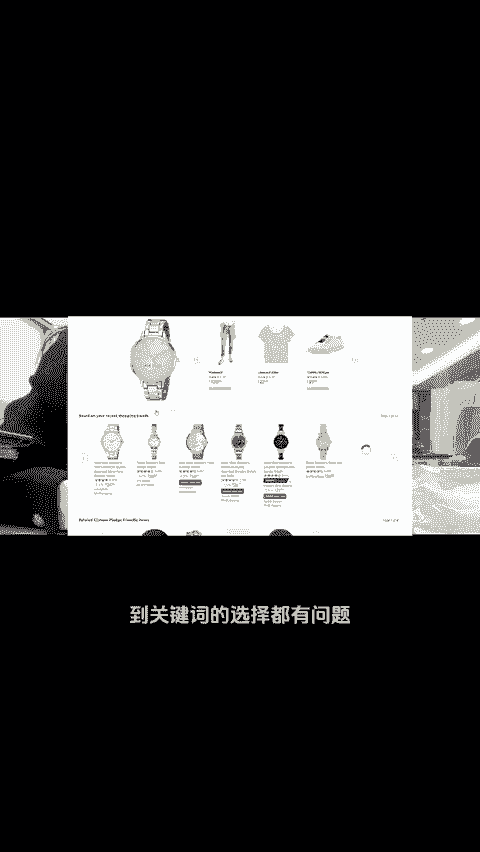
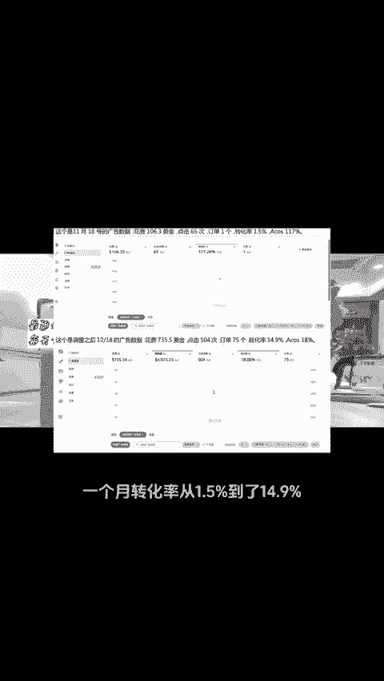
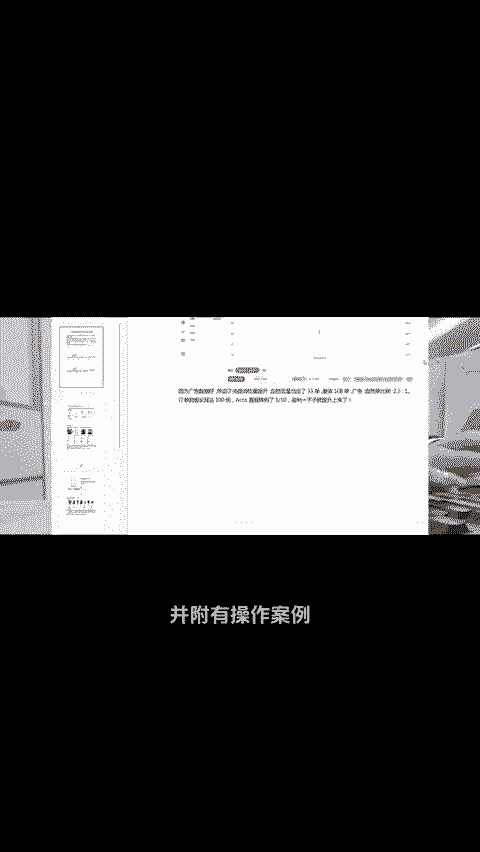

# 亚马逊1个月出单量增加 100倍的广告打法解析 ！ - P1 - 小亚跨境研究 - BV1zimNY6EfE

一个月出单量增加100倍。很多人问我广告怎么打。我先说下我的情况。在我还是新手的时候，一款产品耗了半年，每天还只是一两单occos动不动就200%到300。后面一次机会。

我碰到了一位有78年经验的大卖交流后发现自己之前真的对广告有很多误解，没懂它的底层逻辑，很多用法都错乱，从广告框架出价预算到关键词的选择都有问题。后来这些广告问题一一调整后，一个月转化率从1。

5%到了14。9%。occos从117%降到了18%，盈利一下就提上来了。可能很多人会问我，具体是怎么调整优化的，篇幅有限，我把自己的优化操作都整理好了，并富有操作案例，方便大家更好理解。

需要的三个6挨个发一起跨境，一起报富。😊。

