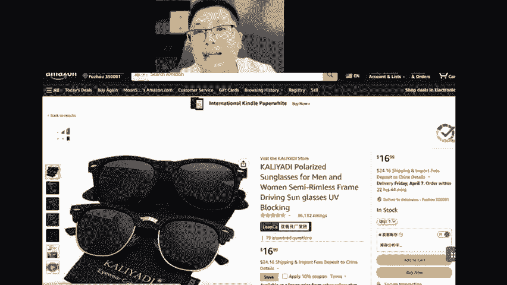
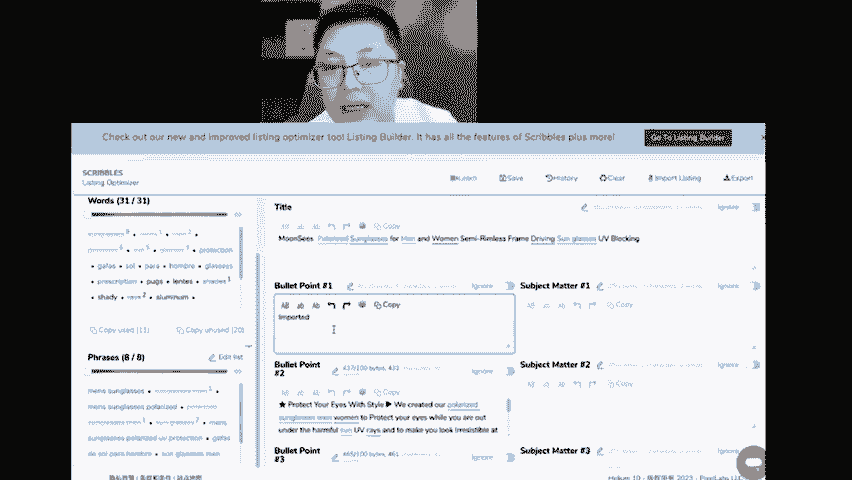
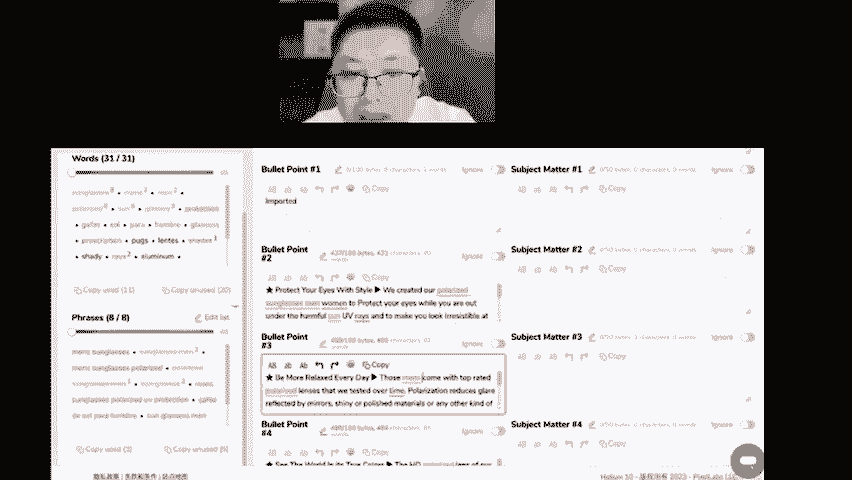
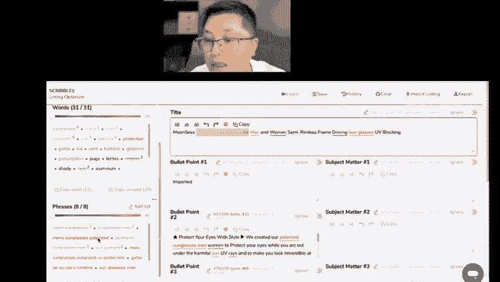
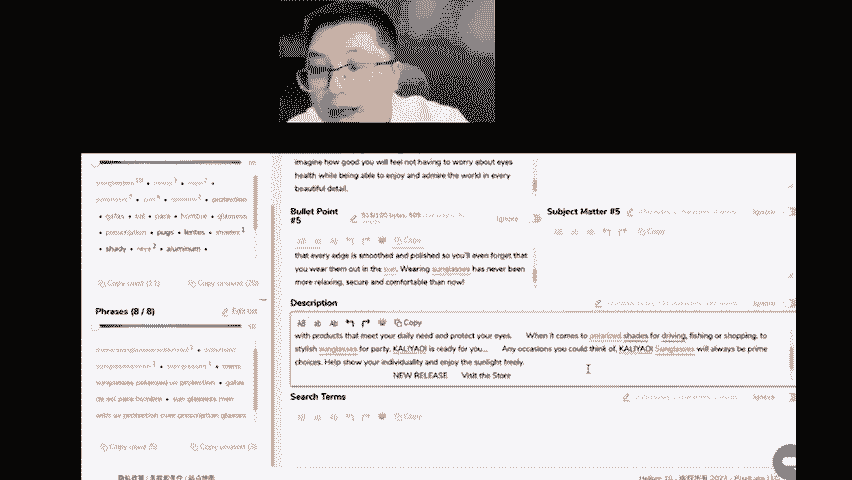

# 亚马逊listing埋词的详细步骤技巧 - P1 - MoonSees - BV1g52gYTEbE

就是我点一个as进来。点个S进来。比如说我想学的是是这个卖家的，卖的最好嘛。假定啊我想学的是这个卖家的，我把它S偷偷的复制过来，或把它链接复制过来，我把它的链接一键生成一下。

Yeah。import哎，这里面把SURL放进来就好了。Did it a apply。好了啊，OK那么这里面呢你就看到，如果有用到的单词就被划掉，上面的数字9代表的是这glasses被用了9次啊。

m被用了一次啊，ms被用了一次mm用了两次等等。那这个标题你很很显然你这个标题的品牌肯定不是这个，假定是ms啊。Yeah。好了。那么有一些词组的话呢，是他没有用到的。你看啊这个单词的词组当中的话。

有不少的词其实是没有用到的。那么我们的目标是把这些单词全部词组的话，以词组的方式全部埋到最重要的两个环节。一个是标题。另外一个是5点描述里面去。好，那么单词板块的话呢，这个单一的单词板块的话呢。

我们啊确保它有全部写到就可以。那接下来我们操作一下，比如说ms glasses这个关键词的话一直都没有用啊，假定import啊import它是没办法啊这个我就不写进来。假定我比如说。

在这里面写到ms glasses。把这个词给我列进来，我这个我写完的话，这个就会被。

这个就是会被划掉啊，然后我们看看头部啊，这个关键词的话呢，其实在标题里面已经出现过一次了，但是它是这样的一个货的形式。那如果以词组的形式存在的话，它也一定会有搜索量，而且搜索量不小。

所以我我我打算在比如说第二个或第三个点啊，第三个点好了。

给他埋进去。实际上他已经写了啊，就这些呢其实他可以以关键词收入的角度来说，其实都已经有了。那只不过说如果以词组方式存在，再配合我广告的话，那会更好那这时候我有可能在这后端加一个啊。

某一个地方加一个lasy已经存在过了，那我还是写mens啊，不是这个啊，但它自动自动的会给我写完啊，把它划掉啊，然后呢有比如说有这个西班牙语的啊。GAFAS这个开头的，我希望呢也把它写进来啊。

要去埋进来。那我不不埋在这个，比如说不埋在我们的5点描述里面，那我可能会偷偷的埋到详情页这里，对吧？可以买一个详情页相关的。

，啊，比如说把这个埋进去，这个埋进去，这个关键词就可以化掉了啊，这里面也都写到了，对吧？那么剩下的啊还没有这个还没有被。用到的，如果你想买的话，你有有时间我是希望你一个一个买啊。如果说特词特别多的话。

你也可以直接复制放到啊查描述里面去。哎，这个时候的话31个词你就差不多用完了，这里面也有两个单词是还没有用到的那你可以用到哪呢？比如说用到s term。啊，用到4区啊，放进去，对不对？那这个时候的话。

你的关键词埋词全部埋完了啊，这些时候就埋完了。然后呢，埋完以后做个保存。对不对？导出来或者是safe导出来都可以啊，导出1个CSV。

