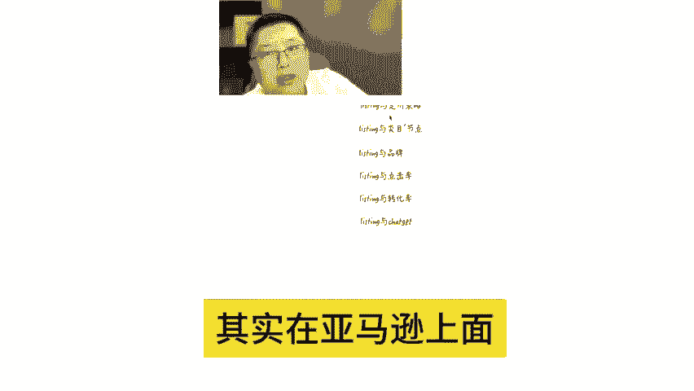
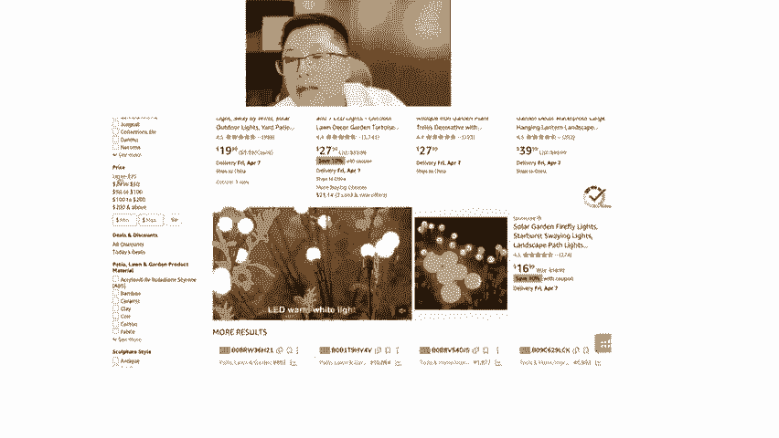
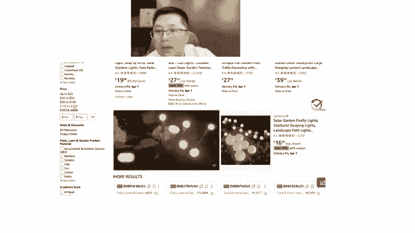
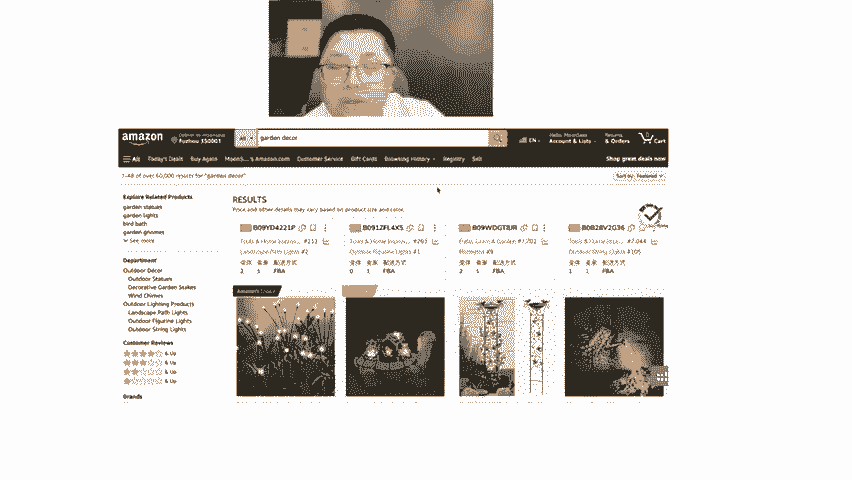
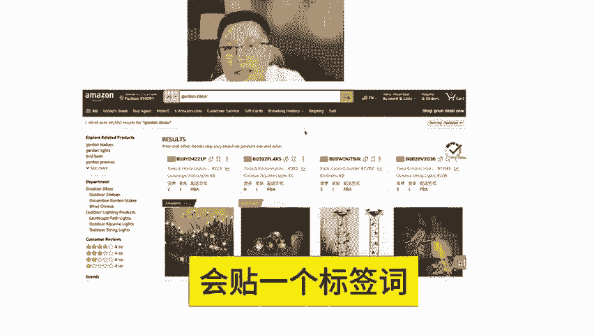
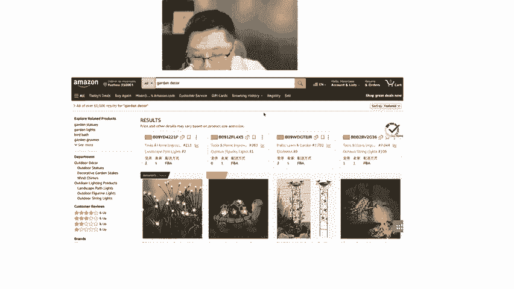

# 亚马逊listing定价技巧！别忽视这些流量通道 - P1 - MoonSees - BV1sJxkenE1A

接下来呢是涉及到了定价策略。我们刚才说了，其实在亚马逊上面一条链接的定价，它至少有多个节点。这就是你看这个是价格高于25的，25到50的50到100的100到20200以上的这这些就是它的节点分类节点。

所以这些逻这这些流量通道，如果打开的话，是给你贴链接上会贴一个标签词，我知道上一次讲流量通道的逻辑上给大家去说了，对吧？如果你是大额折扣，加上价格，比如说低于5美金，它会自动触发流流量的标签词给你。

比如说触发的是clearance item，然后呢，比如说under five和under ten under twenty三个流4个流量通道给你啊。

这个就是我们说的定价其实可以给过给给出来很多的流量的通道来。

