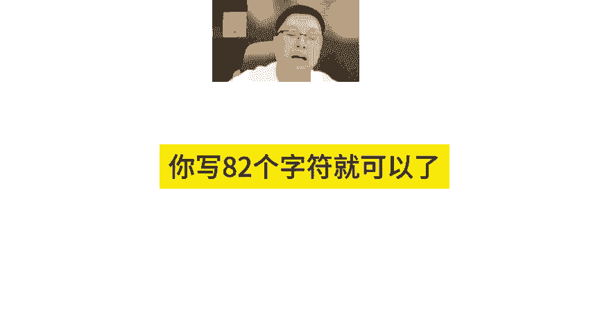
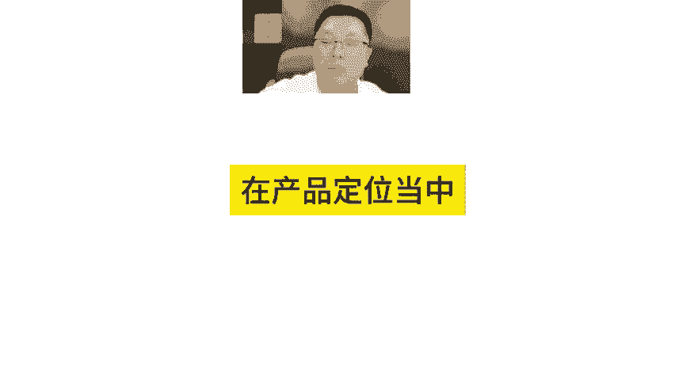
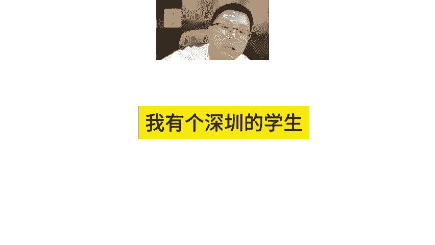
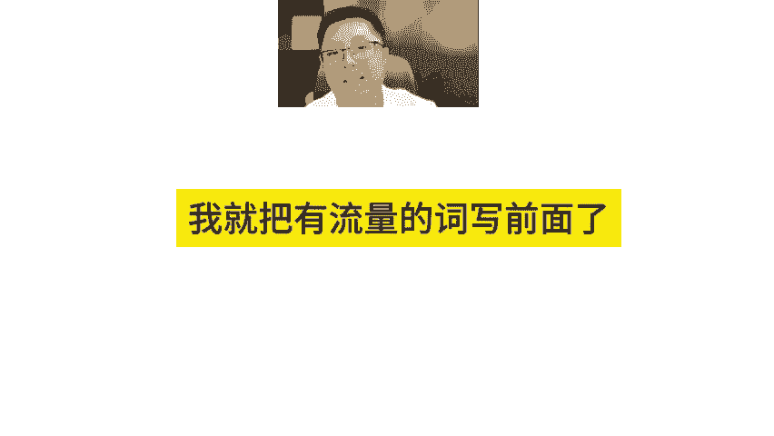
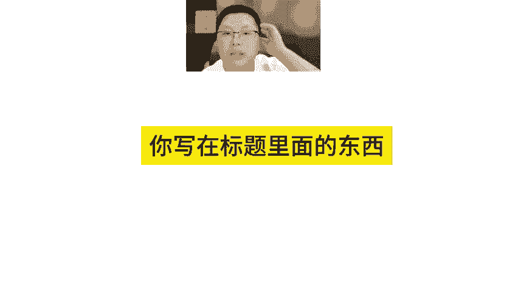
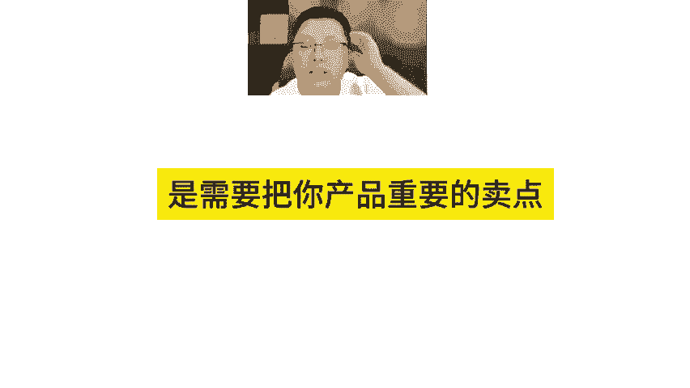
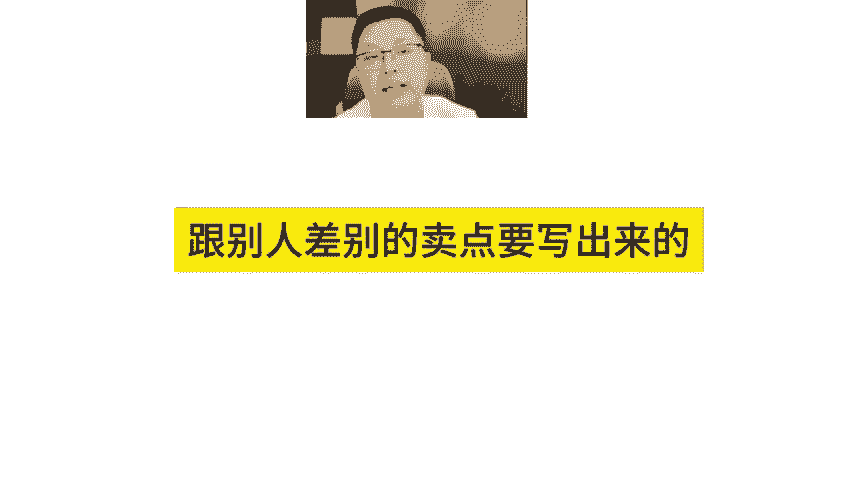
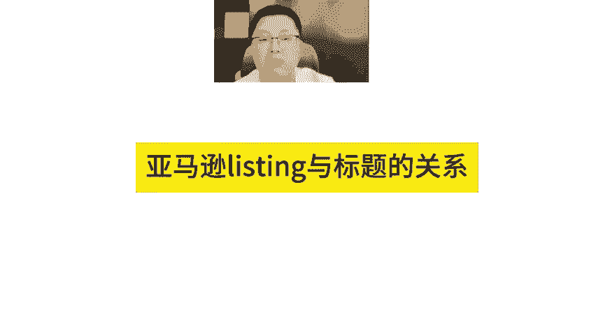
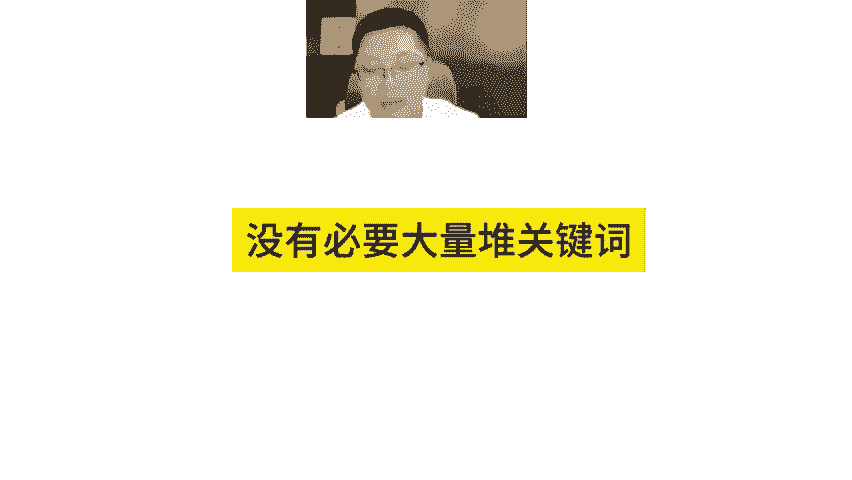

# 亚马逊listing标题不要陷入错误写法 - P1 - MoonSees - BV1LPsSeDEaF

正确的标题写法不是那么简单的说哦，你写82个字符就可以了，或200个字符就可以了。把关键词写进去就可以了。不要不是这么写的。一般来说你还要去兼顾你接下来用什么样的主推关键词来打广告来推广。

你要主打什么关键词，并且还要去了解清楚在产品定位当中，你的产品有哪一些的重要特征和特点，我有一个深圳的学生看最重要的卖点，你把它写在后方干什么？他说我要把最重要的主推词写前面啊，所以啊写着写着的话。

我就把有流量的词写前面了，没有错吧？我说算错了。😊。

你写在标题里面的东西，我觉得在前两行，特别前82个字符的时候，是需要把你产品最重要的卖点跟别人差差别的卖点要写出来的啊，那么这里面已经包含了你主推的关键词类型的够了。

如果你有添加的其他关键词写后面反而面关系。因为它是负责把流量给你引进来的，对不对？所以你应应该是带呃跟关键词，你死那跟标题的关系，应该是要去凸显你这个产品的主要特征啊，没有必要大量不一关键词没有。

