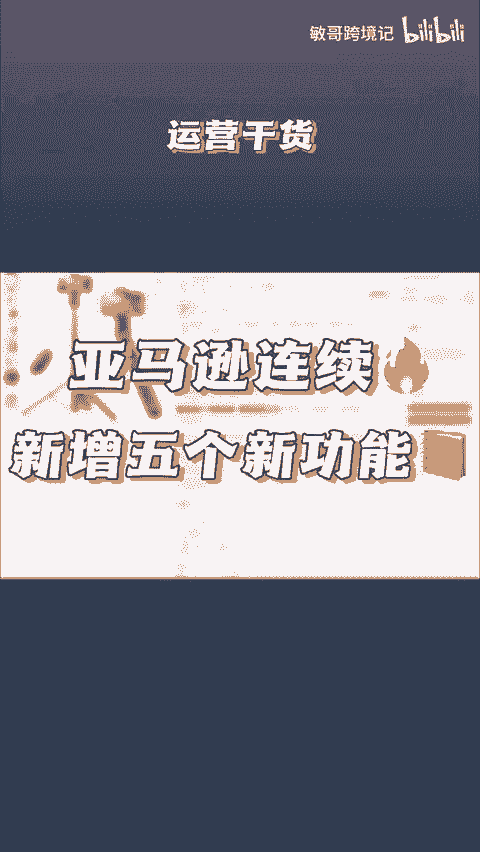
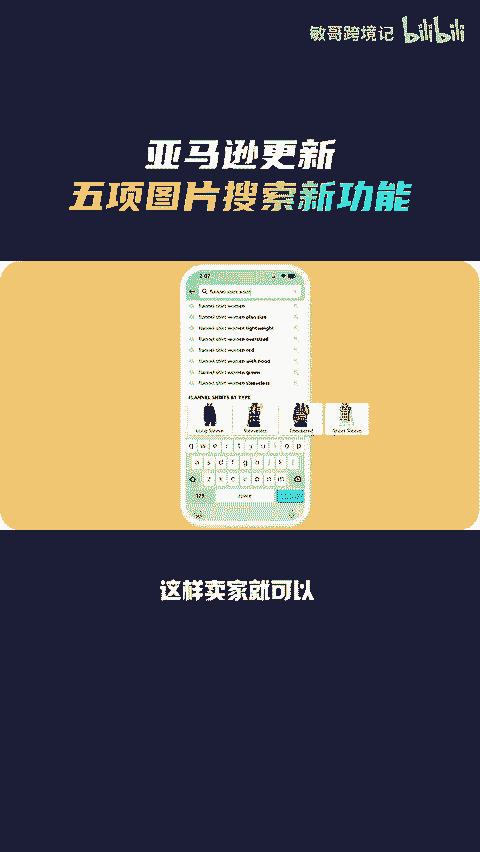
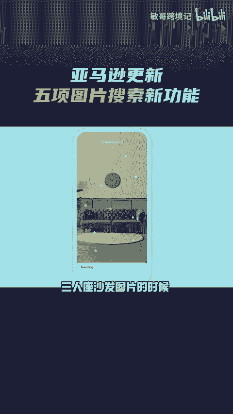
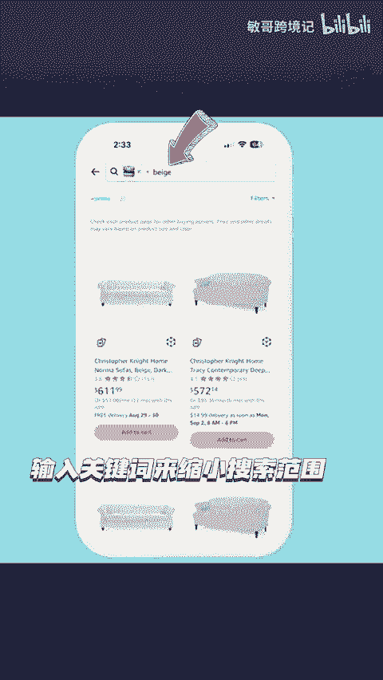
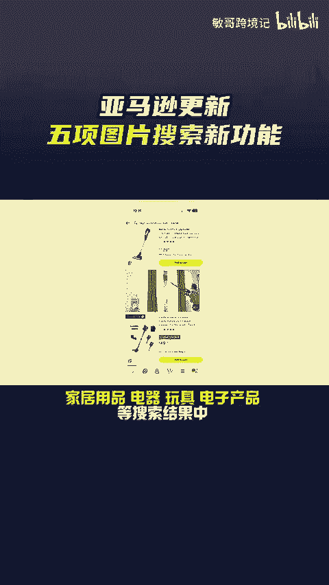
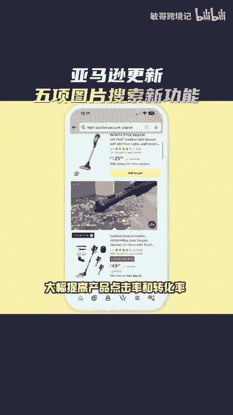
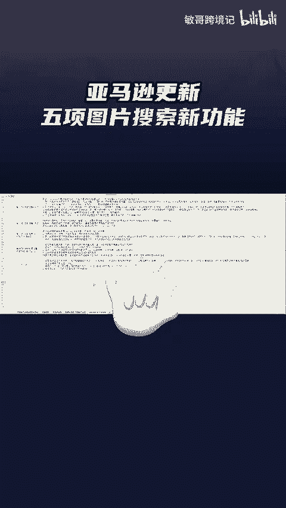

# 亚马逊一口气更新五条图片搜索新功能！ - P1 - 敏哥跨境记 - BV1Fs2PYKEMc

🎼亚马逊一口气新增了5项图片搜索功能。第一个搜索框图片建议。当卖家在搜索框内输入Mal shirt这样的关键词时，平台就会显示相关的图片建议，包含了产品的颜色、款式、材质等多种属性。

这样卖家就可以根据自己的需求，直接浏览相关的产品。第二个，在图片搜索添加关键词。比如说当卖家上传一张三人做沙发图片的时候，可以直接通过输入关键词来缩小搜索范围。第三个，类似推荐。

当卖家在输入连衣裙搜索产品的时候，可以点击类似推荐，系统就会为卖家推荐语言产品，类似的款式，比如不同的裙子长度或者袖子，找到自己更心仪的产品。第四个，搜索视频。

卖家现在可以在家居用品、电器、玩具、电子产品等搜索结果中。

🎼直接观看产品视频，大幅提高产品点击率和转化率。第5个圆圈搜索。买家在浏览某张图片的时候，可以直接圈定某个产品进行二次检索。精准定位买家更心仪的产品。这些功能的更新无疑是，对图片和视频的要求更高了。

但也给卖家带来更多的机会和更大的挑战。最后我这里有一份亚马逊运营s，感兴趣的卖家点赞评论666给你安排。

