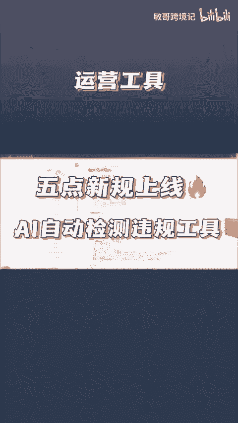
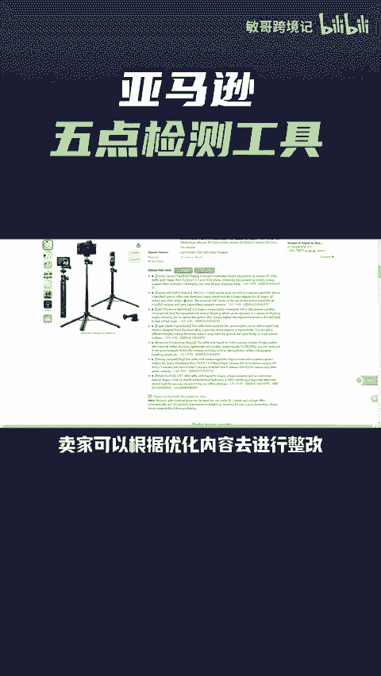
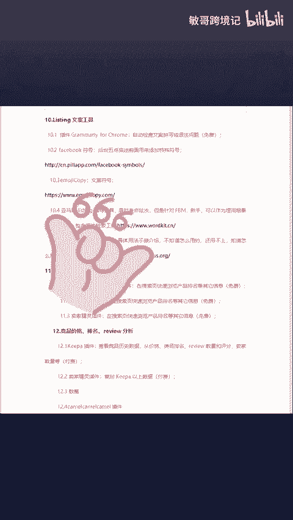

# 亚马逊五点自动检测工具，快速帮你检测出五点中所有的违规点！ - P1 - 敏哥跨境记 - BV1XpsYeYE5Y

🎼亚马逊五点新规已经正式开始实施了，此次更新主要是针对一些特殊符号、表情以及一些短语的限制。一旦被亚马逊检测存在违规，就会对listing进行修改。所以卖家们一定要整改到位。

🎼那卖家精灵也上线了，5点检测工具，点击5点上方的违规检测工具，就会帮助卖家自动检查5点是否存在违规，并且给出了相应的优化建议。卖家可以根据优化内容去进行整改。快去试试吧。

最后我这里有一份跨境运营实用小工具大全，有需要的卖家点赞评论666给你安排。

