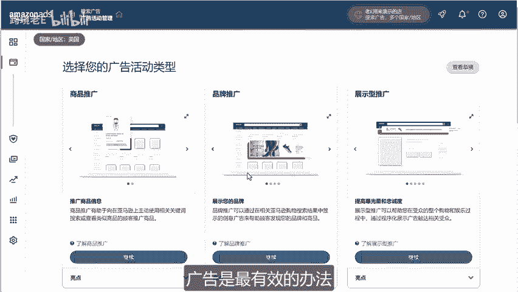
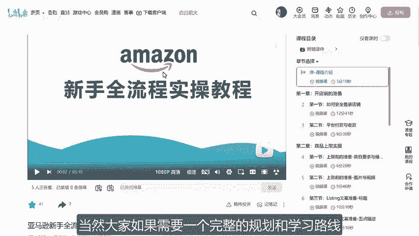
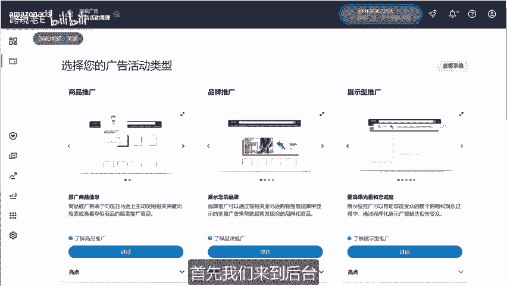
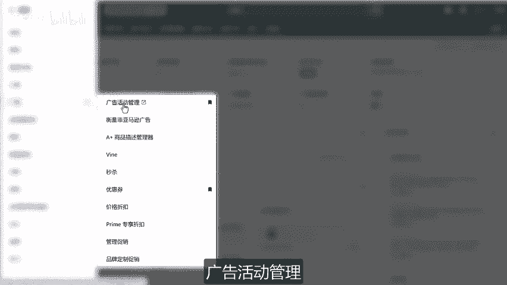
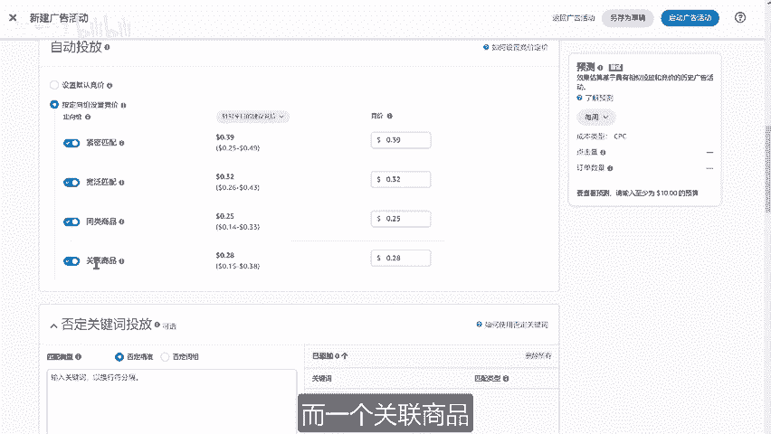
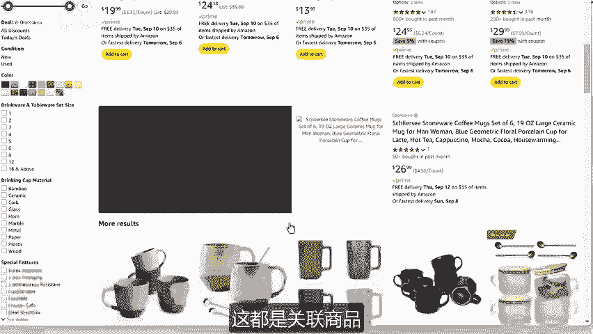
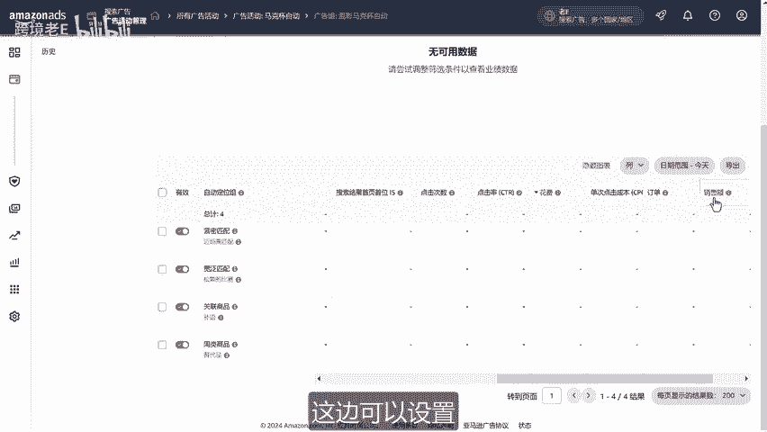
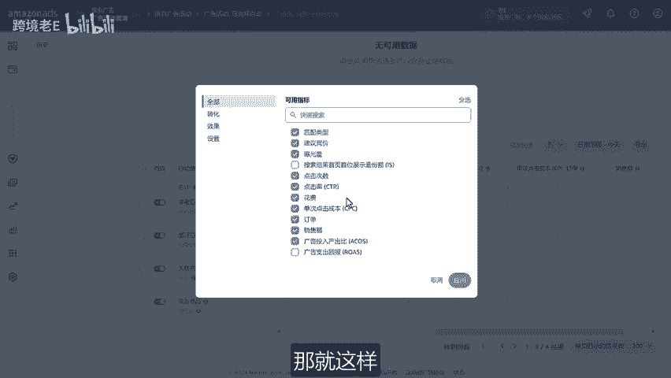
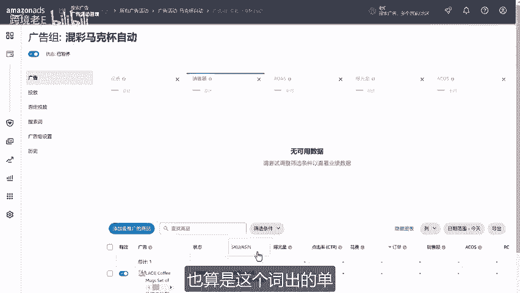
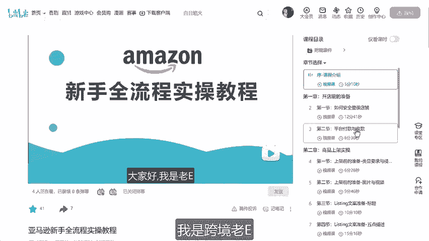

# 亚马逊保姆级自动广告创建流程 - P1 - 跨境老E - BV13jtfeLEL9

大家好，今天跟大家聊一聊如何创建广告。我们产品上架之后，要促成出单的手段中，广告是最有效的办法。那我们先从自动广告说起。当然，大家如果需要一个完整的规划和学习路线，可以看一下我这个付费教程。

等于从零开始涵盖所有运营线路实操演示，不论你是想入行还是刚入行，都有很好的帮助。首先我们来到后台。

点击左上角菜单。广告。广告活动管理。

那我们来到后台这个广告管理页面，点击创建广告活动，选择商品推广点继续。好，打开这个新建广告活动的页面，这边广告组设置广告主名称先留空，我等一下跟大家讲怎么命名商品这边选择你要投放的这个商品点添加啊。

这边可以这所有的产品都在这边。把它。添加过去。那如果说是遇到多变题的，你一开始不知道哪个产品比较好的话，你可以全部把它添加下去。然后呢，后面到分析这个广告效果的时候，我们再把高转化率的这个产品给留下啊。

这个我在广告优化的时候会跟大家讲，定向策略。它分为自动投放和手动投放。手动投放，它还有分为一个关键词投放和商品投放。那我们先讲自动投放。那什么叫自动投放啊。就是亚马逊用AI帮你投啊。

根据你的listing的这个文案啊图片，然后呢帮你选词，帮你推广。那这个的好处呢就是简单点一下啊，直接提交啊，启动就可以了。那不好的地方呢，就是如果说你listing写的不好，它有可能会有偏差。

比如你是mar，你可能你因为listing写不好，人家帮你推到了这个碗里面，那是不是这个就影响到你的转化率了呀。是不是所以说listing前期是很重要的，先写好，至少没有什么太大的问题。然后呢。

我们自动投放。这个出价嗯就是人家点击一次，你要付多少钱，看一下它默认进价是3。9好，0。0。39就0。25到0。49之间，证明这个市场它的这个竞争还好啊，不是很竞争很激烈啊。这个碗这个马克杯套装啊。

不是很激烈。但是呢我不建议大家这么做啊，不建议这样全部一股脑用这个默认竞价，而是选择按定向组设置进价选一下啊。大家来看一下，这边有一个比较重要的知识点，它有4种匹配方式，我给大家看一个表格。好。

就比如紧密匹配。我们的关键词是max seat，那么它可匹配什么呢？它只能匹配maxxi和maxix啊，单复数形式这个紧密匹配就非常紧密了哦，非常相似的啊。如果你要这个关键词，它只能匹配这两个。然后呢。

这个。宽换匹配，那它可匹配的东西就多了。首先它可以单复数跟上面一样。然后呢，他无序，你sit mark也行啊，m C也行。长尾就mxi of老逸啊，m of a movie啊。

就是电影中的一个这个什么啊很长下去的啊，也可以搜得到。错误的评写markax it呃也行。还有近义词啊，这个没什么近义词了，它就当那个就是只有马克杯呃也行，就宽泛匹配。它有这么多的流量啊。

那紧密匹配就是说你觉得这个词非常的精准啊，我找到了一个非常精准的词。比如这次的这个悟空啊，就黑悟空黑神和悟空，它就是要用紧密匹配啊，它很精准因为大家都会搜这个啊，你在不确定的情况下啊。

他除了收纳戏还能搜什么呢？你可以用这个宽欢宽泛匹配啊，可匹配。啊，这个东西同类商品啊，顾名思义就是所有的maxs啊都是它的同类商品。这些都是他的同类商品。而一个关联商品，就比如啊勺子啊盖子。

或者是底部底托啊，这个马克杯的这个底部的托盘啊，这都是关联商品。一般情况下，这个关联商品量会比较少啊，然后这样子就可以了。那出价的话呃，我建议就这样。比如说你广告一开始如果说预算还不怎么高。

但是毕竟呃因为我们现在这个亚马逊上商品是非常多嘛。所以说啊你看随便收一个就8000个超过8000个结果。那凭什么给你流量呢，那还是要开广告。所以说广告，你要自然出单其实是很难的。

除非你就是像前几周这个热卖的这个悟空啊，它是可以有自然流量，不然像这种被人家收烂的词啊，很难至少出一点钱。所以说如果说是这种心态的话，我们出这0。25啊，一般出0。26这样子。

啊，比最低还高一分钱啊，那这个呢就0。27。啊，0。15。0。16，这样那正常呢用的是这个钱再加一分钱。但是呢同时比如说这个0。39，你看0。40，但是0。40，这个数据太整齐了，大家都可能出这个钱啊。

大家哎0。4下去，所以说一般是0。41啊，0。32就0。33。0。25就0。26。啊，那0。28就0。29。那如果0。3，那你就改成0。31啊，这样子就多人家一分钱。

毕竟这是一个竞价的这个机制嘛哦你有可能多他几位是吧？多了一分钱就肯定是在他前面。然后呢，如果说呃。有比较强的这个公式的，就是说你也比较急着想出单啊，想测流量的话，按这个钱啊，0。49那就0。5啊。那0。

5的话，就按按照我刚刚的这个理论就0。51。0。44。0。3234啊0。39。嗯，那就这样子出价出这样出价之后，那接下去这个否定关键词投放，这个是整个广告中的核心部分呃。

这个将在下一节上这个广告优化上面讲。当然你现在投这个否定关键词，就是说你可能有一个竞争对手，比如说叫老一老F这个牌子你觉得别人搜这个牌子，你不想出现，你就在这个呃关键词投放这边搜。

因为老F的转化率太高了啊，你不想跟他竞争啊，添加关键词啊，加下去以后搜这个词一定不会出你这个产品，就比如说我们买鞋子，我们可能把nike给否掉。

因为一般搜nike的人他可能就是买nike他不大可能买我们对不对？买鞋子，这个这叫前置否否定。就是说你在不确定好不好的情况下，你就直接把它否定掉了。前置啊，那后置的话是根据数据进行啊。

发现出了这个词出了这么多的点。但是不出单啊，那我们把它否掉这个下一节课讲好，那这个关掉了哈，删掉否定商品定位。这个是在呃同类商品这个数据有数据之后我们再否。然后呢。这个东西选固定竞价，前期选固定竞价。

大概半年之后选动态竞价请降低。理论比较复杂，我也不说，反正记住就好。固定竞价好不好？这个留空。好，那这个广告活动名称，像我们这边是什么？是一个自动投放马克杯，那就是马克杯自动。

广告组名称是在进去之后的广告组。这个广告这个叫广告活动，就我们进广告面板里面的那个链接叫广告活动。点进去之后，它可能有很多组。因为你可能有两三个产品分为不同的组，这个叫马克杯自动。那你甚至可以写彩色啊。

滚彩。文彩。马克杯自动，因为你在这个整个大活动里面有可能有一个粉彩，也有一个哦粉色，有一个红色分在不同的广告组啊，那就这样子。等一下我们点进去看一下，大概就知道了。开始和结束时间不动啊，默认是今天。

无结束日期想结束我们关掉嘛。每日预算一般情况下我们填200，确保你一整天都有投放啊，全天投放。也不会到这么高了，一般就其实前面前期出这个价格可能一天就二三十。而这个每日预算是什么意思呢？

就是每天不能超过200，但有时候会超过200是什么情况呢？它是一个月平均每天不超过200啊。你刚开始它可能有个210，有可能210啊，但是呢他第二天就只给你限到190啊，你要记住。

虽然每日预算是这个数字，但是它有可能超它是平均到了整个月，这个在其他国家启动。比如说美国它就会在美国、加拿大、墨西哥，那其他欧洲，你要切换到欧洲的面板，但我不建议打开啊。

因为我们还是要每个国家单独设置会比较好啊，那这个之后点启动广告活动。好，那这样子就可以了。嗯，没问题，那就大概是要他说一小时其实可能五六分钟就可以展示出来了。然后你想要继续的话，你就创建立一个广告活动。

那如果说你想回到广告面板的首页，你可以点这个广告活动管理，或直接点击左上角这个logo。好，那我们来到广告活动的首页。搜索。马克杯自动。啊，当然你不搜索，你可以这个是全部的。然后我们往下拉可以拉得到啊。

那因为我在广告数据比较多，所以我们直接用着搜索。啊，这个就是广告活动，就是我们刚刚在最下面设置的这个名称，就我们设置于马克杯自动这个名字其实要起好，不然后面你识别不到啊，你不知道哎，这个是广告是干嘛的。

然后呢，这边我们先关掉吧，因为我图片也还没做啊，现在也还没数据啊，那我们点进去看一下。好，那这边就是广告组名称。就是我们刚刚点进去第一个让你填的这个东西啊，广告组。所以呢你现在要是在创建广告组。

在下面有可能有一个粉色马克杯自动啊，然后呢红色马克杯自动，你可以分成三个自动，统一放在这个马克杯自动的这个广告活动里，那这叫广告组，这边也能暂停，但是外面总的已经暂停了啊，如果说外面开着。

然后这边我们想推这个混的啊，然后那我们想推这个混彩的，那下面这个呃粉色的，你可以把它关掉啊，这个单独关。啊，你看现在是已经暂停了，因为外面总的这个马克杯自动已经关闭了啊，然后再点进去。

左边这个广告的意思就是我们推的这个产品，当然你也可以在这边再新增商品啊，再来一个两个3个。啊，这个就是一个前面的这个数据，这个是商品。第二，投放。然后呢，大家看一下这边这个静议镜架。

它是一直实时在变化的。好，那我们这边设置完之后，其实还是可以让它跑个。几天看一下效果啊，看一下点击率。这边可以设置啊，这边列自定义列。一般情况下，大家注意一下这个数据就是曝光量。

点击次数，但点击次数它意味着这个点击率啊花费。单是点击成本。那A cost和这个这个我也不知道怎么读，它是一个导数。A cost等于这个分之一哈，或者这个分之一是导数，它们两个就导数。

所以我我们习惯看A cost，但也有人习惯看这个支出回报的然后就这样。

好，那还有这边有个否定投放，就我们点到最后这个广告组进去之后。啊，广告啊，这个一开始就是这个产品，我们的产品。投放就是这个投放的出价。否定投放。就是否定那个关键词啊，我说的下节课会会会讲，就这个和这个。

是广告优化用的啊，然后广告主设置呢就是这个名称。啊，这个广告组的名称可以修改这个历史呢。是我们的修改历史。比如说哎我改了之后发现有点问题啊，你看这边有讲。啊，我刚刚。出的默认出价，然后呢。

添加了这个广告。广告组状态由正在投放变成已暂停啊，就大概是这样子。一个广告组啊这几个东西大家注意一下，然后呢，就让他开始跑。大概一般情况下数据也要跑个7天才有效果好。它这个广告归因周期也是7天。

也就是说我今天点下去到第七天购买也算是这个词出的单。

好嗯，这就是亚马逊自动广告的创建流程。那如果说大家还有其他问题的话，也可以直接联系我。我是跨境劳，我们下次见。

