# 亚马逊全功能ERP贴牌独立部署不限制店铺 - P1 - 洋少AL885918 - BV1kQtZehEy9

大家好，很多亚马逊新手卖家不知道ERP是什么。今天给大家简单的说一下ERP。首先，ERP是通过网络技术，整合企业资源优化业务流程和提高企业运营决策效率。那对于做亚马逊的卖家来说有哪些帮助呢？

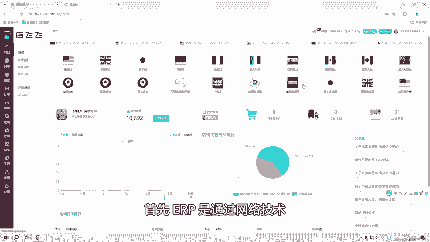

第一个模式选择，一套拥有铺货及跟麦的双模式样品，可以自由切换模式及模式之间互相辅助选品。第二个，采集选品可以通过现有的网络技术快速的获取产品的信息。对于铺货卖家来说，可以对采集到的产品进行编辑。

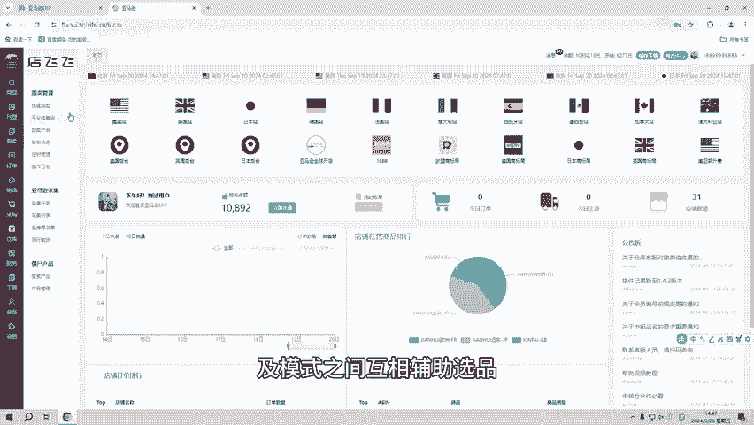

翻译及导出。那对于跟卖卖家来说，采集到的产品可以导出认领及分析竞品。第三个，采购同步若亚马逊无货源需要在客户下单产品的时候进行采购。那在1688采购的产品。

它就会同步到系统上会显示采购的订单及国内物流快递单号。

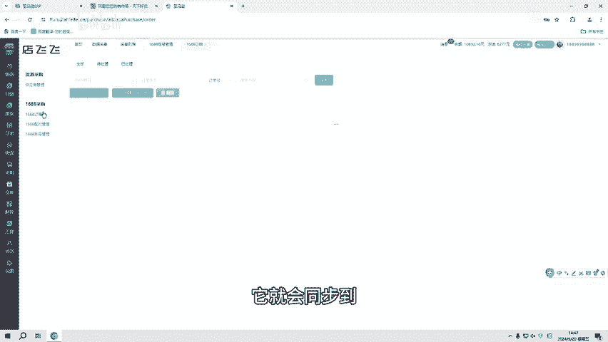

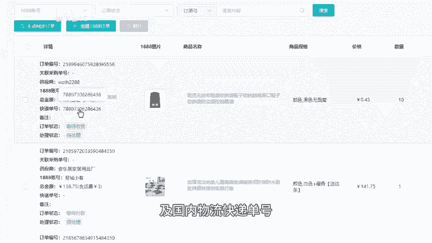

第4个财务明细。有物流运费及订单成本汇总、绩效等等。

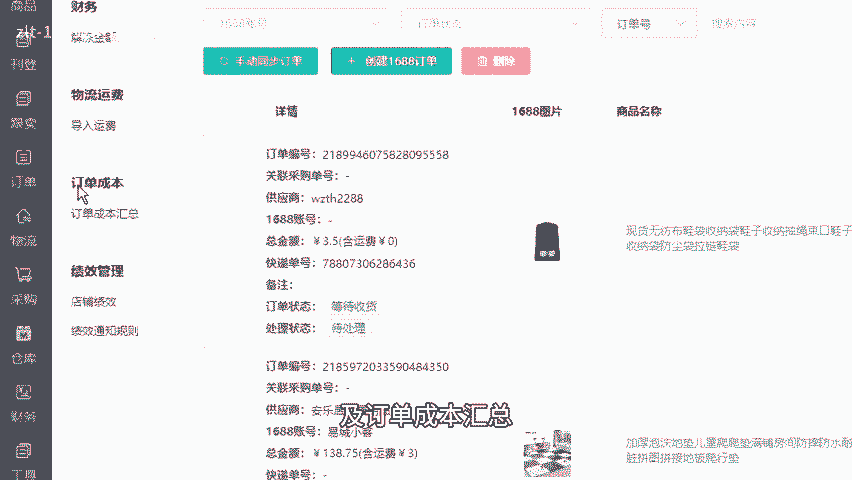

更清晰的知道产品的利润。第五个应当发货。

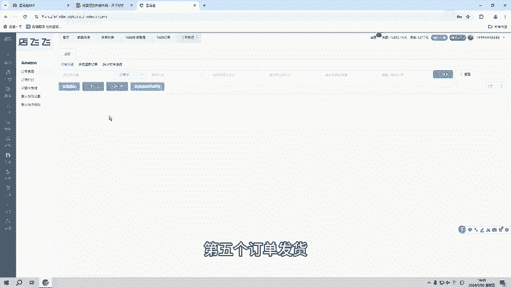

在店铺中有场景出单，系统就会自动同步，可以快速的去编辑订单信息，支持手动及自动虚拟发货，还可以打印国际面单查看物流进程。第二个邮箱管理，可以一站式管理店铺下的所有邮箱可自由添加模板，快捷回复客户信息。

第七个员工管理，可以根据员工的工作内容不同，分配不同的功能权限，且给员工之间的数据不互通。第八个辅助工具，有定时上下架智能调价防跟卖监控、烧麦监控及凡恶意竞争等等，可以帮助卖家更快出单及自动抢占购物车。

让工作更简单，流程更清晰。如果说想要测试ERP或者想详细了解ERP的功能，可以关注我或者私信666。

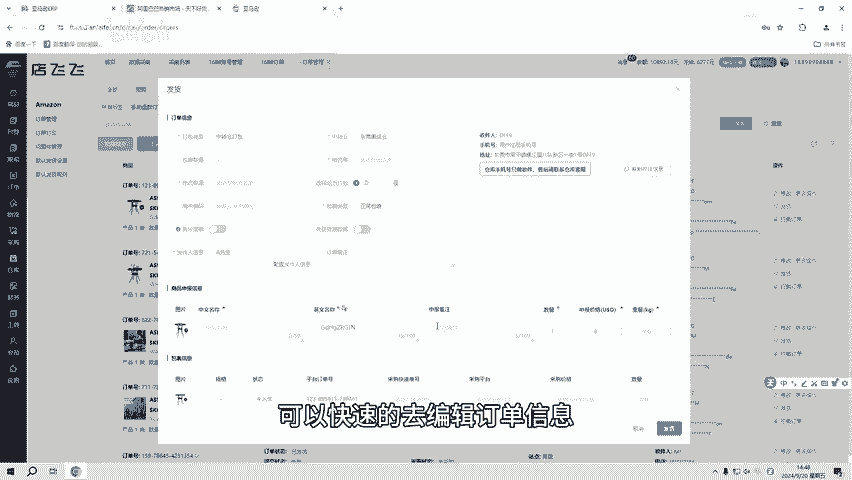

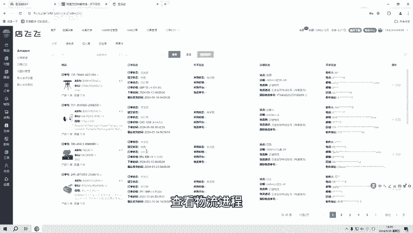

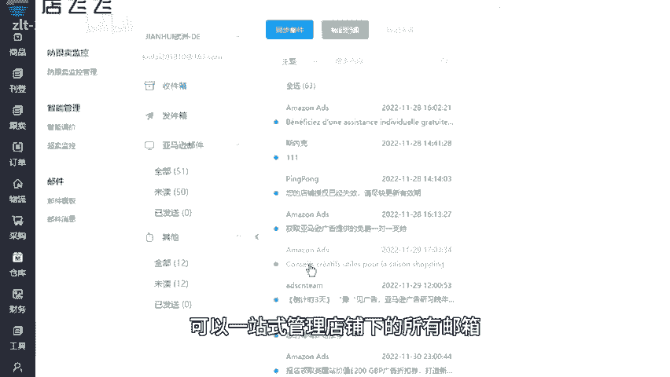

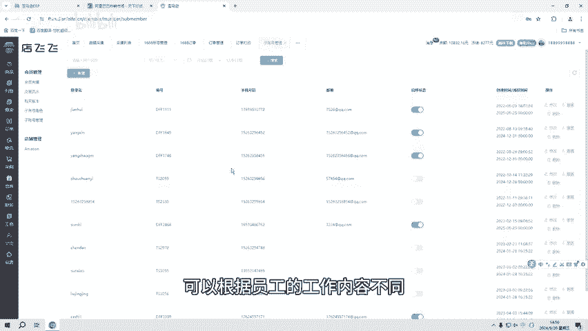

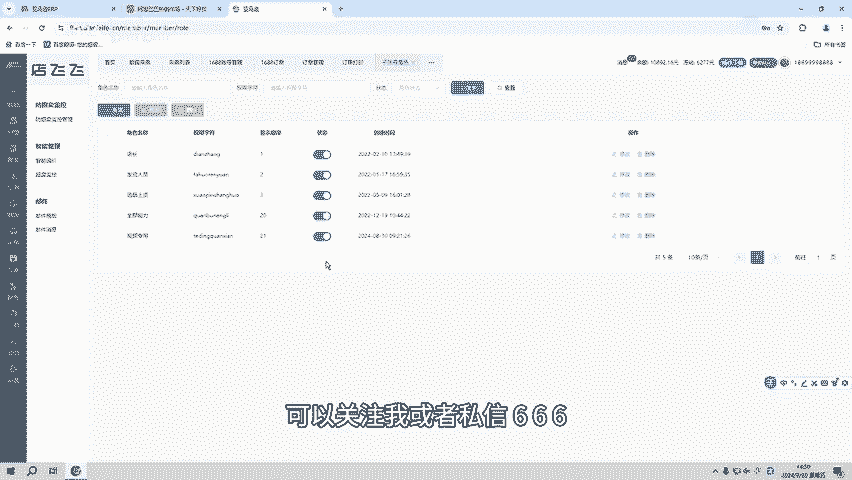