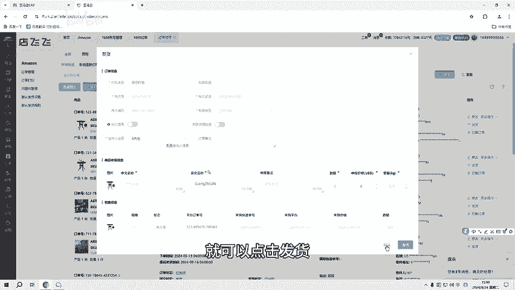

# 亚马逊全功能erp贴牌，独立部署不限店铺 - P1 - 洋少AL885918 - BV1NRsae9EQs

大家好，上两期给亚马逊卖家们简单的介绍了亚马逊全功能UP的两种模式。这一期就介绍系统中的功能。首先，我们需要在会员中的店铺管理里面去授权店铺绑定邮箱。那店铺授权成功之后。

产品的发布及店铺出单就可以在系统上直接操作和查看。有很多卖家是在做无货源，所以在采购功能中可以绑定1688账号。那当店铺中的产品出单时，就可以去到1688中采购需求产品系统就会自动同步。

采购单号及国内物流单号出单产品就在订单功能的订单管理里面显示，这里可以选择店铺，在这里可以对订单进行发货等操作。将产品的打包，有中转仓及自己打包。

在包息中填写采购国内物流单号及选择平台自己其他的按需求填写完之后，就可以点击发货。在订单打印中是可以对发货产品进行打印国际订单。那订单的物流信息可以在订单管理的，以发货中找到订单的店铺信息。

国际物流单号的点击按钮，和查看物流信息，最后就是客服功能在工具功能的邮件信息中可以查看店铺的所有邮件信息，以暂时收发。除了以上功能以外，系统中还有财务汇总，可以查看订单成本及店铺绩效等等，以及预密试算。

如果是自己打包，就可以在物流认证中去添加自己合作的物流商对于抢购物车的辅助工具系统是由定时上下架和防登卖监控智能调。

价等等，其他辅助工具有自动虚拟发货、超卖监控帮同行恶意竞争等等。最后，员工管理在会员功能的子账号角色中，可以先分配子账号的功能，再到子账号管理中添加其管理子账号。

一同开始定制品牌名称logo以及独立部署等等。所有功能全开图设限，且无二次收费，以次付费终身使用。同时终身免费更新系统。如果你想了解系统的功能操作细节或者实操压题，可以关注我或者私信666。

