# 亚马逊全功能erp，双模式一体化可定制贴牌 - P1 - 洋少AL885918 - BV18JsQeEEUN

大家好，亚马逊卖家们都知道，在行业里面流传着一句话，七分靠选品，三分靠运营，所以高效的选择质量好的商品是至关重要的。这个时候可以使用ERP系统辅助选品。

那今天推荐的这一套ERP系统是拥有扑火和跟麦刷模式选品，可以自由选择随意切换或者互相辅助选品等等。先简单的介绍这两种模式的选品。

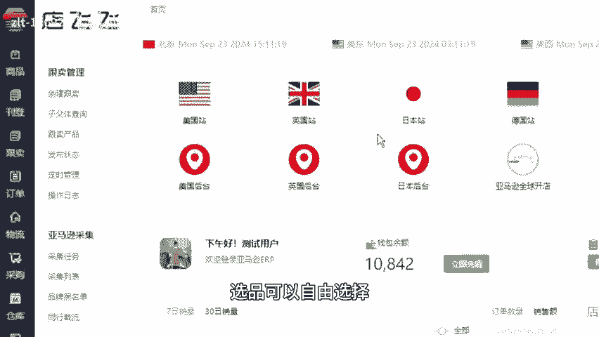

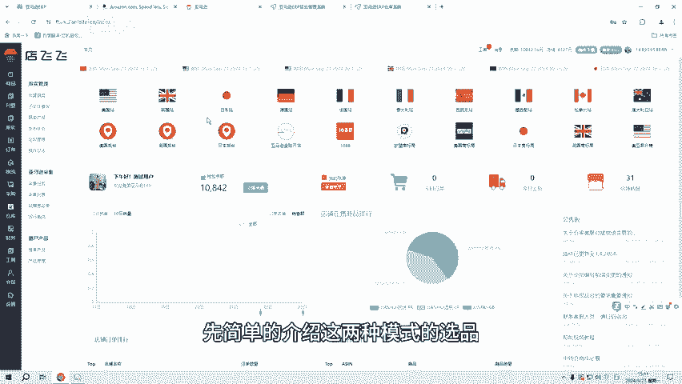

补货模式的选品是支持国内外多平台采集选品，可以海普和金普采集到的产品在系统的刊登数据采集中显示可以导出。

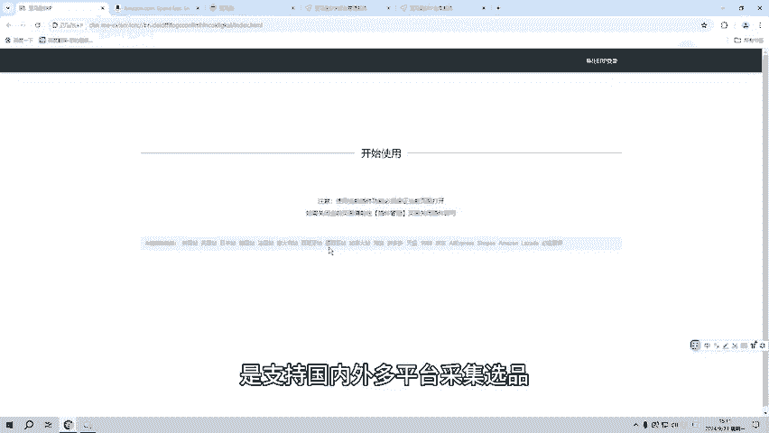

也可以在系统中批量对产品进行文本和图片的编辑翻译，同时也可以精细化编辑商品的产品信息、图片信息以及商品属性信息。

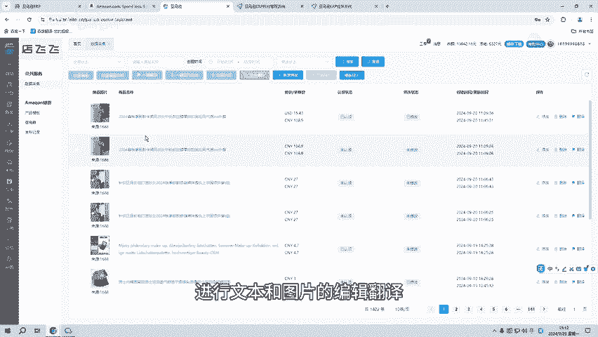

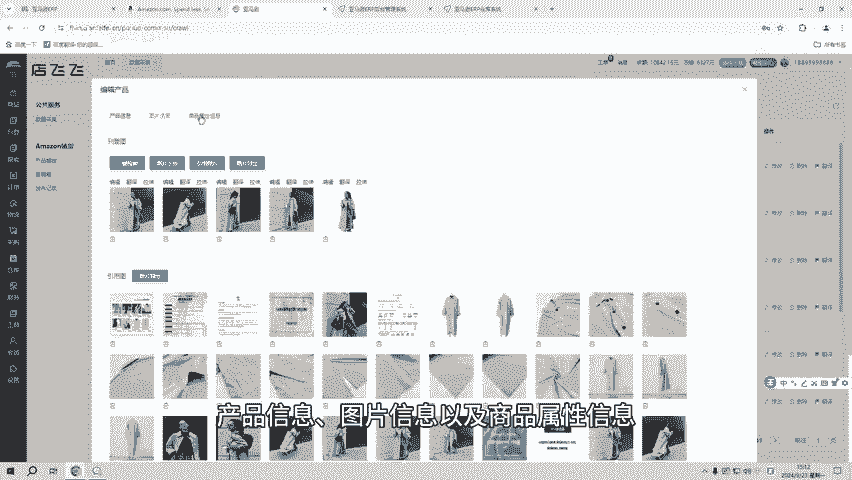

那图片信息是支持在线去编辑图片的。

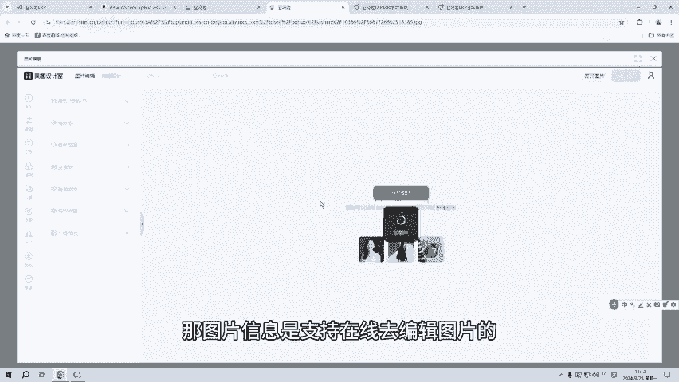

以及图片的在线拉伸嗯等等产品的文本及图片也是可以在线翻译成需求语言。那当所有信息修改翻译好之后，就可以任为产品到草稿箱，在草稿箱中找到产品点击修改，可以生成商品的SKU以及产品的IDUPC等等。

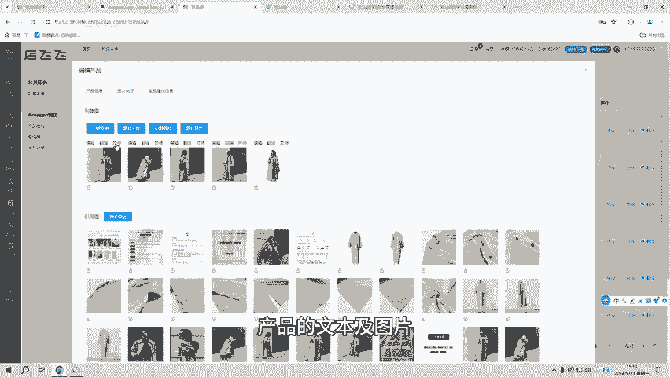

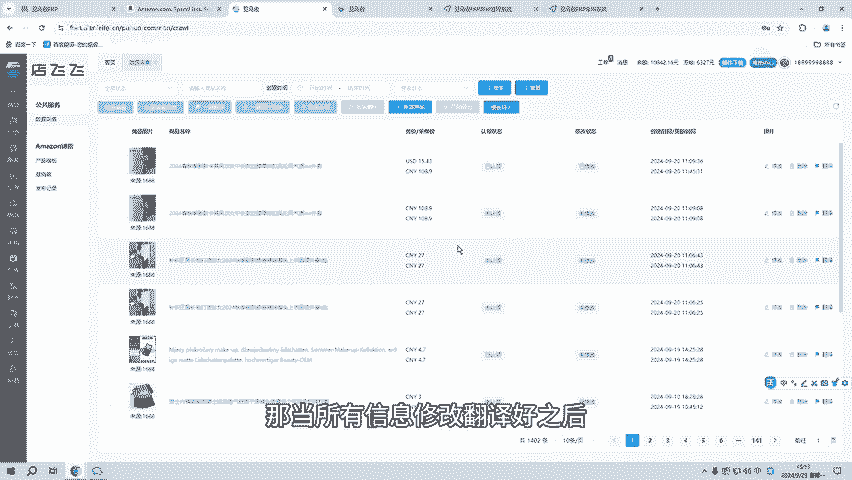

那跟麦选品是支持所有站点采集，多种采集类型是随意切换，或者互相搭配的采集采集结果。在采集列表中显示，可以对采集到的产品进行导出认领商选以及竞品分析。那采票的产品数据都是实时数据。

且备案状态是对应站点商标局的实时数据，选择产品点击同步，就可刷新选众的产品的所有数据信息，更新产品的最新数据。不管哪种选品模式，产品发布到店铺中都可以设置自动抢占购物车以及订单的自动虚拟发货。

如果想了解详细的采集选品的操作或者实操感受ERP系统，可以关注我或者私信6666。

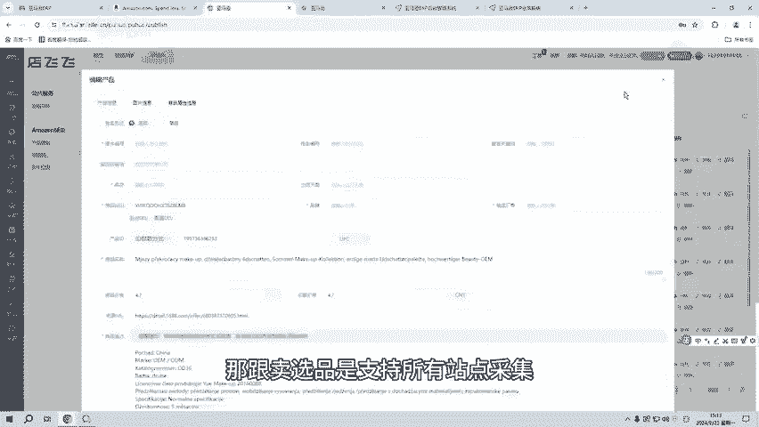

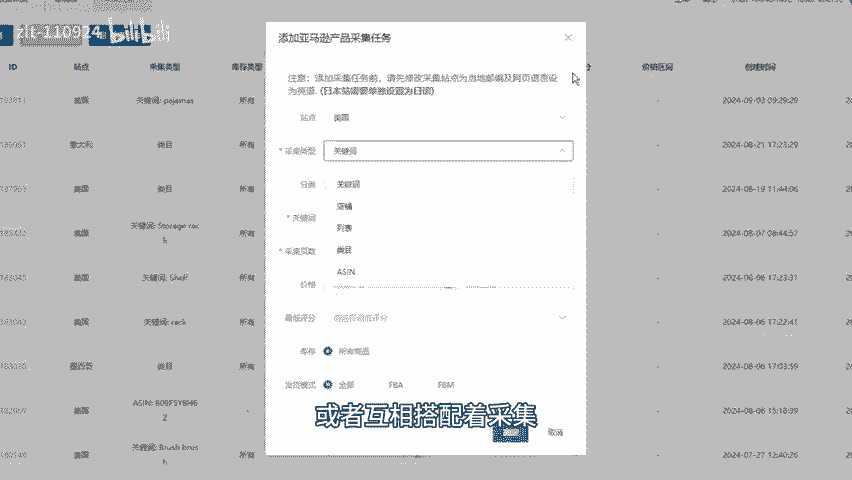

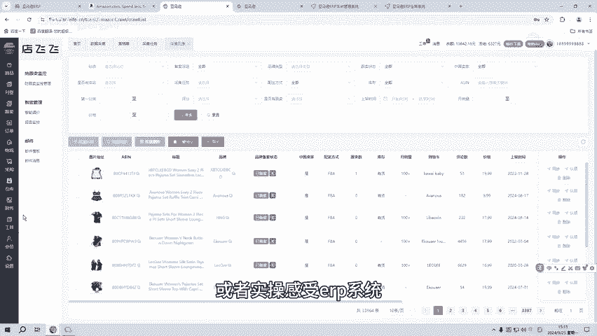