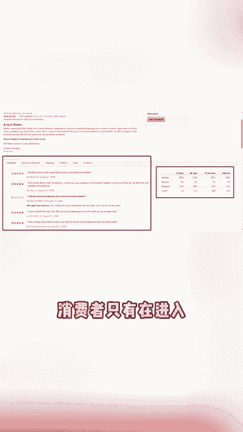

# 亚马逊前台显示迎来重大变动，FBM卖家天塌了？ - P1 - 紫鸟浏览器 - BV1TsxWeNEyX

🎼亚马逊产品详情页开始显示feedbackFBM卖家的偏要他了。和产品review不同feedback是针对卖家和店铺的整体服务给出的一个评分。具体包括卖家的服务态度、交易过程、物流速度和售后支持等。

以前消费者只有在进入卖家店铺页面时，才能查看具体的feback评分。但现在买家在浏览产品详情时就能直接看到这一评分情况。这就导致消费者在下单的时候，考虑到不仅仅是产品本身了。

还有卖家服务产品物流时效和售后服务等也会成为影响产品转化率的因素。这次更新后，对FBM卖家来说将是一大挑战。与FB卖家相比，自发货的卖家将需要更加关注物流和售后方面的问题。

避免其影响店铺整体评分进而影响销量。更别说现在美国LA工会罢工在即上万集装箱将积压在港口。整个美国东海岸都将停滞。别说FBM卖家就连FB卖家也很难保证物流情况。😊。

