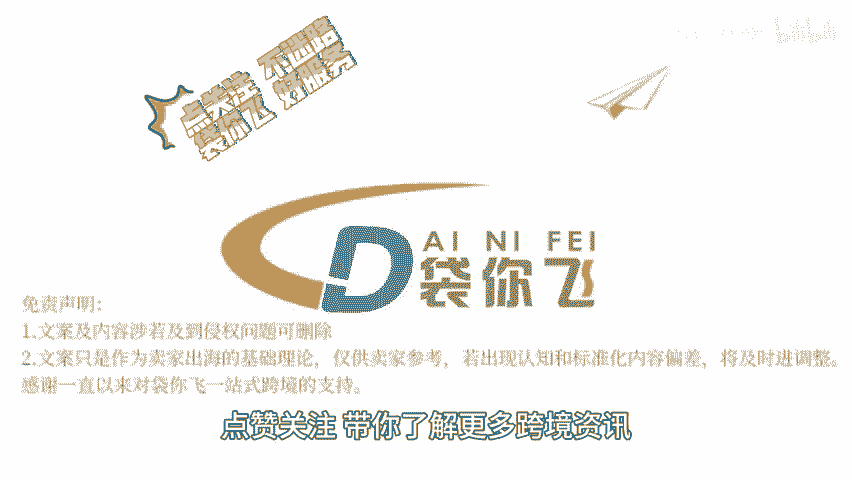

# 亚马逊前台页面更新 - P1 - 袋你飞进亚马逊课堂 - BV1hymHYuETn

🎼Yeah。

🎼欢迎收看带你飞电商小课堂。今天我们来了解一下亚马逊搜索结果页面。商品详情页面的更新变化。近期亚马逊搜索结果页面和商品详情页面的更新，卖家应该确保填写完整的产品属性，以增加在搜索结果中显示的机会。

从而提高点击率和转化率。亚马逊前台页面新增了关联词推荐和品牌旗舰店推荐两大流量入口。小型卖家可以通过精准设置，关键词来抓住这些新增的流量机会，同时，品牌旗舰店的推广也成为提升品牌曝光和转化率的关键。

亚马逊引入了AI购物助手他通过智能问答，帮助用户找到所需产品。卖家需要关注ru的运行逻辑，优化产品详情页和评论，以获得ru的推荐。亚马逊后台的更新，鼓励卖家增加广告投入和参与促销活动。

小型卖家应该合理规划广告预算，利用亚马逊提供的广告工具，和促销功能来吸引。😊，🎼消费者亚马逊前台页面出现了定价没有竞争力的标签，这要求卖家在保持价格竞争力的同时，也要注重产品差异化，以避免价格战。

总的来说，卖家需要密切，关注亚马逊前台页面的变化，及时调整运营策略，以适应这些变化，并抓住新的增长机会，点关注不迷路，带你飞好服务，点赞关注，带你了解更多跨境资讯。😊。

