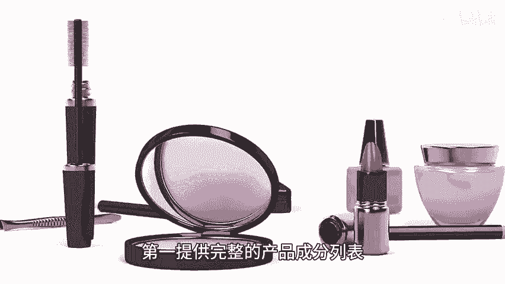
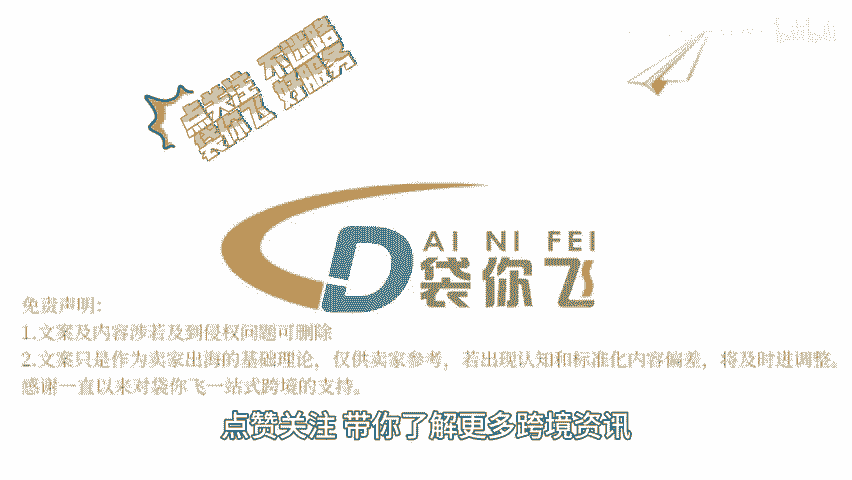

# 亚马逊化妆品品类新规 - P1 - 袋你飞进亚马逊课堂 - BV1sTtZeaEPH

🎼Yeah。

🎼欢迎收看带你飞电商小课堂。今天我们来了解一下亚马逊化妆品品类新规。为遵守美国食品和药物管理局FDA新规定，亚马逊平台销售的化妆品需要在9月24号之前，按照新的指南更新信息。如果没更新信息。

商品可能会被下架。想要只有50块有3点，也能活得相完整的产品成分列表放心买或者文字。第二，如果产品或者里面的成分被归类为药品。那相关的药品信息也要提供。第三。

产品的名称、用途、数量、成分含有制造商信息需要写清楚。亚马逊平台对化妆品的定义广泛，洗发水、染发剂、牙膏和除臭剂，这些也算化妆品品类，建议卖家仔细检查上架商品FDA对化学换肤产品的监管也加强了。

如果产品可能会对皮肤造成严重的伤害，比如烧伤感、疼痛感，产品信息需要合规，更新产品信息后需要等个2到4小时。😊。

🎼在系统里看到变化，建议卖家提前准备，确保自己的产品都是合规的，这样才能避免不必要的麻烦和损失。点关注不迷路，带你飞好服务，点赞关注，带你了解更多跨进资讯。😊。

