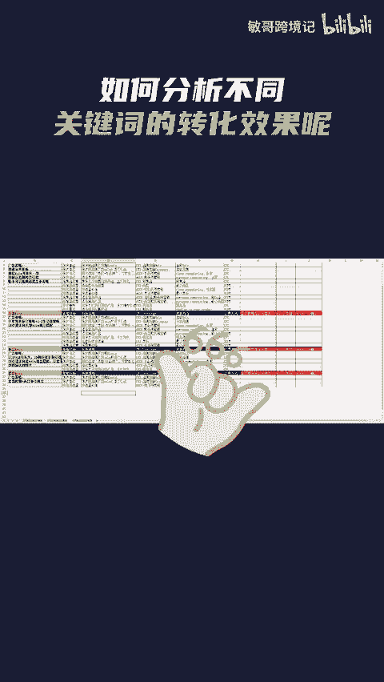

# 亚马逊卖家如何快速分析自己的产品，在不同关键词下的转化效果？ - P1 - 敏哥跨境记 - BV1SSsoeAEpV

🎼亚马逊卖家怎样才能清楚知道不同关键词的转化效果呢？这里我们要用到卖家精灵的关键词反查功能，在这里输入产品的4就能反查出产品的出单关键词是哪些了。像这样的转化优质词，就是能给产品带来流量和转化的词。

而像这种转化平稳词，卖家们可以适当加一点预算，增加产品曝光，而这种无效曝光词，卖家们可以看一下旁边的这些产品图，如果与自己的产品不相关的，要及时否定掉转化流逝词就是之前转化还可以，但现在已经不行了的词。

这种词，卖家也可以去对比一下相关性，分析一下流逝的原因。最后我这里有一份亚马逊广告每个阶段的不同打法策略，有需要的卖家点赞评论666给你安排。

