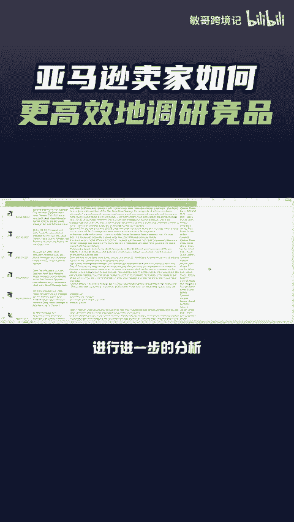
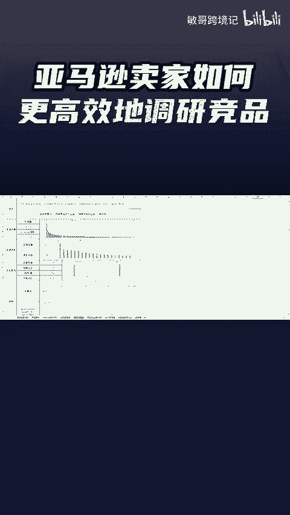

# 亚马逊卖家如何快速去分析所有的竞品？ - P1 - 敏哥跨境记 - BV1NUxseBE95

🎼如何快速高效的去进行竞品调研呢？选品的时候，竞品调研是必不可少的部分。卖家们一般都会在亚马逊前台输入产品关键词，然后再去找出与自己产品将类似的产品一个个去进行分析，但这样太浪费时间了。

卖家们只需要点击卖家精营的链接生成器功能，在集合链接下面将竞品的s复制进去，一次性最多可以输入200个s，点击生成链接，接着工具就会生成。一个专属于你产品的竞品链接，打开链接。

可以看到刚刚你输入的所有的产品都集中在了同一个页面中，卖家们还可以将这些竞品的数据，一键导出来，进行进一步的分析，帮助卖家高效的进行竞品调研，提升我们的工作效率，最后我这里有一份亚马逊类目开发分析模板。

有需要的卖家点赞评论666给你安排。

