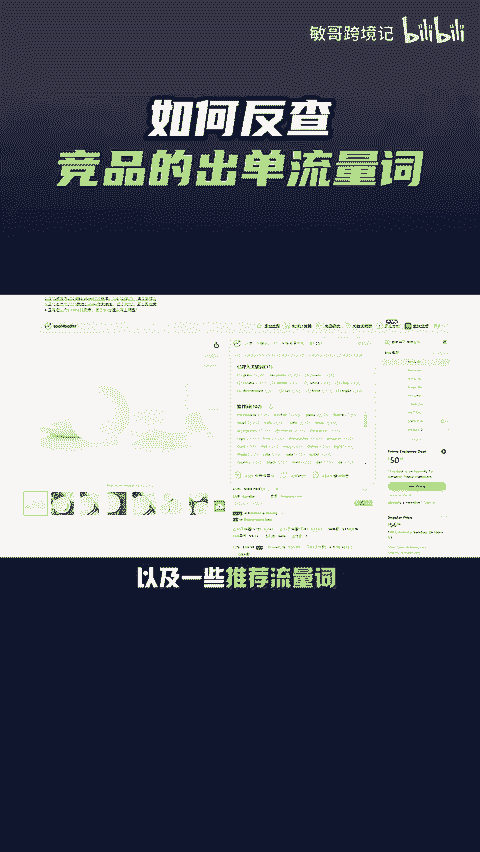
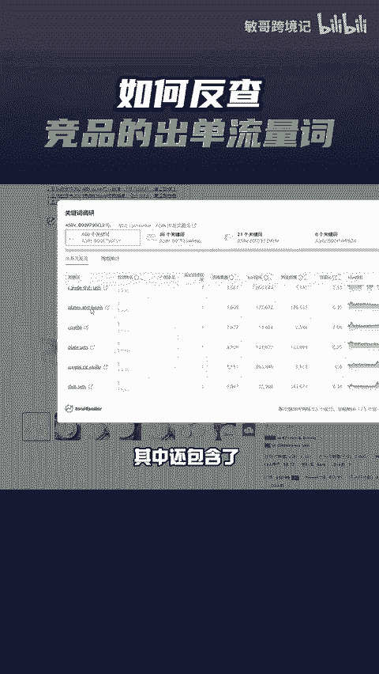

# 亚马逊卖家如何快速反查出竞品的出单流量词？从而找出与竞品的差距 - P1 - 敏哥跨境记 - BV16h2JYjEns

🎼同一款产品，为什么竞品的转化率就是比你好，如何快速反查竞品的出单流量词，从而填补自己的流量缺口呢？一个免费工具帮你搞定。安装之后，打开竞品的listing页面，点击这里就能反查到竞品来了哪些关键词。

以及一些推荐流量词，点击这里就能直接反查到该竞品的出单流量词了，其中还包含了排名搜索量、竞价等数据。

🎼除此之外，该工具还能对listing评分，并指出需要优化的部分，反查竞品的search term等等。有需要该工具的卖家点赞评论666给你。

