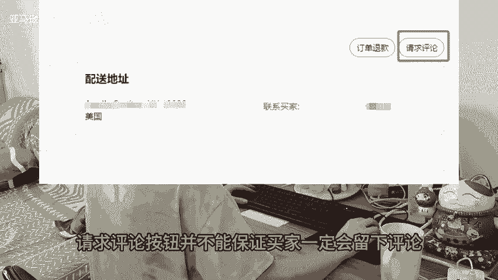

# 亚马逊卖家推新品，前期如何获取评论？分享几个安全增评的方法！ - P1：studio_video_1727271506751.mp4 - 亚马逊跨境玲子 - BV1YPxge3E1p

🎼评论对于新链接来说至关重要，如果没有好评，那么你打广告的成交率也并不高。还爆了我们要如何安全的获取评论呢？下面给大家分享三个方法。一、参加案计划。如果你的产品竞争不是很激烈。那么注册两个即可。

只是损失产品成本和亚马逊配送费不收外注册费用。当然，预算充足的话，可以直接30个名额拉满。2、使用请求评论按钮，这时亚马逊平台自带的安全可靠的增评方式，在后台订单的页面上有一个请求评论按钮。

卖家可以向一定购的买家发送邀请评论的邮件。不过需要注意的是，请求评论按钮并不能保证买家一定会留下评论，且也有大概率留下差评，所以，产品质量过关很重要。

3、可以尝试建立自己的FB群组寻找潜在买家通过赠送产品的方式邀请他们进行评价。一般都是真实的买家账号。

🎼比直接找服务商测评的安全性要高。关注我，每天学习一个亚马逊小知识。Yeah。

