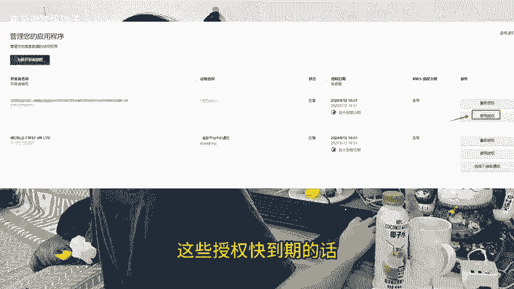

# 亚马逊卖家注意了，别信息泄露了还不知道，这个地方一定要去检查，提高账户安全性。 - P1：studio_video_1727170633842.mp4 - 亚马逊跨境玲子 - BV1CBsYepEWr

🎼亚马逊新手卖家注意了，凡是之前找过代运营的，找服务商修改过品牌或者品牌备案的，找服务商进行过店铺申诉等等系列操作的。下面这个功能一定要定期点进去检查。不然你的店铺信息泄露。还不知道打开店铺后台。

点击右上角设置，找到用户权限功能选项，在这个页面找到第三方开发人员和应用程序，点击进去，这里面就会出现我们全部授权过的机构服务商，如果有些授权是你不知道的，一定要选择禁用授权。

那么你的店铺信息就不会莫名其妙的被泄露了。同样如果是需要经常用到的授权，比如第三方授款ERP等等这些授权快到期的话，可以在这里去延长有效期。亚马逊昨天也刚出了一则政策。

平台每季度都会从卖家的账户中移除处于非活动状态，超过12个月的刺激用户，主要是为了更好的保护卖家平台账户，并确保卖家的数据安。

🎼全提高账户的安全性。关注我，每天学习一个亚马逊小知识。

Yeah。

