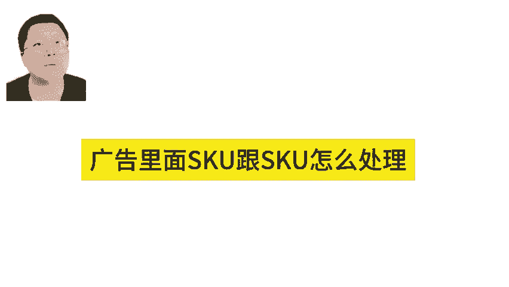
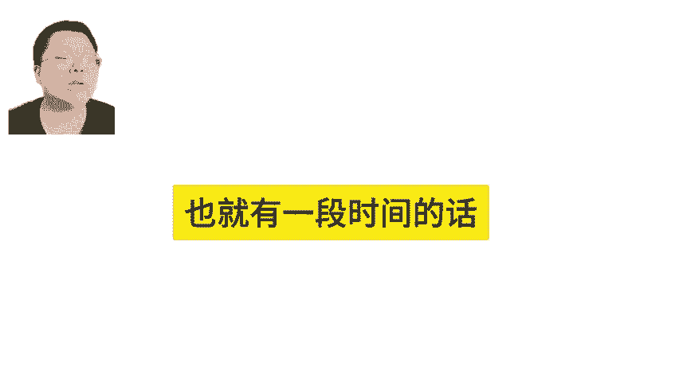
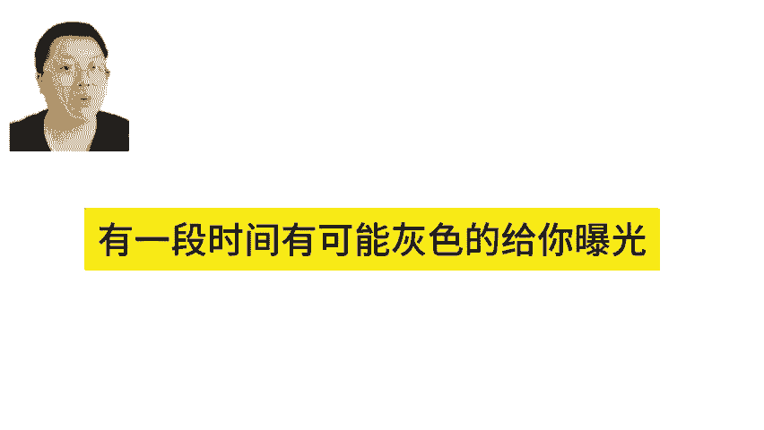
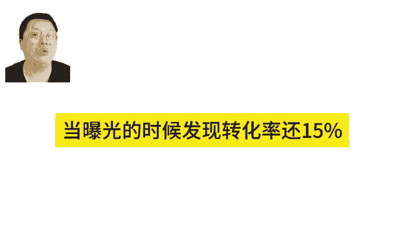
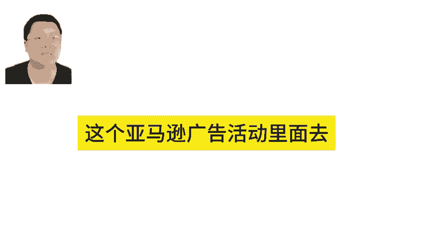
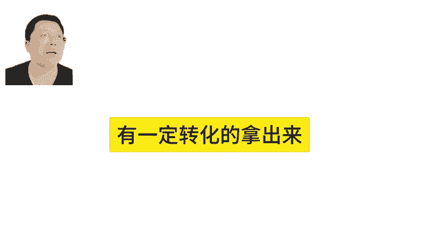

# 亚马逊多变体广告SKU与曝光的技巧！亚马逊广告技巧 - P1 - MoonSees - BV1WnxkeSESg

如果说是同款，然后不同颜色来打的话，那么这里面的话能会涉及到SKU广告里面SKU跟SKU怎么处理问题。你是把两个SKU都放在一起的话，它就会有轮换曝光，也就有一段时间的话，它有可能是绿色的给你曝光。

有一段时间有可能灰色的给你曝光。那么如果说是绿色的曝光点击率不错，转化率10%，如果是灰色的话，当他曝光的时候发现转化率还15%。这时候灰色的就更容易去抢到这个曝光这个逻辑啊。

所以它会有个轮换曝光的概念在这里面啊，所以这个你如果要解决的话呢，就是在初期的时候，广告你可以去测广告SKU这时候你测广告SU一般是自动广告册，你可以放几个你看好的颜色丢到丢到你的SKU啊。

这个广告活动里面去，把那些啊这个叫点击还不错，有一定转化的啊，拿出来。拿出来以后的话。

单独投注意这接下来的话，你已经测出来了。那接下来广告活动就单独投一个广告活动，1个SKU就考好了，这个时候就不会有轮换曝关这一说。

