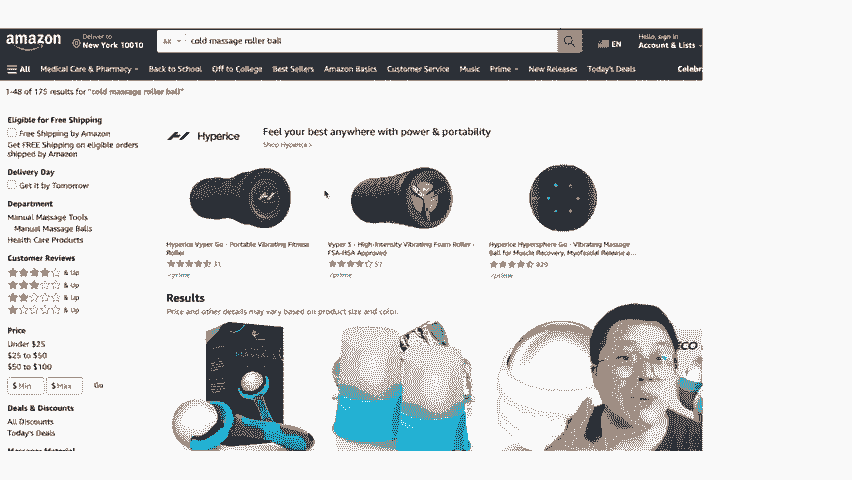
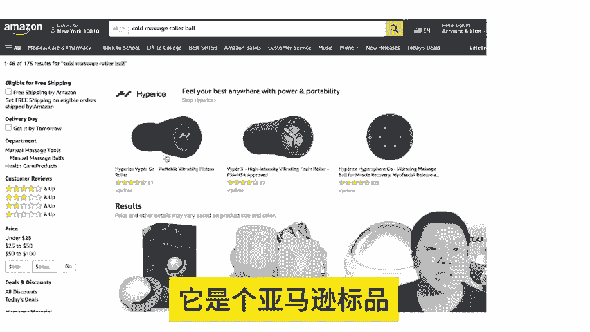
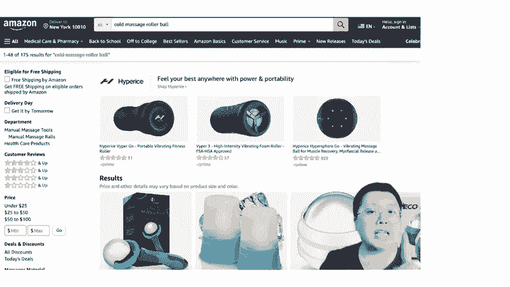
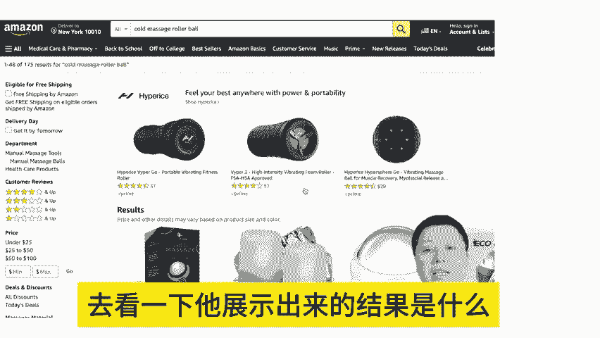
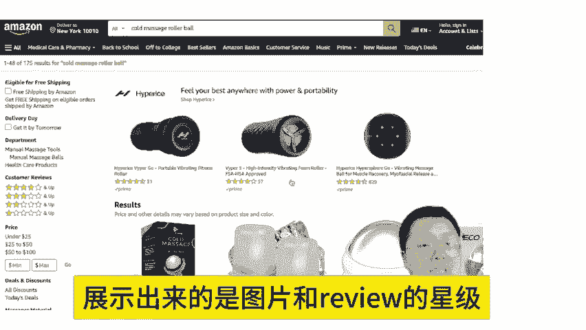
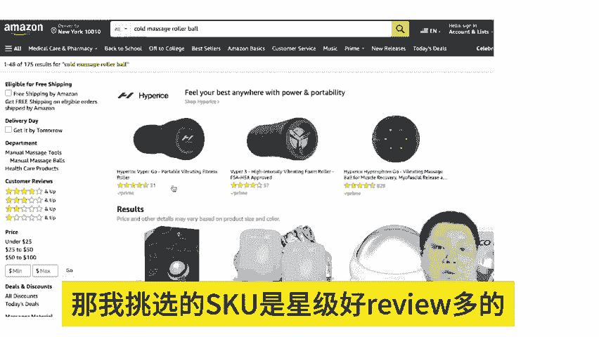
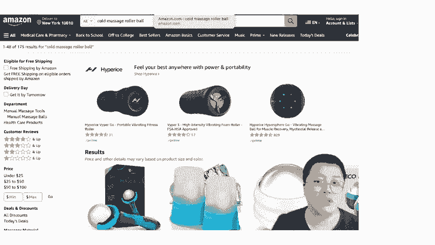
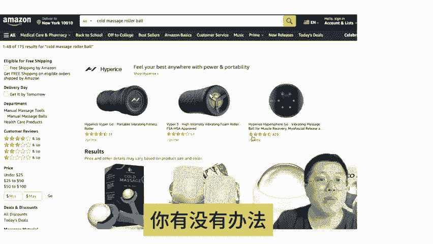
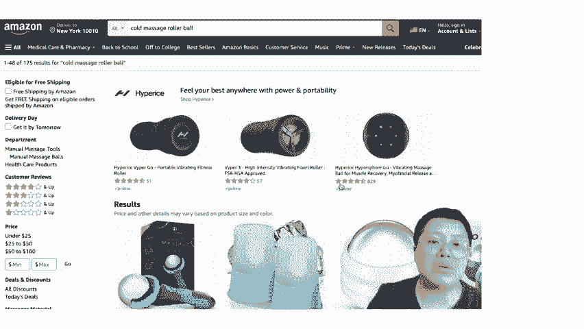
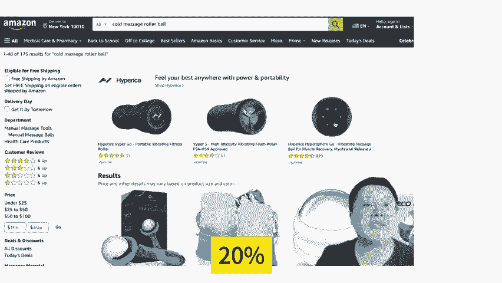

# 亚马逊多变体广告卡排名的正确投放思维 - P1 - MoonSees - BV1jPsSeDEE5

这样的一个关键词进来以后，在这个头部你控不住的时候，我有办法控住。

因为你知道你你要打广告，最佳的策略是是它是个标准比，你要出现在头部这两行或者三行。那你接下来有没有能力给我打到这三方去。好，我有我就去借工具。第一，如果要在这个位置。

我就是SBC广告开起来SBC广告关键词你有找对找完以后去看一下它展示出来的结果是什么？哎有发现展示出来的是图片和review的星级以及星级个数，那我挑选的SQ一定是星级好review多的，同时啊。

同时关键词匹配度比较高的。这个就是我的逻辑，同时位置能不能卡呢？比如说出现在这个头部，你有没有办法能够去卡吗？就你有没有办法去卡住这位置吗？有我可能会用到一个三方工具，如果我在SBC广告当中。

如果有机会出现在搜索的头部，也就这个位置，我愿意他加价20%，这样我就能。

能卡得住。