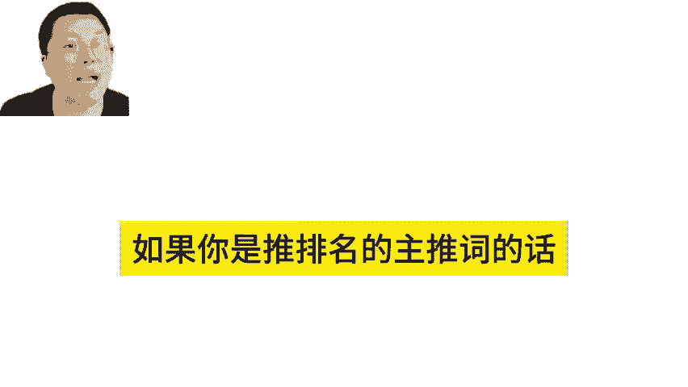
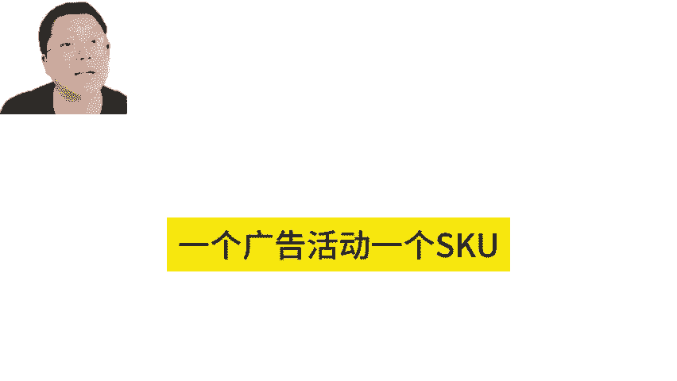
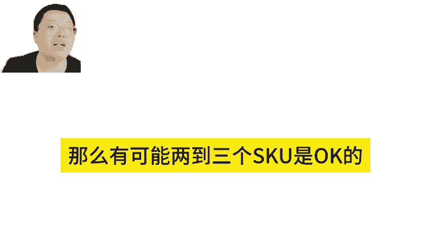
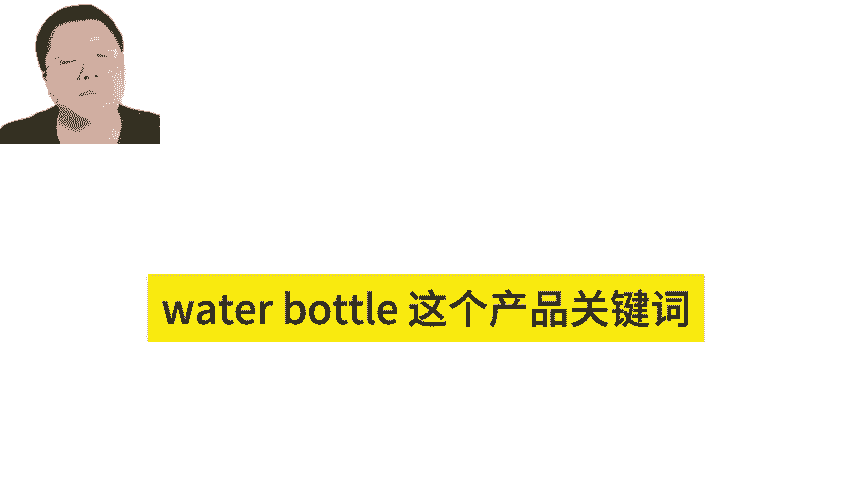
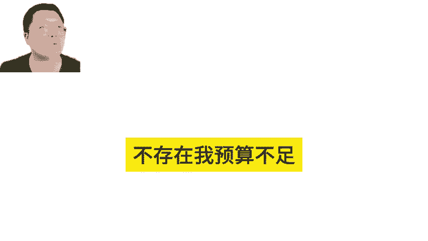
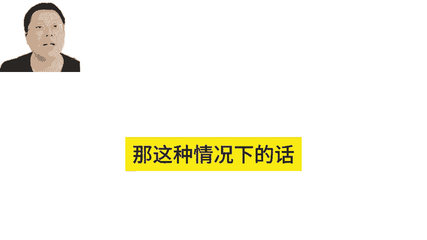
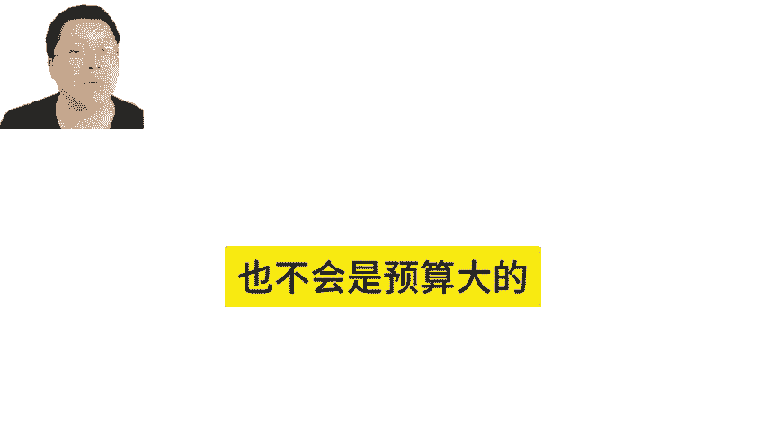
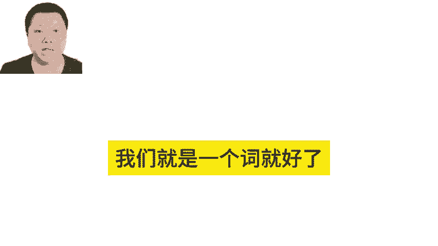

# 亚马逊多变体推排名的关键词数量技巧 - P1 - MoonSees - BV1WK2nYpEVQ

一个广告活动，一个SKU建议加几个关键词。如果你是推排名的，主推词的话，一般来说一个广告SKU一个就可以，这是最可控的一个广告活动一个SKU精确匹配推排名，这最可控的那同时的话呢如果你预算很丰富。

都是大词。那么有可能2到3个SQ是O的。比如说我们一些头部的卖家就卖water bottlewater bottle这个产品关键词。那这时候我的投放的话就有可能把2到3个关键词也放在里面精确匹配。

那么因为我预算充足啊，不存在等一下我预算不足抢预算的情况，而且关键词都是大词。那这种情况下的话，不会是一大一小，然后小的没流量，大的有流量啊也不会是预算大的吃走，那小的没有吃走的情况。

那这时候的话我们就是一个词就好了。

