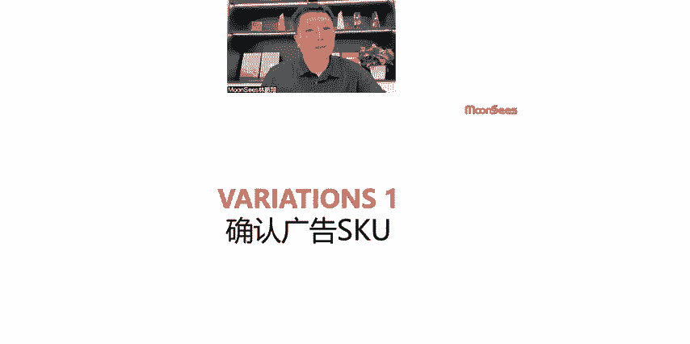
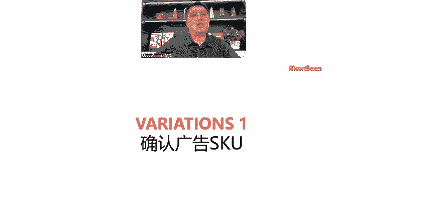
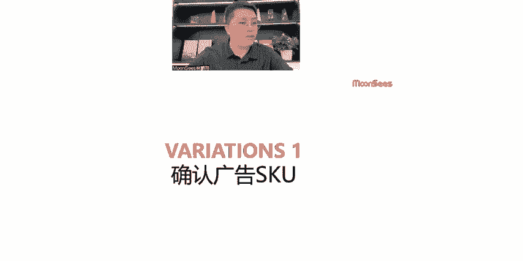
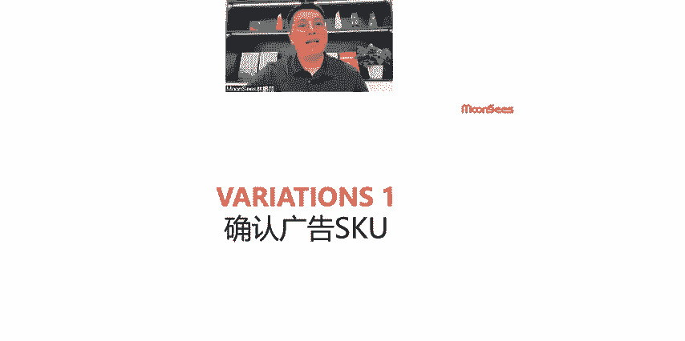
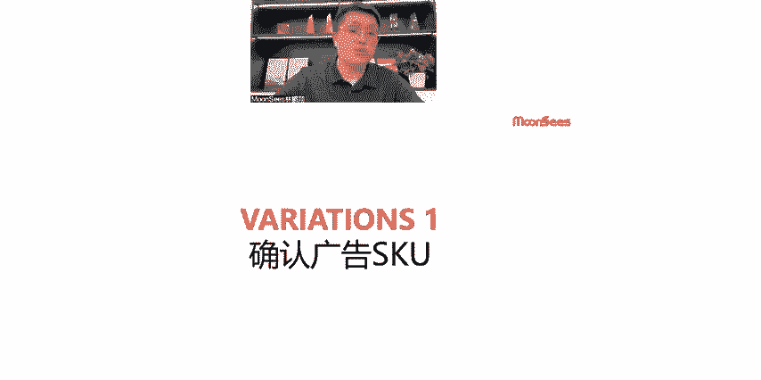
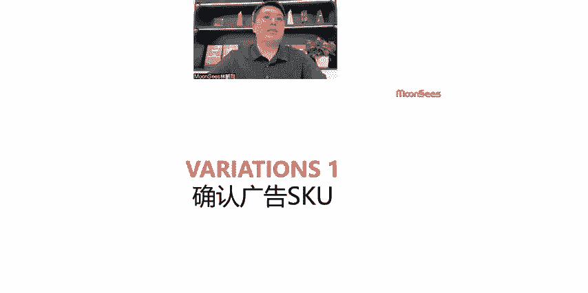
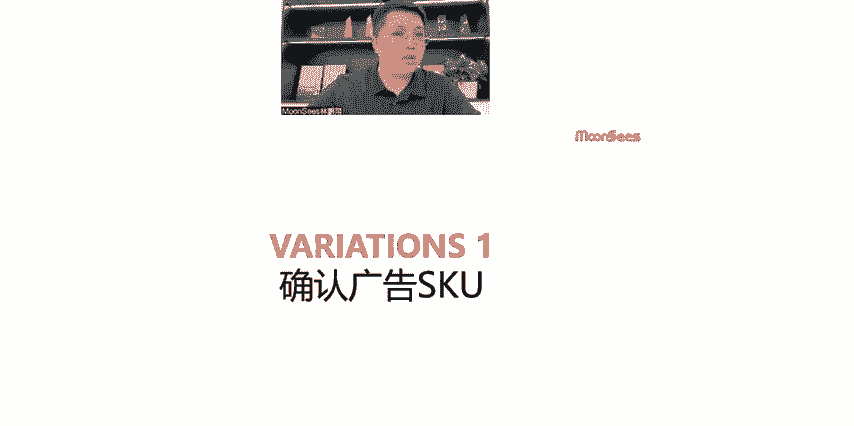

# 亚马逊多变体确认广告SKU的底层逻辑 - P1 - MoonSees - BV1kSmKYSECS

好，所以多变题的广告的话，首先我觉得第一点比较重要的事情是确认广告的SKU既然是多变体，那么你的广告又希望这个能够有主次之分。

但是先先要去希望去确认你的广告SKU的广告SKU当然不会是不会是随便啊找一个产品上来，对不对？他一定会去具备一点特征的，就是我们比较好的广告SKU如果是通过什么呢？通过呃流量这个角度出发。

那么你的强广告SKU应该就是那个关键词收入特别多。

啊，关键是收入特别多，标签痕迹很明显的强SKU这种广告就这种SKU就会在流量上占据一定的优势。第二个呢，如果是从形态上去考量的话，你可能会去考虑这个产品的款式是经典款。这个款式是你这个所有款当中的话。

比如流行的比较好的流行的那这个会考虑它的整体的款式点击率等这个因素，所以这个是第二个层面上可能可以考虑的。第三个考虑呢广告呢大概率我们会找的SKU是库存相对充足的。评分比较高的。因这些维度去考量。

所以确定广告的SKU这个逻辑来讲的话是需要啊，你很明确的去明确目标的。

