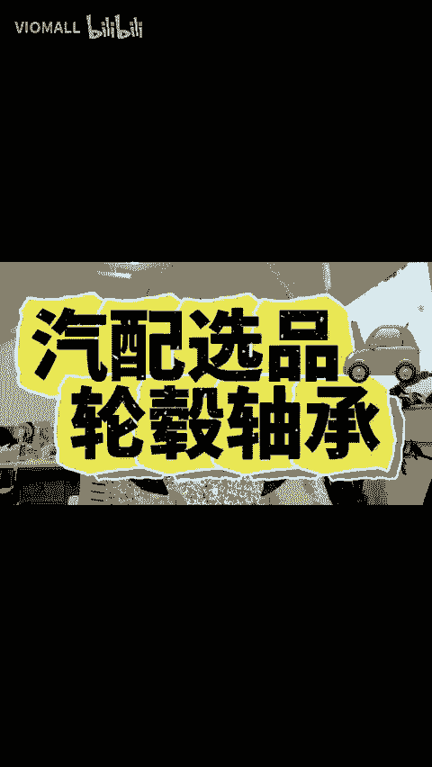

# 亚马逊大促定档10月11日！收好这期汽配选品推荐，抢先一步上架销售，接住大促时的泼天“自然流量” - P1 - VIOMALL - BV1EitoeXEkj

🎼汽车轴承坏了，是换一个还是4个呢？一代轴承的缺点是什么呢？那如何安装轮毂轴承呢？这些问题啊可是在谷歌指数上搜索量非常大的关键词。看来轴承的用户群体还是真的不小。大家都知道小助理是做汽配供应链的。

一直以来呢都在给大家推荐优质的汽配供应商和非常有潜力的汽配产品。那这期轴承的汽配全品推荐也建议大家点赞收藏慢慢观看。那汽车轮毂轴承作为现代汽车行驶的重要组成部分，一直以来呀都是汽配市场的隐形冠军。

从伽利略时代的早期轴承的雏形到20世纪伴随着汽车工业的发展，轴承也都经历了多个技术革新的阶段，成为了如今汽车不可或缺的核心零件。那之前小助理在山东参展的时候，也看到那边的轴承的制造商非常多。

那这个品类里的斯凯佛襄阳的轴承等等的大卖也都非常知迷。那现在轴承在亚马逊上面叫轮毂轴承，那它的全球市场预计到2026年将达到了270亿美元。

而美国市场作为全球最大的后市场轴承的市场呢占据全球的30%的份额。那我们的汽配分销平台上呢，汽配分销卖家们的销售情况也非常出色。平均分销价为70美元。而。😊。

销售价呢可以达到92美元，销售定价倍数为1。39倍。扣除亚马逊佣金之后，分销商的平均利润率还能达到27%。并且目前平台上可供上架的轮毂轴承SQ超过了18000多个。

所以呢想要打着专业的汽配店铺或者贴近美国消费者去DIY市场的卖家可以用轮毂和轴承这样的组合产品搭配去上架提高利润。那这个汽配零件销售特点就比较强。如它的销售周期稳定，市场流量大客单价SQ丰富。

车主替换需求频繁。那由于轴承的专业性，很多车主在购买的时候的年度就比较高，通常有适合的车型的轴承就会反复购买但是有个情况还是得提前给大家说明一下，那就是它的售后问题也同样值得关注。那平台数据显示啊。

该类的产品的售后率为9%，尤其是在非专业买家自行安装的时候容易出现退货损坏等问题。所以呢卖家一定要设置ES汽车适配性插件，并且针对于专车专用的产品进行详细的SQ描述和使用指导来减少售后率带来的影响。

以呢这期的高利润产品，你ge赶上架销售吧。跨境汽配威帽。

