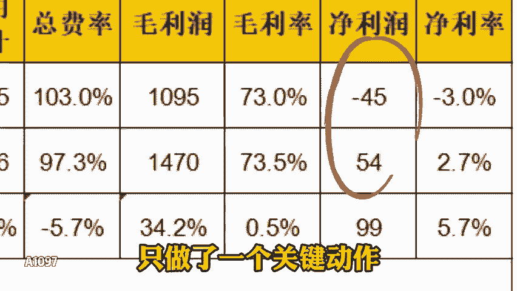
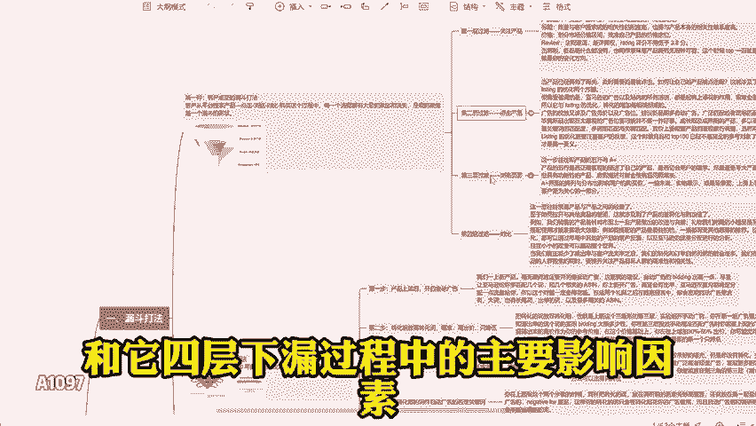
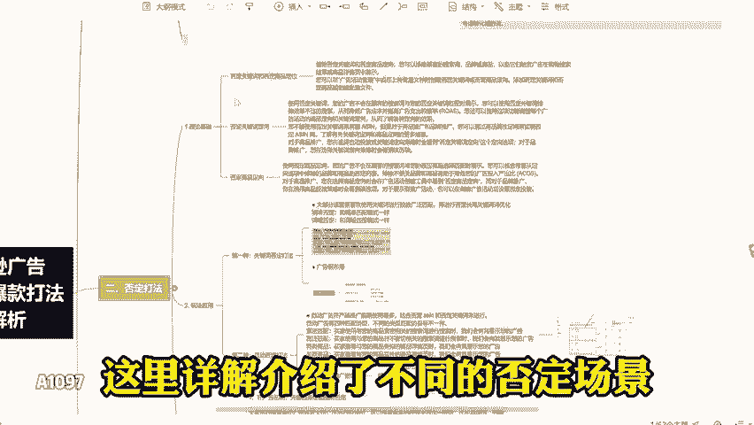
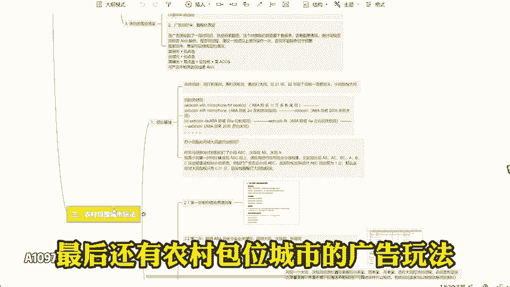
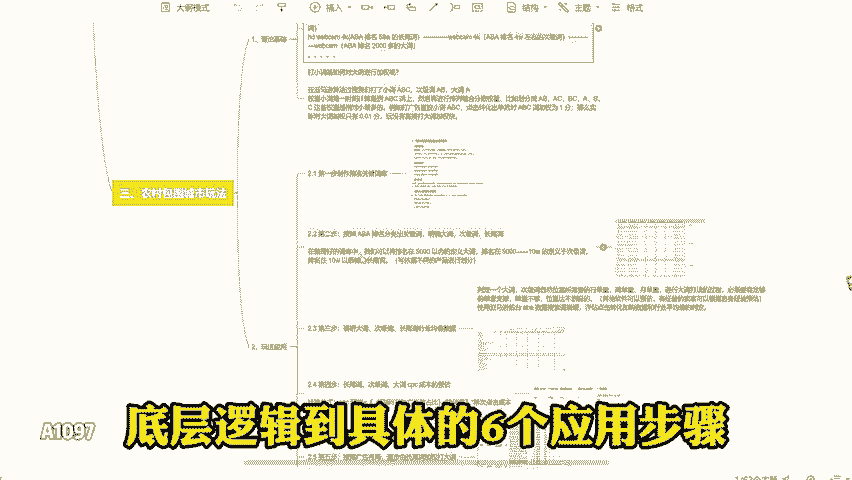
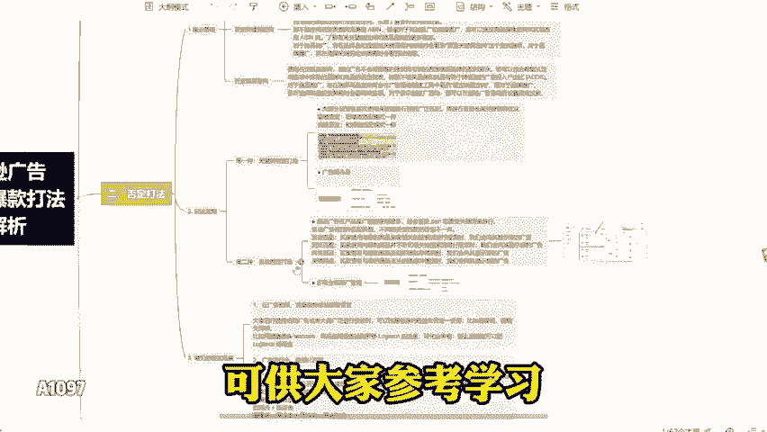

# 亚马逊大麦三种广告打法深度解析 - P1 - 咪咪的跨境日记 - BV1i92NYNEGu

一年从亏300个到盈利300个。这个亚马逊卖家只做了一个关键动作，调整广告策略，看看它是怎么调整的。一共用了三种调整策略。第一种漏斗打法。

主要包含客户成交的漏斗打法和它四层下漏过程中的主要影响因素和相应的布局策略，还有广告的漏斗打法和它的5个布局的关键步骤，都有详细的阐述。第二种否定打法。这里详姐介绍了不同的否定场景。具体操作和实战案例。

最后还有农村包位城市的广告玩法，类似小词带大词的策略，从理论基础底层逻辑到具体的6个应用步骤，都有详细介绍完整版三种常见爆款打法，供大家参考学习。😊。

