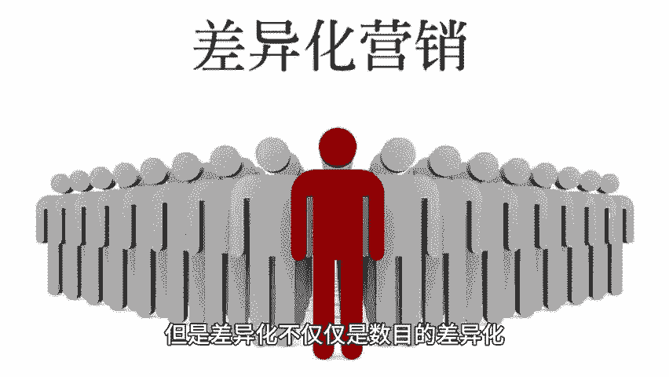
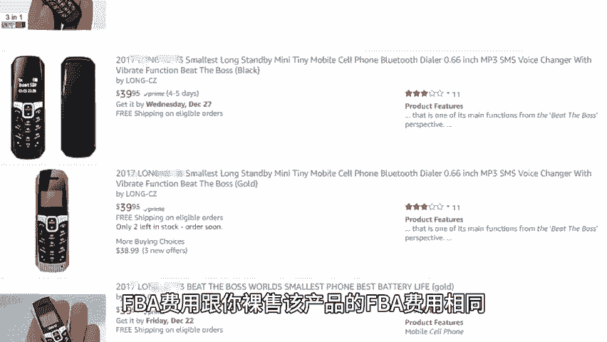
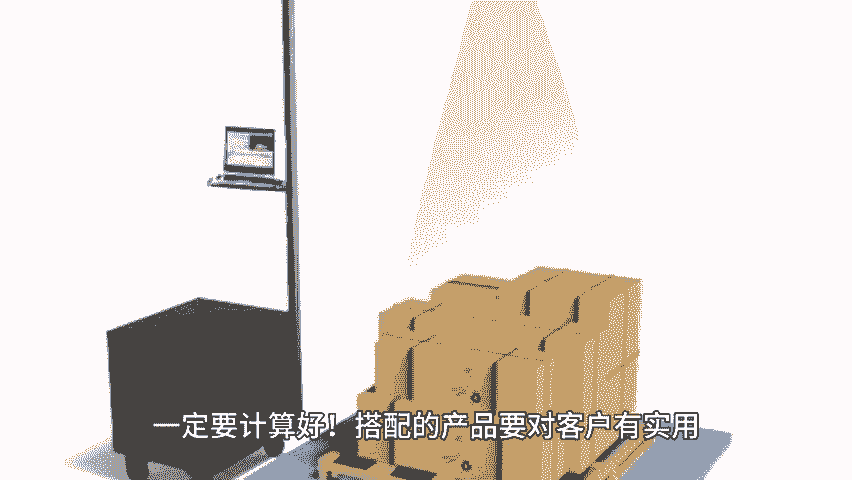
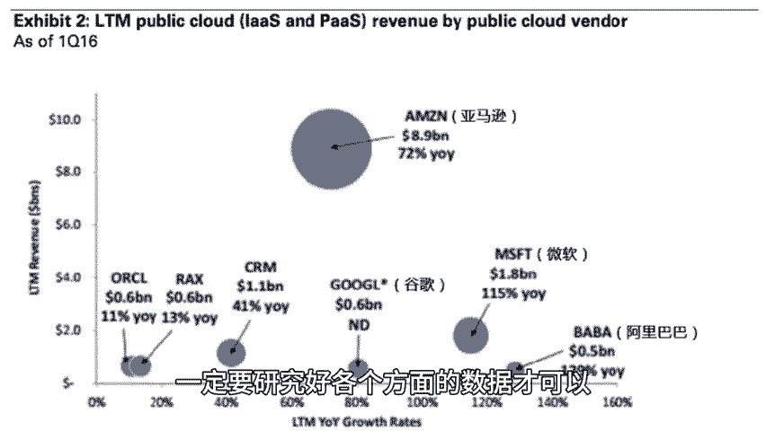

# 亚马逊小卖选品如何打造差异化？ - P1 - 小猛龙跨境俱乐部 - BV14y21YYEqG

🎼差异化有很多种，比如从0到1的创新产品或者是不同的差异化组合。本期小猛龙给大家分享亚马逊小麦选品如何打造差异化，同时为大家准备了亚马逊选品实力。老规矩回复选品，我来安排对小麦来说。

资金资源人员等各方面都有限。就不要想着一上来就搞开幕啥的，我们要做的是低成本的微创新，比如人家上100PCS的组合产品，以上50PCS价格比100PCS的一半，还要便宜，这就是差异化。

但是差异化不仅仅是数目的差异化，搭配不同的产品也是一个非常不错的差异化思路。大家去亚马逊搜索鼠标这个常见的产品，你会收到很多结果。但是如果你搭配一个鼠标店作为赠送，跟竞争对手买相同的价格，那对客户来说。

是不是更有吸引力。而。

🎼增加一个鼠标垫，对你来说，成本本身并没有什么增加。具体来说，小麦可以从以下几个方面入手差异化，调研清楚，要做的产品在市场受欢迎的是几个装的搭配。那么你可以搭配数量比竞争对手多。

但是平均下来单个价格肯定要比竞对便宜些许。一般例如市场都是四个装搭配受欢迎。你卖6个装，8个装便有优势。调研清楚要做的产品在市场受欢迎的都是什么颜色？

那么你卖的颜色在原来市场好卖的颜色基础上增加其他颜色搭配，增加颜色的话，那数量相对也增加了。跟第一点会不会有点重复，不会重复。因为第一点说的数量搭配是清一色的基础上加数量。

我们现在说的这点是颜色基础上增加数量，同类搭配套装搭配，关联搭配，功能差异，外观差异。对了。搭配的对象。

🎼有几点值得我们卖家注意，搭配的产品成本不要太高，否则你的售价cover不住你的成本，赔本赚吆喝有什么意思？搭配的产品体积不要太大，最起码搭配了产品以后，FBA费用跟你裸受该产品的FBA费用相同。

FBA收费有不同的标准，亚马逊卖家大学都有详细的说明，主要考虑的是包装后的重量和体积，一定要计算好搭配的产品要对客户有实用，可以解决客户某方面需求，比如鼠标加鼠标垫组合，鼠标垫对客户来说很有用。

举个天马行空的例子，如果你鼠标加勺子是不是没啥吸引力。虽然客户可能也需要个勺子，总之，不要为了追求差异化而盲目搭配产品组合，我们在亚马逊上卖产品的终极目的是为了赚钱，在上新品之前，一定要研究好各个方。

🎼面的数据才可以，否则面临的就是呆滞库存和昂贵的长期仓储费，天幅有限，获取亚马逊选品资料以及更多亚马逊运营小技巧，点赞、关注评论，带你出海不迷路。

