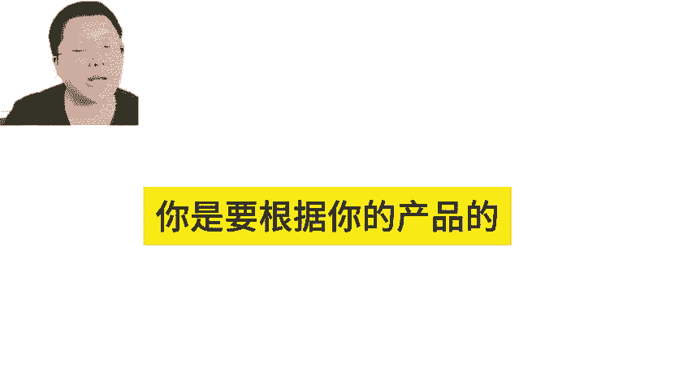
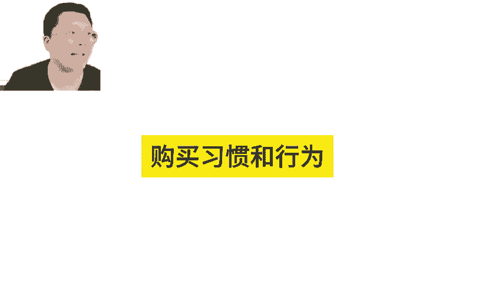
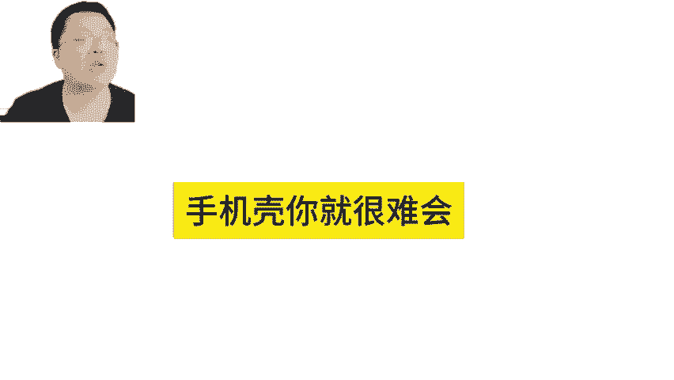
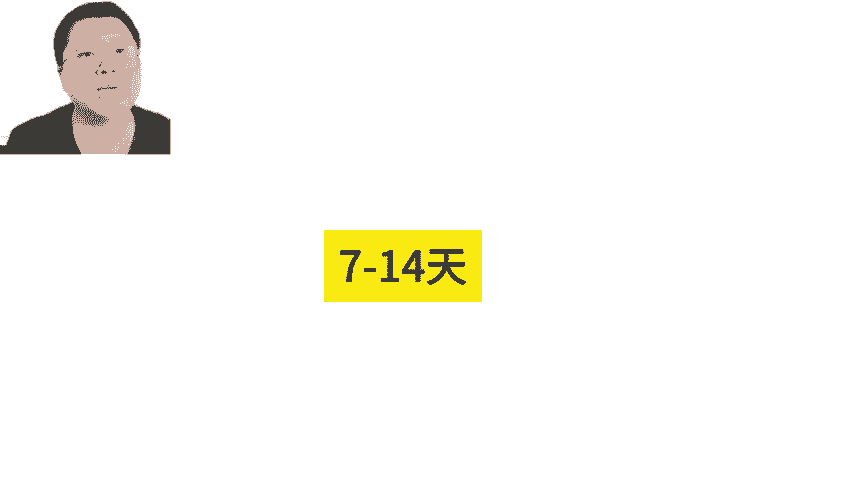
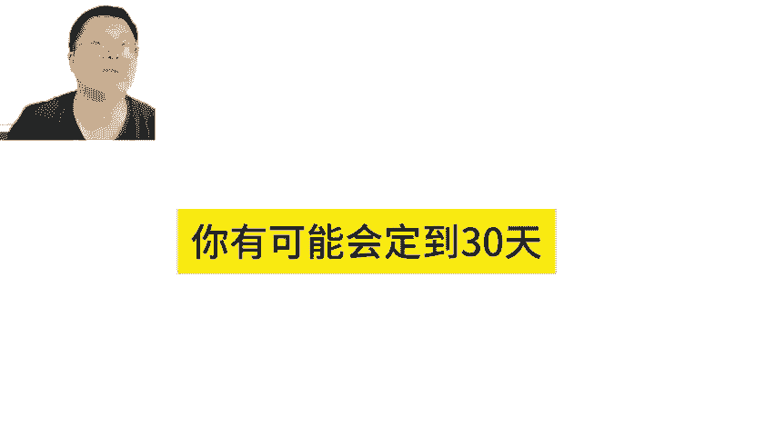
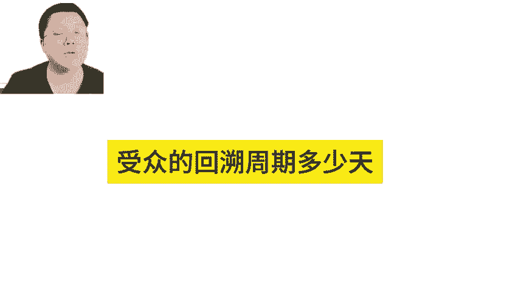
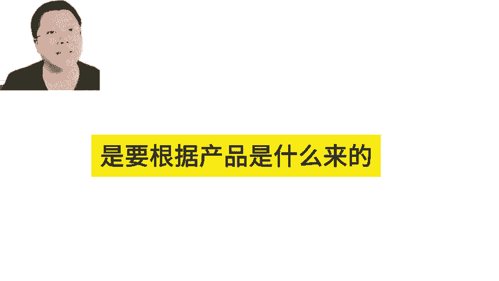
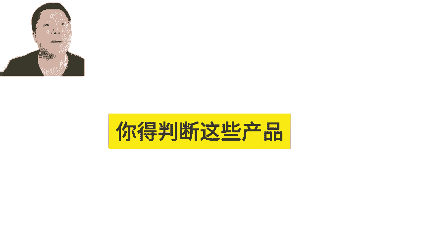
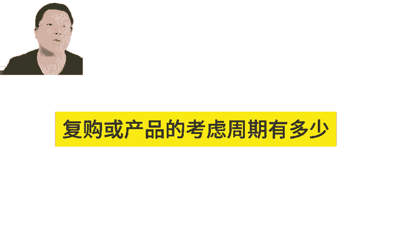

# 亚马逊展示型广告受众回溯周期多少天？亚马逊广告技巧 - P1 - MoonSees - BV1sJxkenEQy

SD广告7到7天14天、30天，还有90天，对不对？这些呢你是要根据你的产品的这个叫购买习惯，购购买行为。比如说你如果买的是袜子，那么袜子它它这个呃做决定的时间可能就比较短啊，像说手机膜手机壳。

你就很很难会这个叫定位到90天，你一般定位7到14天就可以了，对不对？呃，如果说你买的是跑步机，那跑步机啊就高高客能量样的产品，它考虑周期就会比较长，你有可能会定到30天啊，所以你的产品要怎么打。

用受众的这个回溯周期要回溯多少天，是要根据产品是什么来的。这里面呢有一定的所谓的我们这就是一定的技巧，你得判断这些产品的，就是不购或产品的考虑周期有多少。

