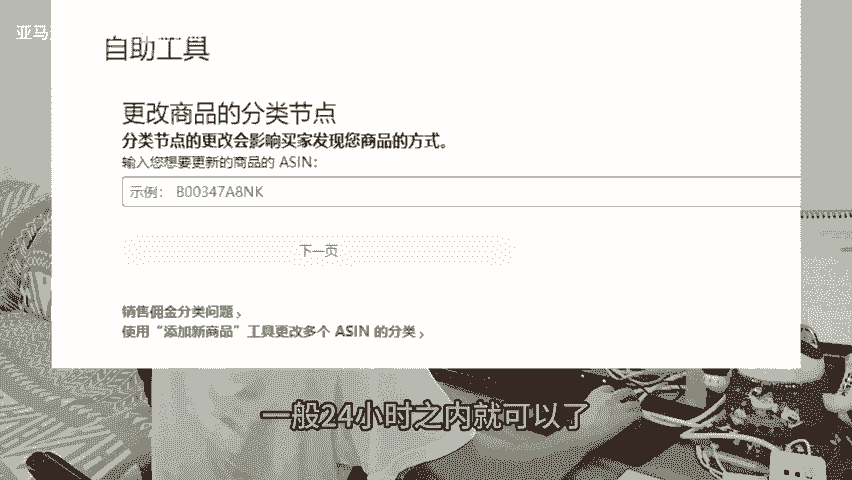

# 亚马逊常见运营问题，链接类目节点被改，卖家要怎样更正过来呢？ - P1：studio_video_1728531359367.mp4 - 亚马逊跨境玲子 - BV11N23YwEkR

🎼这是很多亚马逊卖家都会遇到的问题，明明链接卖得好好的，但是类目节点无缘无故被平台自动更改了，要怎样去更改过来呢？我们可以直接开case，让客服更改过来。一般24小时之内就可以了。

还有一种比较复杂的情况，客服会告诉你说，识别到你的产品更贴合现在的类目，所以无法帮助你更改类目。这个处理起来就比较麻烦一点。先检查下你的关键词是否精准。

检查链接的标题5点描述和search term看看里面是否包含了被更改类目的关键词。如果有把这些关键词都删除，然后在后台链接编辑页面选择正确的类目节点，重新提交保存。不行的话，再用表格去刷新一次不行。

就再试多几次。如果还是没成功，那就找国外的客服去刷新，他们的权限会高很多，处理效率会更高。我们要定期去检查自己链接的类目节点。😊。

🎼以防被平台自动调整到其他类目，从而影响销量。关注我，每天学习一个亚马逊小知识。

Yeah。