# 亚马逊广告｜TACoS 是什么？这个指标怎么用？一线运营如何把广告目标变为实际投放方案 - P1 - SciAds亚马逊广告 - BV1WatfePEMQ

大家好啊，这次我们给大家谈一谈TAco这个话题呢是笔者在线上课程的群友以及线下培训的学员都一致向我提过的一些问题，并且还催更。所以我们就有了今天这个视频。

我们第一个问题是讲一讲什么是TAco呢没有官方的定义。江湖中大家默认是对某一款产品的某一个时间段内，也就具体某一款as了TA cost等于这款as的总体的X spendingending除以它总体的sales所谓的总体saleles是不限于广告啊。

就是说 dashboard上面的总体的销售额。因为扣除采购费用，运费佣金退货后的产品毛利润呢，通常是管理者十分清晰的。且不太会随着运营节奏的变化而改变。

又因为呢运营目标当中通常都包含利润率和销售额两个目标。所以呢不少公司在运营上通过限制TAco的上线，防止一线的运营烧太多的广告，进而导致产品赔本。总之呢TAco是管理者为了提高管理效率。

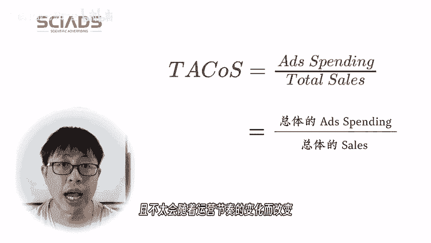

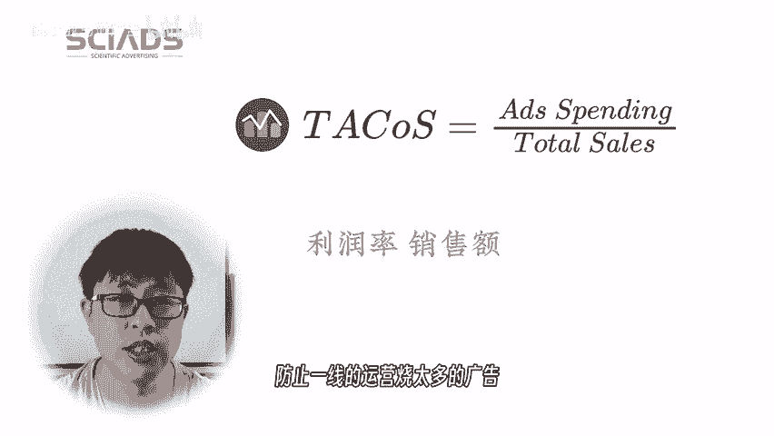

控制性利润而设计出来的一个业务指标。TAco的出现，也代表了广大卖家对利润率的重视啊，间接说明了广告在业务当中的重要性越来越高了，行业也进入了成熟。毕竟呢早些年我说明说早些年就5年前吧。

广告的花费一般在总销售额的占比不到5%啊，很可能就3%左右，现在怕是10%都打不住了。第二个大的话题，咱们说一下广告以CPS为抓手。

前面一小节我给大家讲了主要是站在管理者的角度怎么来看TAco以及他们为什么这么设计。这一小节我们说一下一线运营。事实上呢一切的广告投放都应该以CPS为抓手。相比Aco啊，我们更推荐用CPS来衡量广告。

所以呢实际上我们更推荐TCPS用来做评估。这边说一下TCPS什么意思？也就是说用你的广告花费除以你的总订单，都包括自然订单啊什么样的总订单算你的广告的出单成本。那么我们以TCPS。

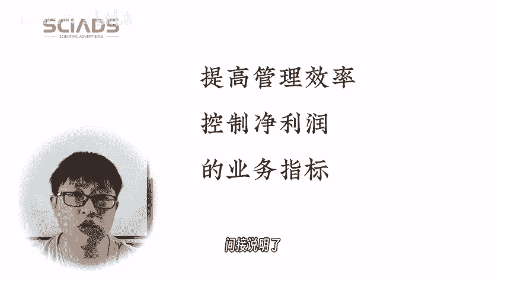

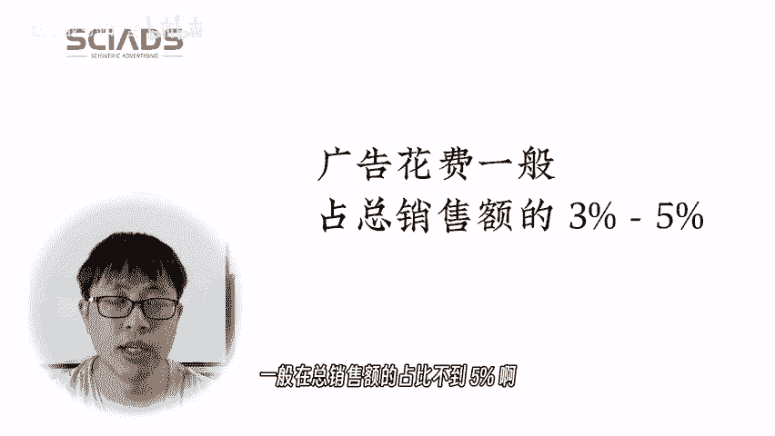

cost进行一些讨论啊，这边我们CPS再给大家说明一下CPS就是说cost per sale也就出单成本。使用CPS为计量单位的话呢，它相比A cost有更好的通用性。因为不管是广告还是折扣啊。

都可以统一的用CPS来计量。而CPS和A cost又可以直接换算，具体的A cost等于CPS除以产品售价。比方说CPS如果是10，售价是40的话，那么A cost有25%，就10除以40啊。

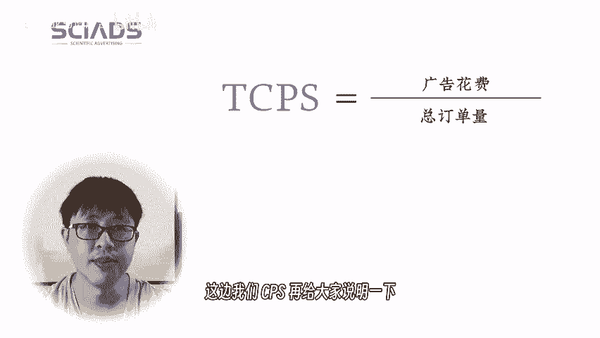

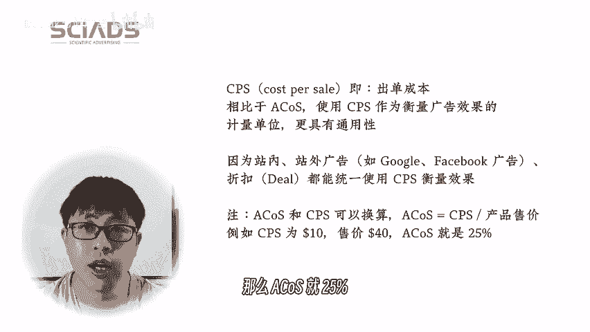

管理层面为了统筹销售和利润率，使用TCPS来度量总投放成本是无可厚非的。具体的呢，对于广告投放CPS是一个比TCPS更好的抓手。这边大家一定要注意，就是说在统筹管理层面有一个目标，O这是要执行的。

但是在一线需要完成这个目标的时候，是不能直接拿这个目标直接用的，因为它不可直接操作，它需要有一个抓手，然后实现这个目标就有点绕啊，我们知道一般情况下CPS越高，广告订单在总订单中的占比会越高啊。

结合广告中更高的CPS我们可以很清楚的知道CPS和TCPS是正相关的。也就是说CPS越高TCPS也也越高。广告投放在实操当中应当以CPS为抓手。又因为CPS和TCPS是正相关的。

因此需要业务人员根据工作经验和业务数据结合TCPS的限制，给出当前广告中合适的CPS目标，包括大家知道运营也会有运营的节奏，对吧？比如说我需要。

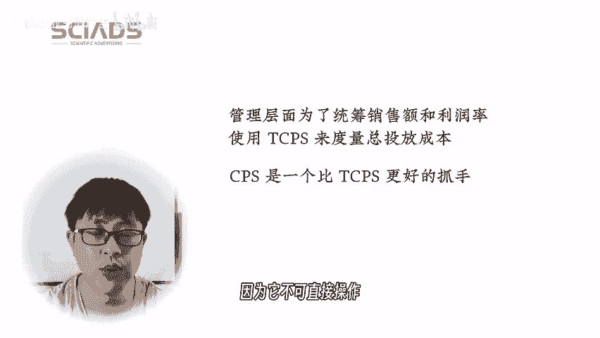

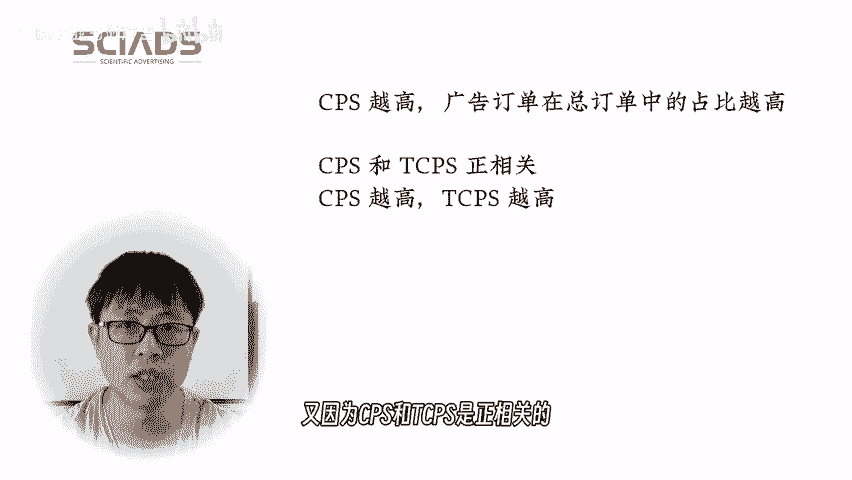

3个月内的TCPS可控。那某个月超出了这个目标也是可以接受的。所以实际上做法是非常灵活的。所以这个事情非常个性化，没办法交错的。就只能大家根据工作经验自己调整，达成一个在运营管理层面的一个目标。

这边也给大家说一下，我引用了一下计算广告的一个内容啊，就是说这么看来，在模型时代，系统虽然提供了强大的优化能力。但是数据化的商业目标才是这一能力的点睛部分。而这个点睛的过程，没有任何人可以替代客户完成。

也就是说没有任何模型或者机器能够替代做这个业务的一线的运营去完成定CPS目标这个活，这个事情是不可替代的。我们进入第三小节，就是CPS如何变成了广告方案的。我们上一小节说啊。

运营的工作就是制定CPS目标。我们这边说一线运营啊管理制定TCPS或者TAcos目标。然后运营制定CPS或者Aco目标。那么广告投放中早词和出价。

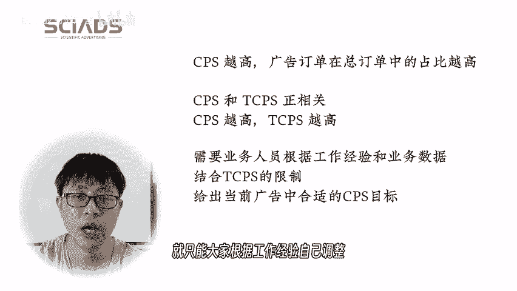

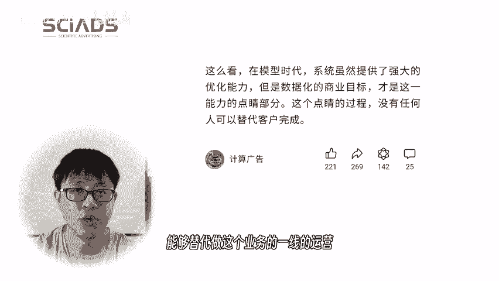

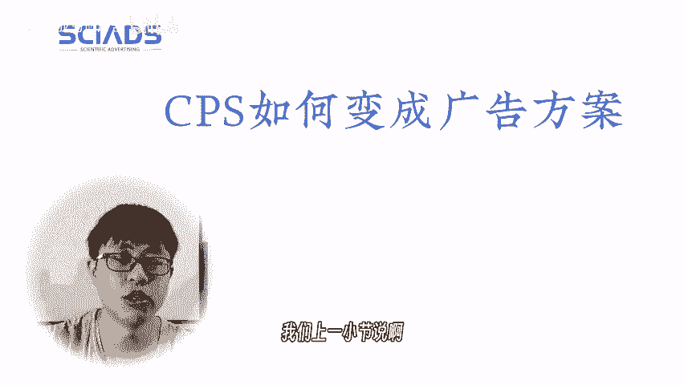

事谁做呢？大家注意啊，这个事情也就是广告优化师，他的事情谁来做呢？这部分工作可以交给ss的广告软件来做。从管理角度来看呢，相当于给工作做了一些专业化的分工，其中管理做管理的活，一线运营来定一线运营的活。

广告的投放交给软件来做，这样的话就提升了效果和效率。我们这边引用了一个图啊，大家可以看到这是ss软件的广告的能启动的一个表单。大家可以看到可以填CPS对吧？其他的东西和你新建一个广告cap是非常相近的。

填什么camp name啊，SKU啊填预算啊，这些东西都是你要做的事情，对吧？所以没有什么特别的。早词和出价的事情全都可以外包出来，相当于你身边放了一个优秀的广告优化师。

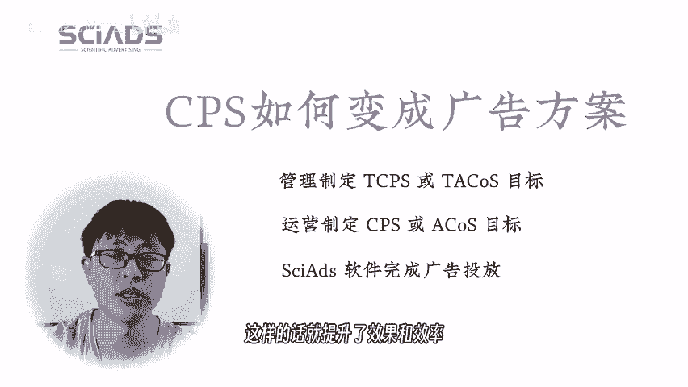

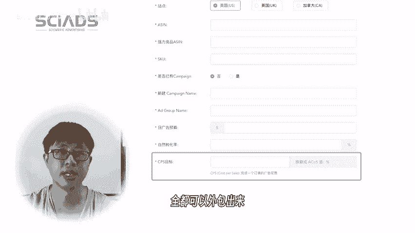

最后一小节给大家总结一下我们今天的视频内容，就随着跨境电商行业逐渐成熟啊，广告的作用和花费都越来越高。卖家中的管理者们提出了TAco这个概念，以适应当当前的业务情况，合理的管理利润，特别是控制广告成本。

那么TAco或者TCPS作为管理概念呢，在实操当中需要一线运营转化成CPS才可以使用，或者说作为抓手。用了CPS后呢，运营通过使用3S广告软件，就能够实现与CPS目标对应的广告的完整的方案。

包括关键词和出价。这样呢就把业务目标层层的代理有条不紊的分工协作，让专业人做专业的事达到了效率和效果的最大化。好，这一节我们就讲到这里吧。大家有什么问题的，欢迎留言和讨论，就这样，拜拜。

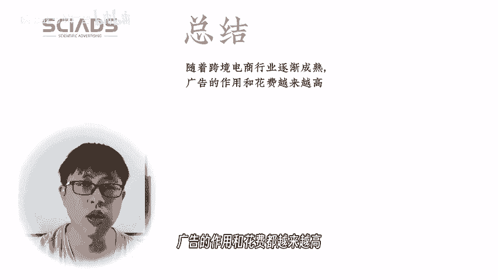

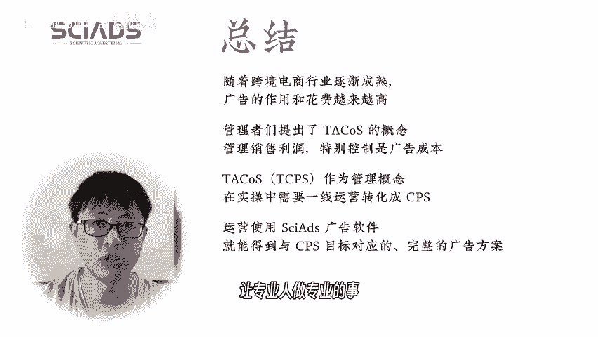

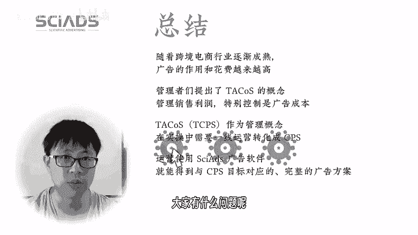

扫码添加客服，邀您一起加入亚马逊广告探讨群，更多亚马逊精彩资讯，请关注CX以下官方渠道。

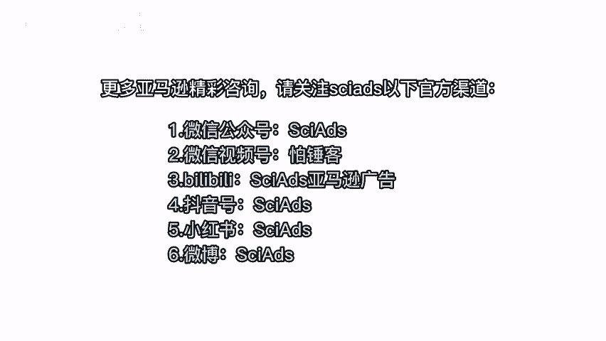