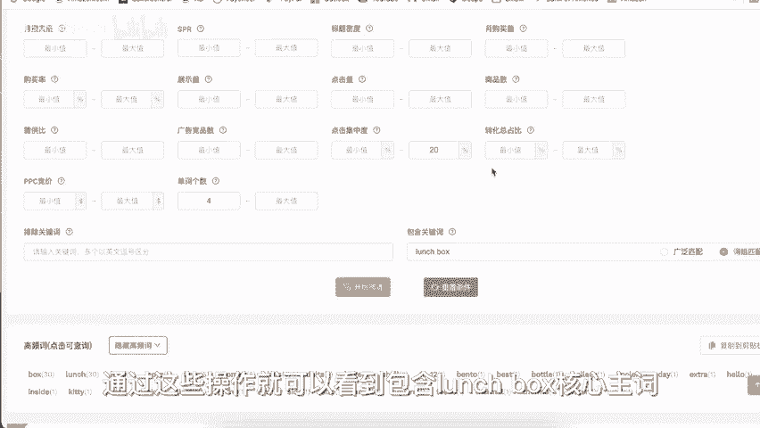
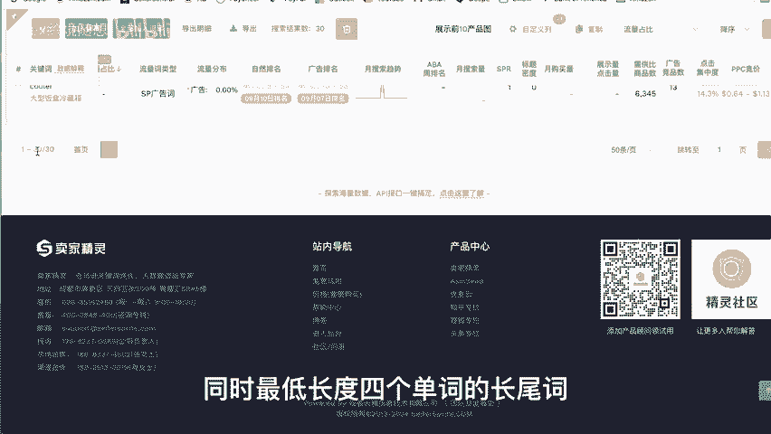
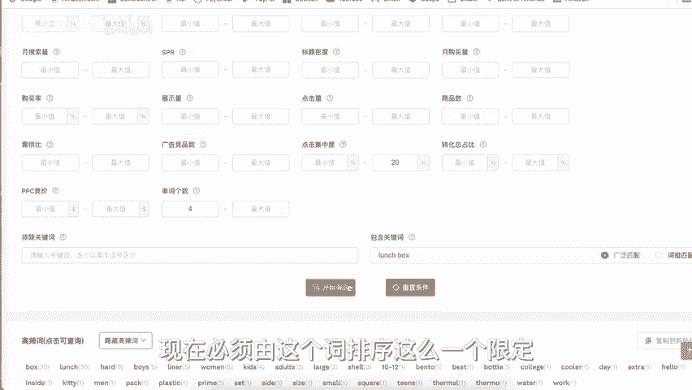

# 亚马逊排名需要便宜精准的长尾词 - P1 - Alex跨境随想 - BV1LXbcetEcR

大家好，欢迎回到爱ex丝快乐最讲。今天是2024年的9月20号星期五。😊，先提醒大家啊，最近在评论区割韭菜的人真的越来越多了，尤其你们要小心免费带人发财赚钱这帮人。

那大家请仔细的辨别评论人的留言逻辑和出动，防止上当受骗。我们回到正题。我们在亚马逊的运营呢很大程度上就是在经营自己的产品排名，产品有多个关键词的排名高，那也就约等于有曝光，有点击有转化。那如果排名低呢。

我们就只能通过呃站内的广告帖子的发布、站外的推广等等这些方式去获得新手村的初示礼报，让产品获得曝光点击和转化，以此来进入良性正反馈的运营模式。可以非常高效提升收入，拉高转化的方式呢是站内广告。

那原来的视频呢也多次提到过呃，中小卖家，因为资金量有限嘛，那你直接去投放主关键词的成本是极高的，尤其是新品上架的前期。所以绝大部分中小卖家呢都应该采用长尾词。

拉动主词的这种投放策略来帮助我们完成高性价比的广告投放。从推广的原理上来说，产品的关键词排名取决于消费者用这个词搜索以后，点不点击你的产品，点了以后呢，买不买你的产品。那同样的词下你卖的多不多。

这三个数据维度。但是我们卖家很看重很追求的评论数量啊，评论星级啊，包括你自身的listing质量啊，对于你的排名其实都有一定影响。但最最重要的就是点击率转化率，还有销售量这三个数据。那广告投放的时候呢。

精准匹配大家肯定是开的。我相信那基于刚刚我说的这个原理，大家也就会知道，在资金充裕listing质量不差这个大的前提下，你去投放大慈，你打开你自动广告的广泛匹配呃，或者是你打开手动广告的词组匹配。

那肯定会带来更多的流量，自然会销售更多的产品。但你销售的多，不代表你就有利润能挣到钱。那很多中小卖家的利润呢其实是被广告投放吃掉了，投产比太低。那还有很多卖家从最开始很多额外的支出就没有算出来。

总觉得能赚钱，到头来一算呢，不光没赚钱，可能还赔了不少。那相信开视频的朋友可能你也会有类似的困扰，那就是总觉得不赚钱。😊，广告投入太大了，不投入不销售，那一投放呢就亏损。

那其实这就是你在广告投放的这些词不正确导致的。呃，选择投放不正确的词或者是太大的词，还有点击单价BID极高的词。那所以广告投放肯定是要想方设法的去降本增效的，用更低的广告费用，撬动更高的销售数据。

我们能做的呢，除了用好免费的帖子facebook群组等等这些呃途径以外，最直接有效的就是在投放战内PPC的时候呢，去找到和使用一些更优质的呃精准长尾词来帮助我们低成本获取曝光点击，还有转化。

那这个操作呢也可以同步的拉升相关主词的搜索排名。我们原来说过，如何反查关键词。但因为反查关键词呃，那个数字很繁杂呢。我提供大家一个相对更简单的筛选方法来帮助大家找到合适的精准长尾词。

我们先在亚马逊的前台找到几个类目销量好的asN或者是竞品的asN。标品呢是前者，不是特别标的产品呢，你可以用后者可以多复制几个as标品可以点开类目，直接去看类目的best seller。

采样率大数据更有代表性。首先，打开卖家精灵的流量词反查功能。把我们在亚马逊前台找到的asen依次的复制进来，我这里呢就不复制了，随便点一个示例as森就可以了，然后点击立即查询。这是一个大号的午餐包。

家庭厨房类目BSR60上架两年多一点点，近5万评价。那现在自然流量呢占到八成以上很不错的产品。搜索结束以后，我们在这里看到的就是在近30天内进入过亚马逊前台搜索结果前三页的所有搜索流量词。

包括这些词的自然和广告排名数据，月搜索购买量PPC竞价这些数据都可以看到。比如我们这个产品流量占比12%的PPC的价格高达7。36美金。我们再来看这个产品的标价也才14。99美金。

那这样的广告价格必然是不可能承受的这也是为什么我们要找到低价且是优质精准长每次的原因。您可以有大量的资金用来运营。但如果让您操作这样一个餐包，你直接投放一个7块钱的词，那是可持续可承受的吗？

我们的逻辑是把大词直接放在筛选框里，要求系统给出所有包含大词的词组，同时限定单词数理论上单词数越多，搜索人的购买需求越具体，搜索的数量越小，词越长，点击费用呢相对也就更低。

比如我们把词的长度限定到4个及以上。这边可以看到PPT的价格已经明显的下降了。当然这种情况呢也会有例外，某些长尾词的竞价可能还会更高。这跟系统的抓取和这个词阴差阳错的畸形转化率是相关的。

这样的词我们避开不选就可以了。但是我还建议大家把点击集中度的最高值限定一下，比如限定最高不要超过呃20%。20%这个意思呢就是排名前三的asen点击总占比不超20%，太高的集中度代表了太高的垄断。

尤其在前期我们应该避其锋芒，主要还是应该以利润为主。通过这些操作，就可以看到包含launch box这个核心主词，点击集中度不超20%。同时最低长度4个单词的唱尾词一共只有30个了。

我们可以新开一个广告活动，把这30个词加进去，跑一跑，去观察一下，点击还有转化。

相对于大词长尾词的性价比绝对是高的，包含核心词的长尾词被点击和转化，也会相应拉高核心大词的排名和权重，而花费却不知道比那些核心大词小了多少。那这个简单的筛选思路提供给大家。

大家可以根据自己的需要和能力进行自我的定制。比如你去限定PPC的竞价，你越搜索量等等。以求找到更适合自己的精准长尾词。如果想给更大范围和幅度，那可以把包含关键词这个位置的词组匹配改成广泛匹配。

那这样就能搜索到更多的词，那不局限在必须由这个词排序这么一个限定。

视频最后呢，欢迎您关注Alex环境最强，我也会经常性的跟大家分享一些针对亚马逊新卖家的经验和知识，期待您的点赞、收藏、转发。如果觉得这个视频对你有帮助呢，也反请您把它转发给更多需要相关内容的朋友。

您的关注和支持，就是对这个视频和做视频的我最大的鼓励和肯定。谢谢大家。😊。