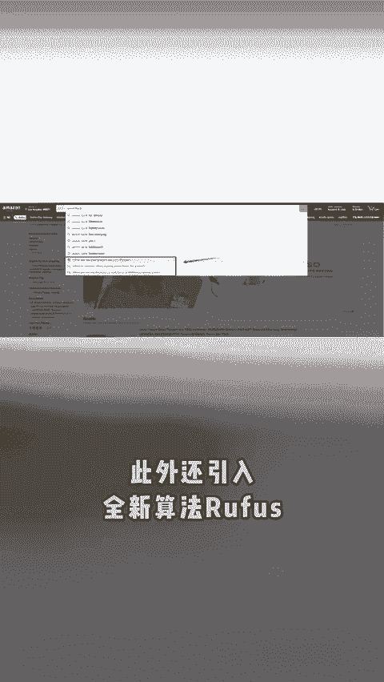
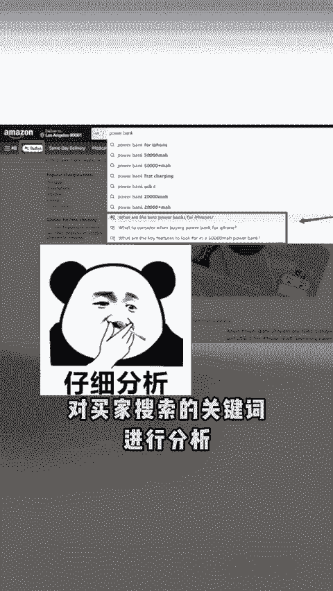
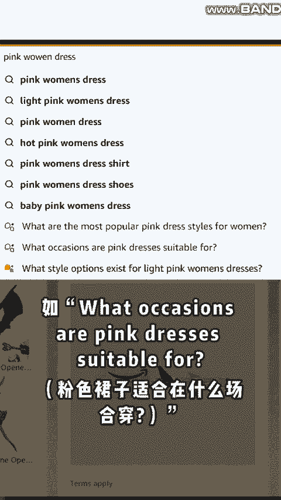

# 亚马逊搜索框发生重大变化！卖家赶紧调整！ - P1 - 紫鸟浏览器 - BV1SqsqezEcd

🎼亚马逊再度大改搜索框，下拉词条由10个减少至7个，此外，还引入全新算法rufus将替代被减少的三个下拉词条，对买家搜索的关键词进行分析，并显示相应的提问。例如，买家在搜索框中输入粉色女生裙子。

系统会自动生成更具场景性的提示。如粉色裙子适合在什么场合穿或粉色裙子可以配什么配饰，还有浅粉色连衣裙的袖子长度是多少。当买家点击粉色裙子适合在什么场合穿时，亚马逊会列出不同的场景，并做出推荐，可以看出。

rufus功能的核心在于能够识别用户的潜在需求，并为其提供更贴近需求的建议，相较于以往以关键词为主的搜索模式。亚马逊现在的搜索体验更具智能化，能够帮助买家更轻松的找到想要的商品，对于卖家来说。

搜索下拉词数量的减少。在选择关键词布局文案时，就需要更加精准。而rufu算法能够通过提问的方式获取更多买家信息。😊。

🎼所以，卖家要完善丰富产品页面的信息和场景，确保能和问题匹配上，获得更多的曝光。