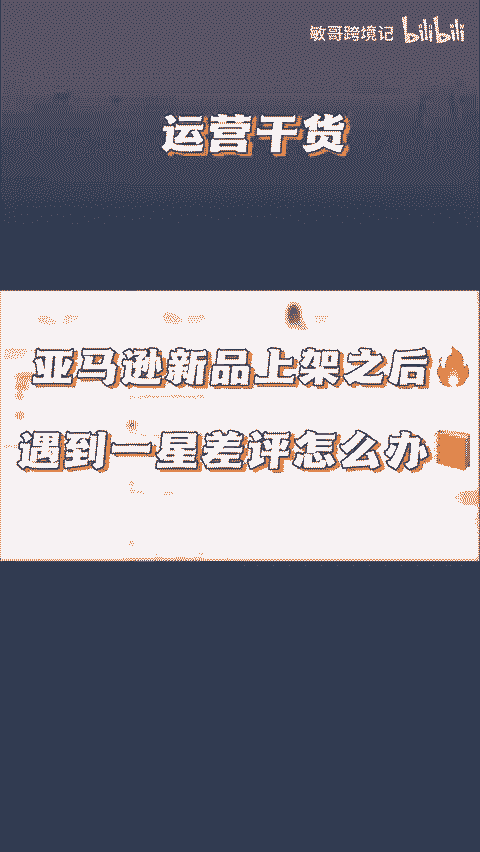
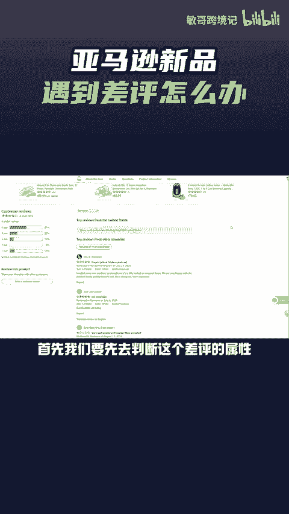
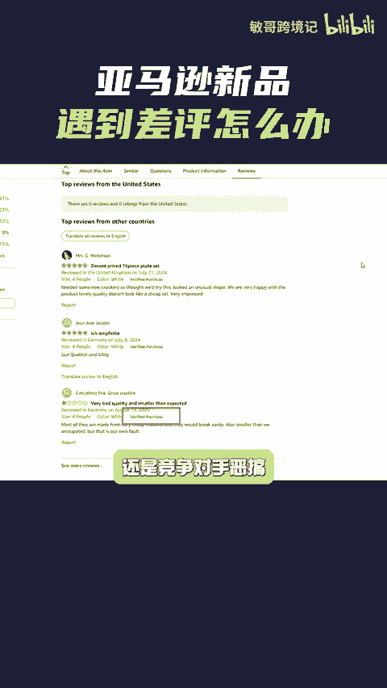
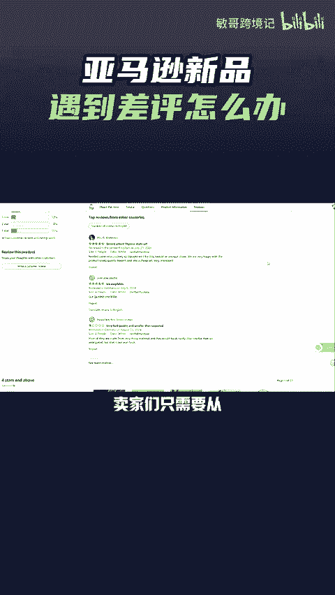
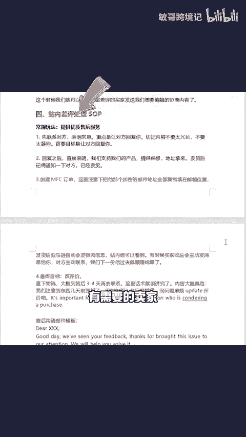

# 亚马逊新品一上架，就来了一星差评怎么办？ - P1 - 敏哥跨境记 - BV1MK2mYMEPK

🎼亚马逊新品上架就来了一星差评怎么办？首先我们要先去判断这个差评的属性。差评是否有ff purchase标识还是竞争对手恶搞，搞清楚差评的属性之后就好办多了。卖家们只需要从删差评和增好评。

这两个方面展开就可以了。这里敏哥针对四种差评类别，分别整理了删差评的思路，卖家们可以自行比对，假如产品是被别人恶搞了，卖家们可以根据敏哥提供的思路，并附上这些模板提交就可以了。成功率还是挺高的。

往下还有如何找出差评订单，站内差评处理sob，有需要的卖家点赞评论666给你安排。

