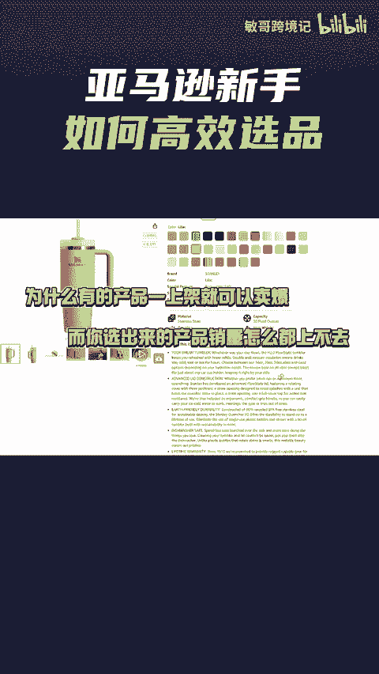
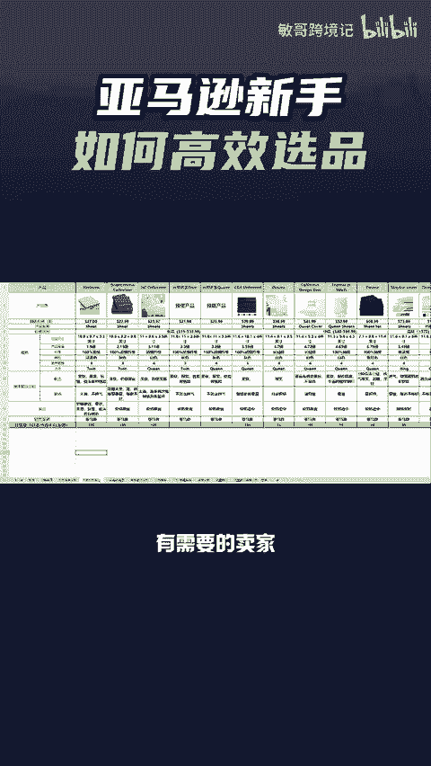

# 亚马逊新手卖家如何高效选品？选出那些竞争小但高销量的产品 - P1 - 敏哥跨境记 - BV1Hb2hY7E6i

🎼为什么有的产品一上架就可以卖爆，而你选出来的产品销量怎么都上不去，那是因为你不会选一些立即市场，那新手卖家究竟该怎么选品呢？我们借助卖家经营的选产品功能，直接点击这里的新手推荐，选择适合自己的类目。

接着在筛选条件这里输入一些数值，比如月销量最低300，变体数最多3个，这样筛选出来的产品，就是工具为你推荐的，非常适合新手去运营的一些产品，这些都是竞争程度相对比较低，又有一定需求量的产品。

而且产品的客单价也不是很高，那还不知道怎么选品的卖家快去试试吧。最后我这里有一份亚马逊选品竞品分析表，有需要的卖家点赞评论666给你安排。

