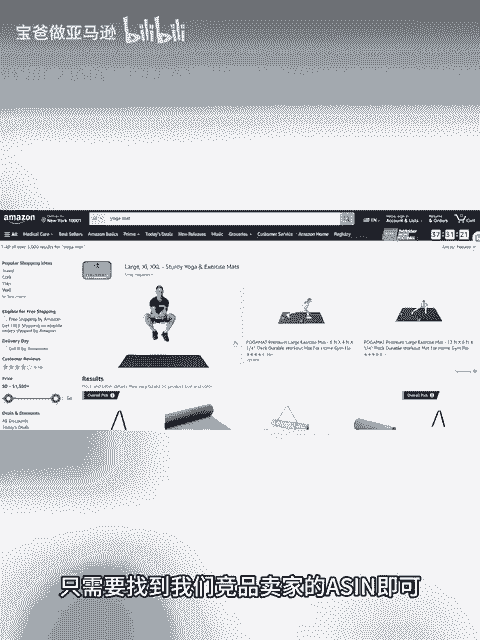
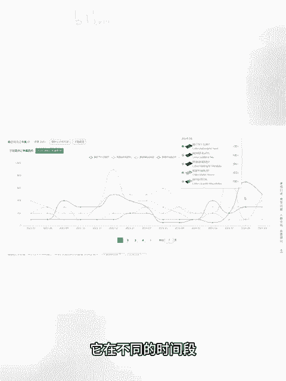

# 亚马逊新手如何反查关键词？亚马逊运营如何分析竞争对手把产品推起来的？ - P1 - 宝爸做亚马逊 - BV1rEycYREQB

如果大家想要提高一款产品的销量，提高它的转化率，首要任务就是要去搭建一个精准而完整的关键词词库。因为大家都知道亚马逊是搜索型的展示型的，所以关键词就是整个listing流量的核心来源。

如果找不出符合我们产品的精准关键词，会导致我们的产品得不到足够的有效曝光。首先我们借用到shift工具，可以轻松的帮我们反查到跟我们产品相关的这些精准关键词，从而提高我们产品的销量。

这个时候只需要找到我们竞品卖家的a即可。首先搜索框里面搜索我们这个产品的关键词，可以找到你预期的销量的这种卖家，看一下这个卖家有没有变体。如果有变题的话，我们需要去找销量最好的这个变体的a。

这个时候shift关键词的查销量，就可以帮我们去查一下哪个子体的销量最好，随便输入一个子体的a。然后这个时候我们就可以看到这些不同a，它在不同的时间段，它的销量的一个波动图，可以更直观的看到这个阶段。

个体的销量最好。这个时候我们用shift关键词的反查流量词输入我们刚才查的销量最好的这个实体的a，然后点击反查这个时候出来了这个子体的所有的关键词的一个数据。

比如说它的自然流量和广告流量以及推荐流量的占比。包括这里我们可以看到最近7天这个实体有76个关键词进入了前三页，历史累计有893个。而且这里可以更清晰的看到最新的广告排名，包括最新的自然位排名。

可以更清楚的帮你看到竞争对手，它的位置在哪里，有利于你去做出调整，这里还有周搜索量，包括ABA热搜词排名，历史排名趋势，当然反查关键词只是反查了一个，你可以找到多个类似的竞品卖家的什吧a去反查。

最终整理好这些精准的关键词，在你的文案标题无点描述，然后在运营推广方面手动广泛或者是手动精准，也可以提前去做一些布局。

