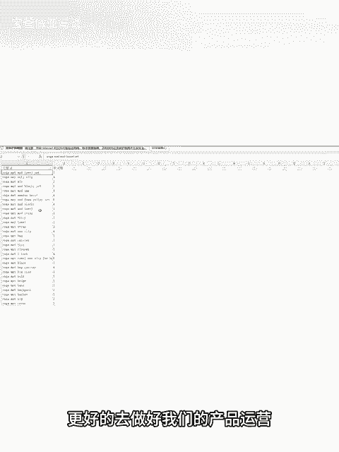

# 亚马逊新手如何快速整理好的关键词，这种整理优秀关键词方式你要会 - P1 - 宝爸做亚马逊 - BV1Ha29YyEC8

亚马逊做的好不好，关键词整理少不了，亚马逊做的好的卖家，他在关键词的整理上面是花了很大的功夫。不论是关键词反查，关键词拓展还是搜索框里出现的一些热门关联关键词，还是一些ABA热搜词。

它都花了很多时间去整理。但是呢有的一个个整理起来确实比较麻烦，而且还不一定整理的完整。今天我们借用优麦云的搜索框拓词，可以更方便我们去整理推的产品的关键词词库，为我们把这个产品推起来做好准备。

相信亚马逊做的好的运营，在整理完listing或者是做广告推广的时，通过关键词反查或者是关键词拓展关键词挖掘，包括前台搜索框关联的这些关键词都逐个的去整理。有的时候一个个的整理确实比较麻烦。

今天呢我们就借用优麦云的搜索框拓词是吧？输入你想去查的这个产品的关键词，然后点击开始拓词，下面就是已经拓出来的关键词，然后我们点导出这个时候就会生成一个表格。

然后我们打开表格留下跟我们产品精准相关的一些。

关键词删掉跟产品不相关的那些无效流量词。因为我们文案 listing的埋词，包括去做广告推广的时候，做的一些手动广泛或者手动精准的一些长尾词，可以更丰富我们的关键词词库，更好的去做好我们的产品运营。

