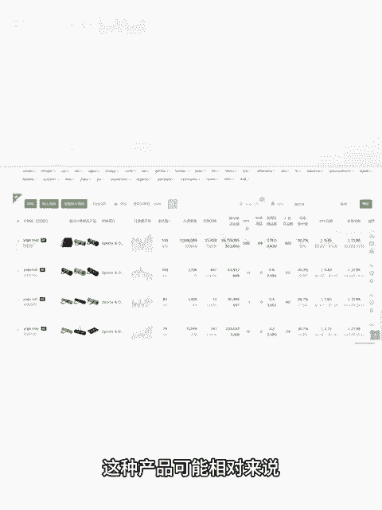
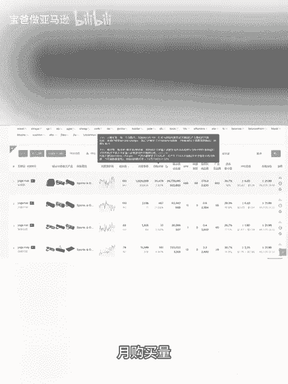
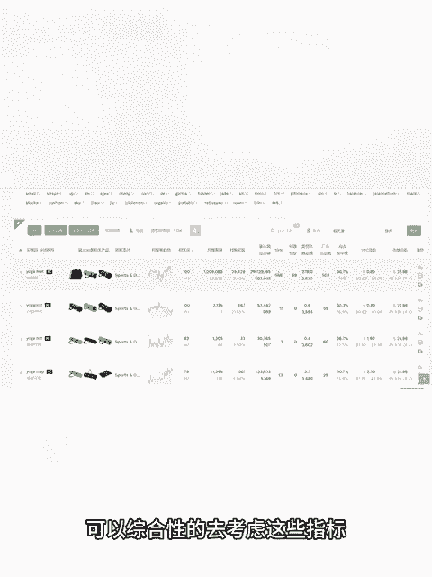

# 亚马逊新手如何让产品占据首页好的位置？亚马逊产品上首页需要多少单？ - P1 - 宝爸做亚马逊 - BV1tUmHYiEoq

不论是做什么电商，相信大家都想自己的订单量越多越好。对于跨境电商亚马逊来说，你想要得到多的销量。你产品链接的位置肯定越靠前越好，尤其是首页黄金旺铺的这个位置。

那怎么才能知道你的产品达到多少销量才能上首页呢？今天我们就借用卖家经灵的一个功能去了解一下。首先打开卖家经灵的关键词挖掘，输入你想查的关键词，然后点击进去查询以后，可以重点看一下这个SPR这个指标。

比如SPR数值，产品8天内，关键词的出单量达到280这个关键词排名，可以到搜索结果首页，如果你在运营推广的过程中，是吧？你的一些关键词，想占据首页的位置是吧？你要每天稳住多少单。

这个SPR值可以给你一个大概的参考。你在今后的选品中把可以把你产品的一些核心词，在拓展关键词里面去搜索一下，看一下这个SPR如果这个值越小，说明你可能不需要太多的单量，就可以占据首页的位置。这种产。

产品可能相对来说比较容易推起来。当然你还是要结合产品的这些是吧？月购买量，包括这个产品的集中度，产品集中度越高的话，虽然说产品数量不多，如果有几个头部卖家垄断的情况你也不一定好推起来。

如果说这个类目的PP资竞价太高的话，可能在推广的上面也会投入不少。不论是选品还是运营，我们在做市场分析的时候，可以综合性的去考虑这些指标。

