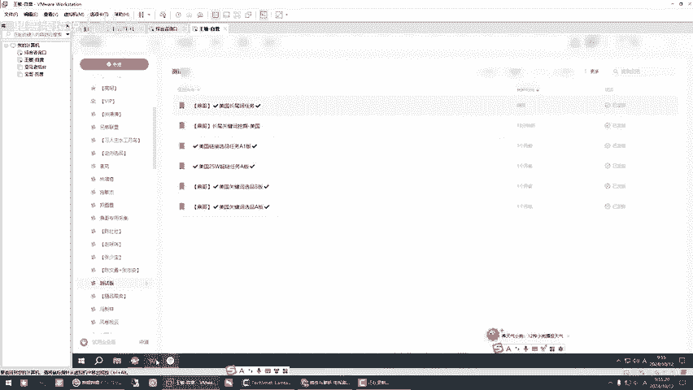

# 亚马逊新手必看！亚马逊选品工具操作使用第三课，挑战全网谁能不爱这个工具！ - P1 - 鼎哥跨境说 - BV12A2RYpEFV

hello，大家好，小伙伴。嗯，今天。😊，很高兴又和你们见面了。今天分享的是第三课啊，就是说长尾磁挖掘如何挖掘长尾慈。我们简单点啊，今天我们做一个简单的动作，你看啊。我们首先打开这个25万这个热搜词啊。

我们首先打开这个。这个是25万，其实每一个国家都可以的。我是给大家举个例子啊，举个举例说dog哎是吧，或者说宠物用品或者说随便。那么dog你看跟他个有关的东西，它就都出来了是吧？跟这个组词词根。

有关系的。嗯。😊，这个时候大家要看明白一个道理是什么？你看它这里有一个功能，这里咱们不不局限于这个25万热搜词。你可以你看你可以这个里面只要你自己有的这些选品工具或者什么都可以。

我们目的就是为了找一个什么，找一个词根，呃，大家弄明白吧。像这些欧路也好，或者说这个sif啊。对不对是吧？你只需要找一个词跟我我给你举例子是什么意思？就例说。我是随便给大家解一个啊。

举例说cut跟猫有关系的啊。我们跟这个适合于做一些精品，或者说你挖掘跟猫有关系的，举对是猫猫玩具是吧？猫玩具，你看cat对不对？你在这个地方搜索一下，或者猫直接词根就是猫。那他大概有19个结果是吧？

你看我只是给大家抛个砖引个月，19个结果是吧？是不是你看啊这个时候我们直接导出这个结果，对吧？导出这个结果的时候，它在桌面上它就生成了这么一个文件。你看热搜词号，这个时候我们打开我们这个程序啊。

我们做一个就会把跟这个。cut toys有关的这个。他都会抓取。我们试一下那个你你我们稍等一下啊。我们稍等一下。呃，稍等，这个是之前的数据啊，它原理是一样的。我给大家重演示一下，原理是一样的。

因为我之前没有删除一个数据，它就会导致一个重复啊，它就成一了，是不是我要把之前的数据删除掉，对不对？你看我必须删除掉。因为之前我做测试的时候，我是用了一个。iphone2的数据，啊，我们把它全部清空啊。

这个热搜词也好，长尾词。这个大家一定要记住，后面它会发生这样的这个事情，那我就要把它删除，我把这个删除，把这个修改了文件名为。你看一我们刚才是不是找的这个。Ct。toys是吧？

okK我只是给大家做演示啊，我们做一下演示。对他默认第一行写的是搜索词，这个这个东西大家不用管它啊不用管。我们只看后面的结果，是不是把那个刚才跟这个cut tos有关的所有的长尾词，我们会把它挖掘出来。

好。我们看一下啊，是不是跟。Cd tos for。有关的啊跟card toys有关的所有的词，我们把它搞下来，这个是为了干什么用呢？这种选品方式举例说你知道了某一个东西以后，你要去做它。

那么跟它有关同类的，我们可以在软件里面直接把所有跟这个有关的，把它关键词变成as，也方便于我们去选品，它它是一个做这么一样的工具啊。我们让他跑一下，它其实是19个词根啊。

我们看这个19个词根到到底能搞来多少个词啊？我们让他去跑。全程都是自动啊，我没有去手动。你看他是不是一直在用作是吧，他会把这个19个。呃，吃根。的常尾词它都会挖掘出来。

这个适用于你确定了你要做什么东西的时候的定向玩法啊。工具呢只是辅助啊，顶哥为了解。解决双手提升效能啊。所以说。挖掘这些工具。那我们暂停录制，让他先跑，跑完了给大家看结果就好了。大家接着看啊。

它这个时候已经运行成功了。那么运行成功以后，你看这个表格里面这个数据是不是那个常尾词，是不是我们看一下啊。常尾关键词。哦，不是这个，他在这个里面。是不是你看一下是不是跟这个cut有关的。

有关的这个就刚才我们做的长尾次的挖掘，是不是它都到了这个里面了，是吧？没毛病吧。我这个电脑有点问题啊，它显示，但是这个数据它已经来了。那么接下来我们干件什么事啊？就是说通过之前的工具，我们把这个数据啊。

我们把这个关键词数据。再把它用我们的别的程序。导到软件里面把它变成。A啊，把它变成跟这个相关的A啊相关的A。那么大家呃现在我们回到这里啊，就是说我们把这个长尾词搞来以后，我们怎么搞？你你看这个东西啊。

稍等一下。我们试一下这个啊长尾次挖掘回来怎么搞，挖掘回来，我们要用一下任务吧。对吧。稍等，我们做一个测试啊。你看他是不是把那个。跟猫有关系的关键词，我们回来了，是不是，你看是不是是不是对吧？

就是把跟刚才我们通过。常尾关键词挖掘工具找回来的关键词，我们现在正把它变成。A审啊，我们会把它变成A，它现在已经在开始执行。对吧你看。好，我们暂停一下，这里只做一个演示啊，我们暂停一下就好了。

是不是大家看一下。对吧。是不是？是不是跟那个有关系的，是不是对吧？是不是跟这个里面有关系的？对不对？我们一步一步的往前走，一步一步的去抓取。是吧那这个时候我们就会得到个数据嘛，得到了什么数据跟猫。

跟这个cut词根有关的是吧？是不是？是不是长尾词这里我们再我再给大家看一遍啊，我把这个删除掉。我的保存我们再来一遍啊，我们再来一遍。看他是不是在操作。有些时候延迟啊，稍等一下。是不是是不是他在操作？

对吧你看我让你们看得清楚点。是不是在操作每一条每一条的操作。这边操作完毕以后。是不是这个地方它自动就消除一条？嗯。那么这个程序它就是这样的一个程序，就是。我这个因为因为我这个电脑有点问题啊，我需要重启。

它就是。添加一条它会自动删除一条，添加一条自动删除一条，它不会重复。所以说这节课给大家方分享的就是如何我们从这个25万里面，你可以随便找一个定点词，找一个定点出来词出来以后，把它的数据我们导出来。

手动导出来以后，我们再用这个工具用用外挂用脚本把它实现每一个词的常尾词，我们都把它挖掘出来。那么挖掘出来以后，它就会生成文件啊，它就会桌面生成一个热搜词啊，热搜词。然后我们通过程序然后把它变成关键词。

再把它变成。

AC是不是跟cut有关的就出来了，是吧？因为我们只做了几个测试，没有全部做测试啊。好了，今天的这节课第三节课我就分享到这里啊，再见，小伙伴们。

