# 亚马逊新手必看！账户突击检查，你遇到这些问题怎么办？鼎哥跨境说！ - P1 - 鼎哥跨境说 - BV1JAshezEsF

🎼hello，大家好，我是顶哥。很高兴今天又和小伙伴们见面了。老样子还是做个简单的自我介绍。顶哥跨境说专注亚马逊的新手选品，独创亚马逊的新手综合选品法，让你选品不再难。

让你最快速实现新手亚马逊运营出单0到1的突破第一成本的FBM进攻模式，让你少走弯路，少踩坑，谁的钱也是血汗钱，不学习就要被市场教训。学习的目的就是减少被教训的几率。那么本期分享呢和学员一对一的实操。

直接拿结果，主要是分享的是处理学员的账户问题。有些时候可能你们在运营的过程中。🎼哎，不小心举例说上了一些违规的商品或者受限商品，你会收到这个绩效通知。很多人很多小伙伴们下意识就是自己会直接删掉这个绩效。

不是删掉这个产品来去躲避和回避这个问题，其实这样的做法是错误的。首先如果我们第一时间收到了亚马逊的绩效，我们应该做的事情去冷静下来。如果看人家要求你处理什么。举例说，文案里面有违禁词。

就是其实就是商标词违禁词。如果说。他比较难搞，这个时候很简单了，你要去学会。🎼用用亚马逊的这个客服工具，你让亚马逊的客服告诉你怎么修改，怎么改，改完了怎么申诉。那么这个问题我们就完美的解决。

而不是你第一时间内你就把这个商品删除，听懂什么意思了。这样的话亚马逊是有重档的，你即使删除了也不管用，亚马逊最擅长的是什么？秋后算账。好了，我们直接开始去带着我的小伙伴去解决问题。

OK我的这个小伙伴就是犯了这样的错误，他直接把as森删除掉，表面上看起来账户是没有任何问题。其实他是留了隐患，希望小伙伴们引以为戒啊，O。

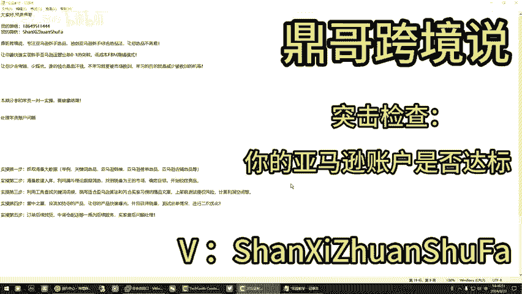

就我把那个商品我已经给他删了，删了之后反正就恢复正常。

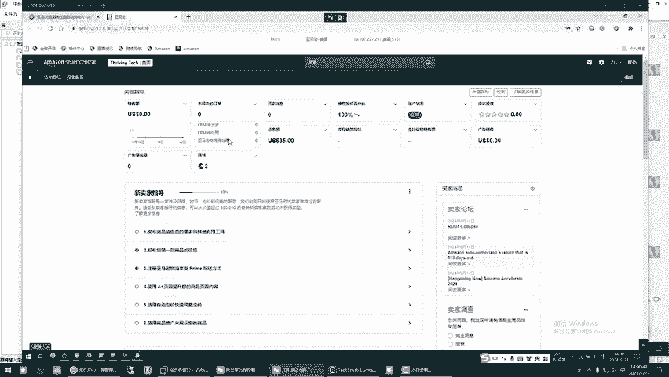

🎼就当时他不是说是有那个有那个什么他提示是什么嘛，你就给人家删了这个吧。

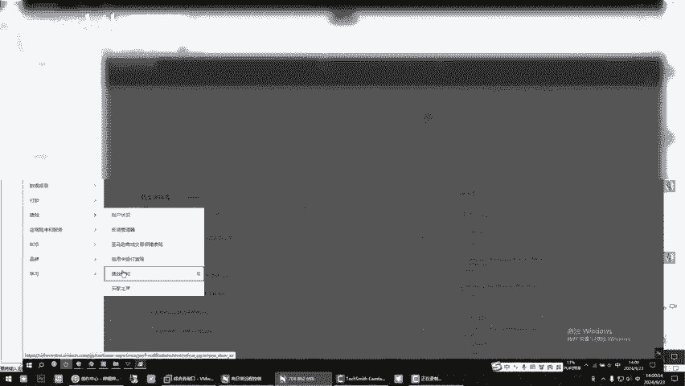

🎼对你这个要检查一下，他给你发的这个，你要看一下你是不是这个东西引起的对吧？🎼做做这都会引起的。这是上了个什么东西？原まし个。🎼电热杯吧。🎼上了这个东西，这就是受限商品，这种这种就是受限商品。

受限商品他给你先停用了。停用了以后，你看已停售受限商品，这个你要解决一下这个东西，你看。

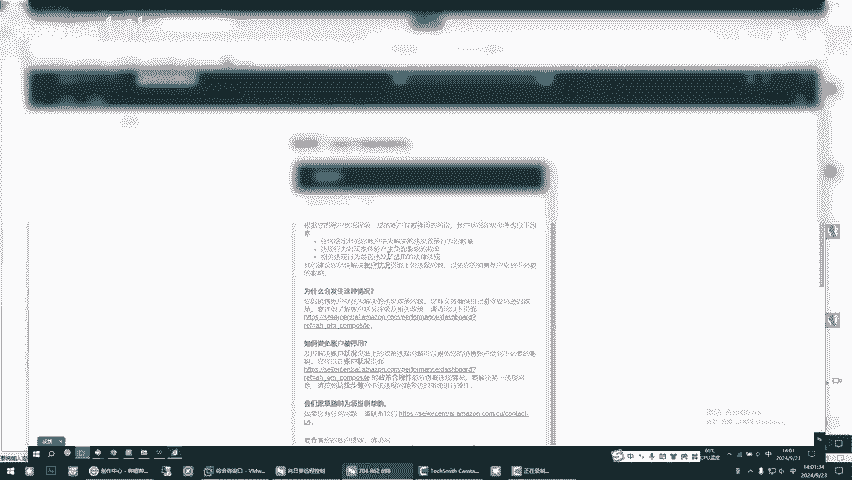

🎼看下这有了绩效了，有了绩效的时候，你要解决这个问题，你要来这个地方看啊。

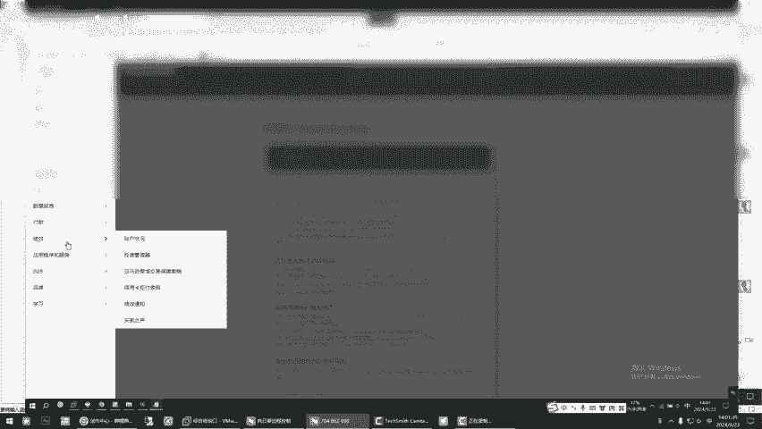

哎，这这量好了有，这个地方还是。这个地方啥毛病还没有。我删了就啥事儿都没有了，就直接给删了就把这。你直接给删了那个产品了。

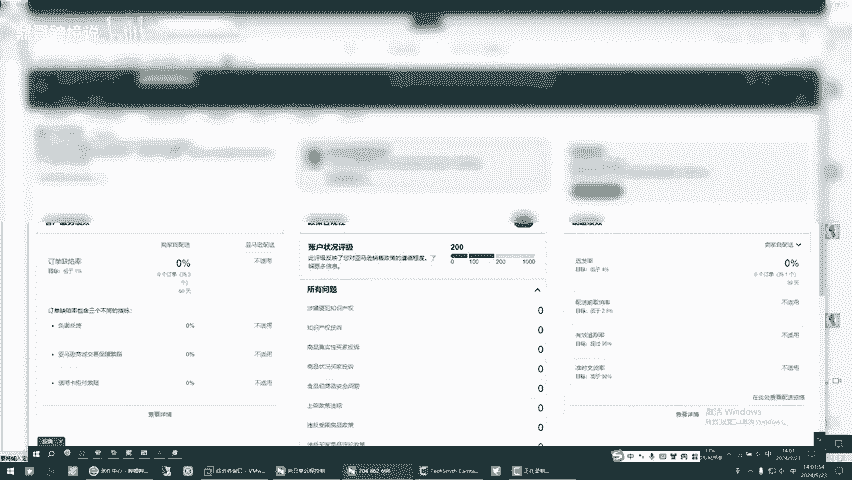

🎼对啊，那商面我直接从库存里边杀了。

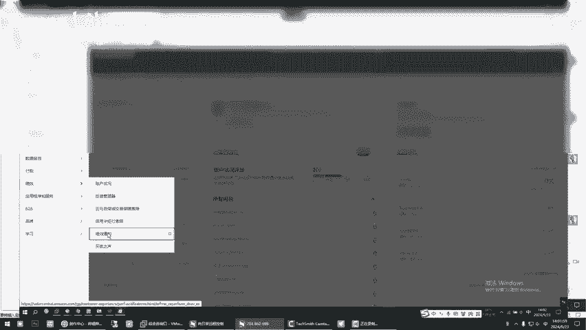

你提示你的时候，你你是哪一个商品，你是。呃哦看见没？嗯。🎼你应该是产品里面有敏感词，知道了？哦，就有敏感词，到时候再。要改一下是吧？这个A森你已经删掉了。对对对，对我删掉了个A森。

还有以后遇到以后遇到这种情况啊。🎼嗯，你要怎么做？第一，你不要乱删除东西，遇到这种情况的时候，你先去这个地方。这个地方帮助来，你听我给你操作一下帮助啊。🎼你先你先去这个地方，这是你之前的case。

你之前你遇到这种问题，先去帮助帮助的时候，你先你要学会用这个。亚马逊的这个呃，客服知道了吗？🎼但客服说英文你们。你可以让他说中文吧。你这个里面你你不用去找这些，你就这样子啊，你就。嗯，你就这样就可以。

知道吗？你看啊。🎼跟商品信息有关的啊，你看这个时候。你看他没有没有没有中文。我靠，对你的铺子是外国铺子是吧？我不知道当时是不是他我也不知道他你的铺子是北美的铺子，是美国人的资料，所以说他不不出中国人的。

No。除非你懂英文啊。🎼所以说有的就直接删不就OK了，有的就直接删了就行，反正他也没没啥没啥风具，那玩意好像给他删了，也没啥风西呃，不不是你你我跟你说这个问题也简单，如果你不去打电话，怎么来解决啊？

Yeah。🎼你你你你等等，我不给你看这个，就是这是什么意思了，就是。🎼从那个有问题的A审里面，就是它会这个地方，它会有一个账户状况，它会这个地方有一个它会有一个绩效，有个列表。你点进去以后。

我知道点进去有一个商就知识产权嘛？有个当时是亮的，是知识产权那个字，我知道你去库存那里找到他把那个文案里面那个敏感词去掉，再点审核，就是审再提交申诉它就好了啊，他就好了。他那个老哥，我有个问题。

就是他那个就是他那个敏感词一般是走他是哪个呀，一般是哪个敏感词。

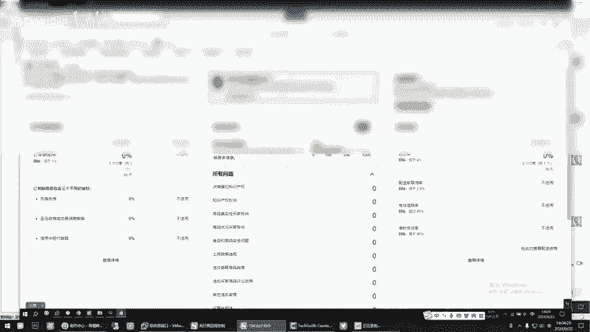

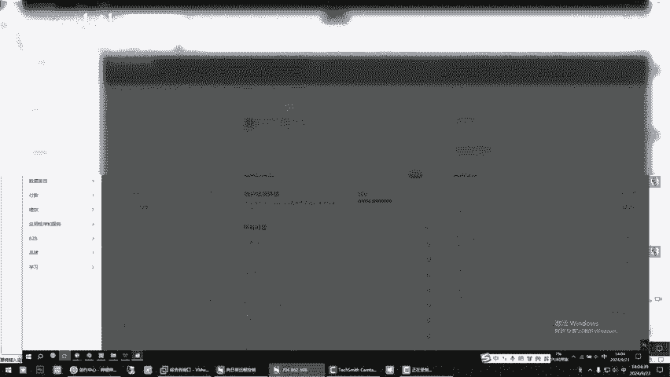

不是敏感词，是你应该是这个吧，你应该是这个吧，不是这个吧。对对第一个吧场第一个第二个。第一个第一个第一个就是亚马逊给你自检的那你删掉了就没有了。知道了？如果说你不删这个AC，你从里面把敏感词。

它会他会告诉你，他会在这个里面有一个东西，他会告诉你哪个敏感词。你去那个你去那个里面把它那个文案里面，文案里面干掉就行了，干掉了以后，点编辑申诉，它就OK了，知道了吧？他解决了这个问题。

这个问题不是什么大问题。

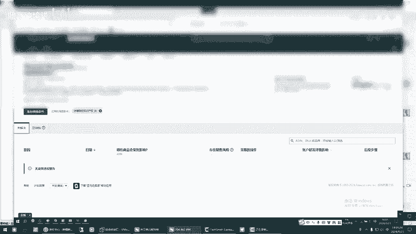

我知道不是大问题，只不过我我不会改，当时我不会改，我就直接删了，回头。

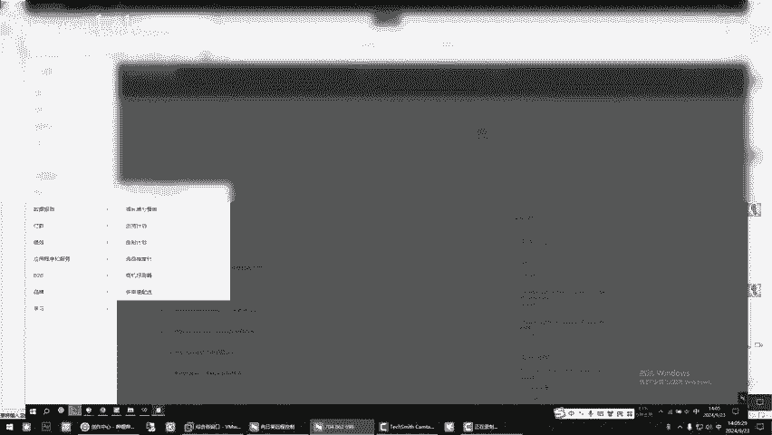

对吧一般上上了品质后两天头流吧，你上了，只要成功了，那个亚马逊没搞你，你就开始投流。嗯，知道吧，就养成一个习惯，一上就投一上，你看你这个地方。你看你的商品数是多少，一共多少？一共一共才37个嘛？

太少嗯太少，我一会儿一会儿再整点去。对。一会儿一会儿再再就慢慢上呗，就慢慢上就慢慢上。别的没啥别的没啥。Y。🎼反正那那玩意儿确实是能出单反正嗯能有出单的就行，你不用着急，慢慢来啊，慢慢来。

我不急我不着急，这个就是自己再慢慢稳扎稳打的来，你这样子啊，来，我再教你个方法啊，我教你个方法，你把那个站，你把那个美国加拿大和墨西哥，我跟你说怎么搞啊，你在你这个领面啊。你把你之前做了的产品上传的。

你再传到加拿大和墨西哥去。🎼加拿大和墨西哥、欧洲和日本都可以，这是什么意思啊？来，你看啊。🎼是吧你可以把这个点开勾中，你先别点，你把日本可以点开同步。这个哦你点一下它英国可英国不过是需要麻烦。英国。

我不知道这个北美的这个就美国人铺子的KYC怎么搞。他中国人我VAT他他他需要那个他需要那个好像是VAT的东西VAT那个东西简单，你去欧税通买一个就行那个东西。啊，我反正就是需要交费对你进去。

你把这文章搞开，你把这三个站同步进行去传吧。你也做了不少品了。对你现在你先登录，你先把日本站激活，激活了以后。等个一两天把也收就小小鬼子就就相当于老哥那小鬼子那个就我来我告诉你说后面的事怎么干呃。

你既然能这样子了，你就不开单了，你就在那个同步进行啊，你先把北美三战和那个叫什么玩意儿了，日本子日本子啊。日本鬼子的对，点他继这是继续点直己点继续就行了。

我需要需要改一下那个改一下那个看你这个账户就是中工简体，中工简体就就和中国版不一样。就就继续注册。对对对，他进去，他绑一下收款。对。但是现在别绑过个一两天再绑，他稳定了IP再绑啊。🎼然后我教你怎么传啊。

你看你在这个里面，这不是吗？你你你之前之前。这个东西我都会给你打码，你做的是这么个玩意儿哈。😊，你在这里传的时候，我一会儿给你我把你的我把你的这个墨西哥、加拿大给你绑定啊，你挨住的传就好了。

这个地方还是软件里的分类，这个是亚马逊分类啊，这个用你的商标跟跟美国一样就一样一样不哥，我那个商标是美国商标。加拿大跟墨西哥得得重新注册吧，不用能上去。

你听我的不用能上去只是说你的商标在加拿大墨西哥不受保护，但在美国你是受保护的啊，就这么个区别但上传商品它是没毛病的啊，它是可以搞的。哦，明白啊，这不就好了吗？这个地方他需要一个呃绑定一下日本的。

他要要让你去绑一个收款，你过过个一两天再绑，看见了吧？就是存款，你用的什么，你完了自己去注册个美国日本的账号把它搞一下就行了啊。欧洲一般写别办啊，因为这个欧洲我不清楚国外版的什么样，国内版的，我知道啊。

别的也不要碰啊，沙特了阿联酋埃及，这个是另一个团队的，你点开一点了这个你账户就要被二审啊。你，那就我我不点我不点，就相当于就相当于北美三是北美北美的那三，我加上你现在你稍等一下啊，你稍等一下。

你以后以后记住有问题啊，你搞不定的时候，别着急，先联系顶哥，顶哥带着你，咱们看一遍，看他怎么解决，我们把它解决了以后，你第一，你要确保咱自己的账户安全，对吧？咱不能说你来不来就给删掉了，是不是这个道理。

不能干那个事情啊，就知道了吧。明白明白哦，你的宣品还可以，没没事，你就这么的干。记住一句话，慢慢就是快，快就是慢。有有些时候你虽然说看起来快了，没没过两天铺子死了是吧？慢就是快快就是慢，记住这个道理。

OKOK啊，没事，努力继续，你有啥事就及时给我留言，看到了以后咱俩就约时间，咱们去搞就行了。还是我要跟你强调的，一代。

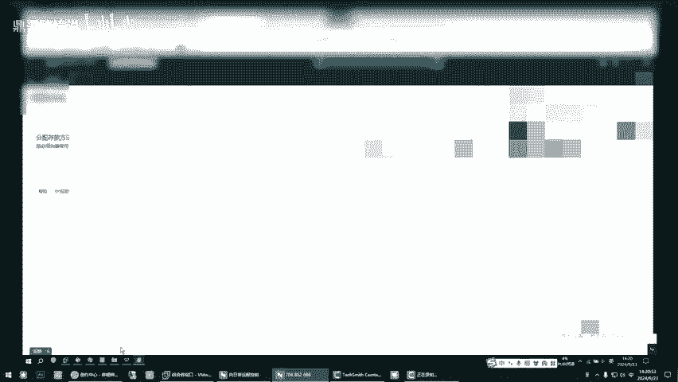

🎼二代选品你自己要多去，这个里面它是简单点，但是它数据没有那个没有没有没有一代新，知道吧？没有这个一代的数据新，但是你去自己做个互补，知道了吗？这个。这不是吗？我教过你啊，这个啊你可以选这个变体书。

自己随意选啊，选他么无品牌的。老老哥教程的话，网上不是教程的话，B站上不是有吗啊，有我再给你复盘一下，知道了吗？做自发货销量怎么地，得别人一个月100到200单，你自己搞了。

你你记住你也就是人家的3分之1，你明白了吗？明白明白，半年内你看你也就是人家的3分之1而已。所以说有些时候仿的时候或者做那个类的时候，先确定我就我就跟你说过，一定要找一个好的市场，有了好的市场以后。

你才会是不是？你自己去选这些东西，选完了以后自己看，你看你能不能玩儿。知道了吗？嗯？婴儿类的你不要去碰，他要的那个什么证书非常多，医疗类的也是啊婴儿类我不婴医疗类了吗？婴儿类的你你你要少去碰啊。嗯。

所以说自己多去琢磨琢磨，这这这这化妆品也不好吧？对化妆品液体的膏状的，咱们别碰，咱没那个资质，对吧？你也出不去。🎼嗯，是不是两个结合起来用啊，你也不要单独的去靠这个也不要单独的靠那个两个结合起来用啊。

结合起来。那两个还得不断的选品，每个两个还得不断的你你要保，不是你要你记住啊，顶哥跟你讲，你知道为什么就会人为什么会慢之后我们练拳一样，我告诉你一个诀窍啊。🎼其说每天要坚持，你每天给自己养成一个。

每天我要从这个数据里面，你看这个里面也有。我要从这个数据里面筛出来，每天我筛两个屏，每天我要留下来两个屏，我要上你是不是一个月就上了60个屏，对吧？每天强迫自己筛出来两个品啊，哪怕你一天上一个。

一个月上了30个。嗯，一上了这个品就去头流，它是同步的，听懂啥S了吗？对熬过第一个月，第二个月你就看到效果，就和咱们农民伯伯做种粮食一样。冲申夏涨秋收冬藏，就是这样的，他永远是规律，他怕是怕什么。

今天想起来了，搞了一大波，结果中间十多天啥也不干然后又想起来了，又搞一波，这不行，知道吧？其亚马逊这个东西啊，就果你上传，他是有记录的，你每天传每天传每天传他给你的流量。

就是每天每天每天在那给你你今儿传十几个中间隔开不传，他不给你流量了，你过两天刚传可以吧？对你就是你要把它形成一个规律，你让他就是那种记忆，知道了？他认为你就其实做SU的道理是一样。

你让你让他认为你是个活着的，活跃的用户啊，你不是今儿想起来搞每人想起来不搞，是不是？对，知道了吧。其实我告诉你的都是经验。😡，🎼为啥今天我给你开了这个站点了，站点开完以后，你把日本则让日本子给他们换了。

换了以后，是不是你现在宣传4个站点，你完了问问他们欧洲是怎么搞的，我不知道这个美国人的铺子，欧洲怎么搞，搞完了，你把欧洲也开了，你一个产品你就能传到13个国家，你是不是出单的概率就大了。对，是吧。

之前没让你开，是你你你原来你不具备那个水平，那我现在看见你可以了，你可以这么的搞了。我为啥看你账户呢？看你账户我就知道我啥时候该让你干啥，你干啥就行了。嗯，对吧。O。没毛病，干吧，我我去我就不录了。

我下来给你编辑视频，我把该抹的都抹掉。老哥把我名字抹了啊，放心放心，你不用管啥，你的信息，包含你的信息，一个都不会存在。行OKOK okK了，先这样了啊。小魏嗯好嘞好嘞，行，谢谢老哥，拜拜嗯。😊。

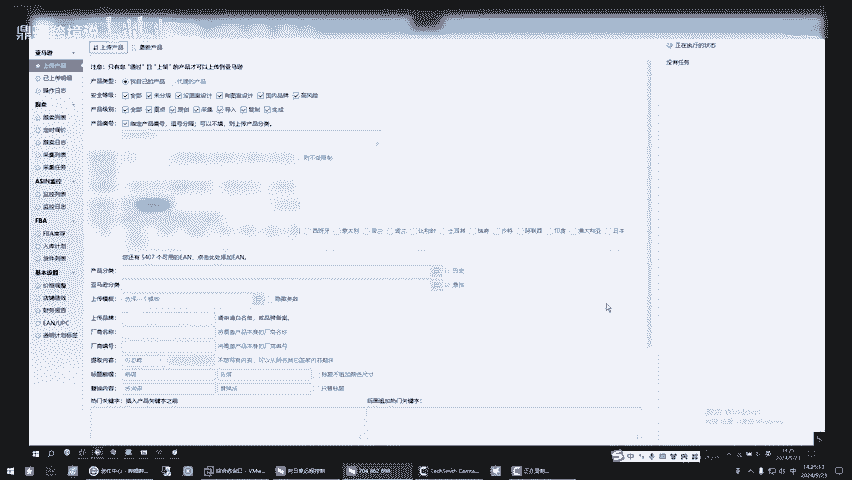