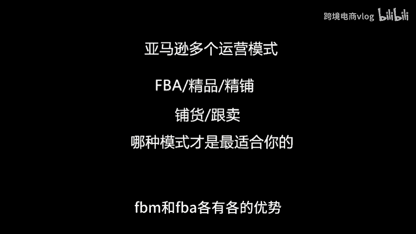
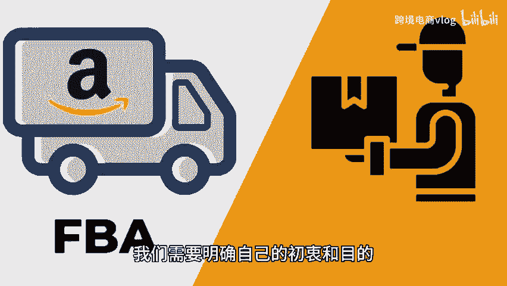
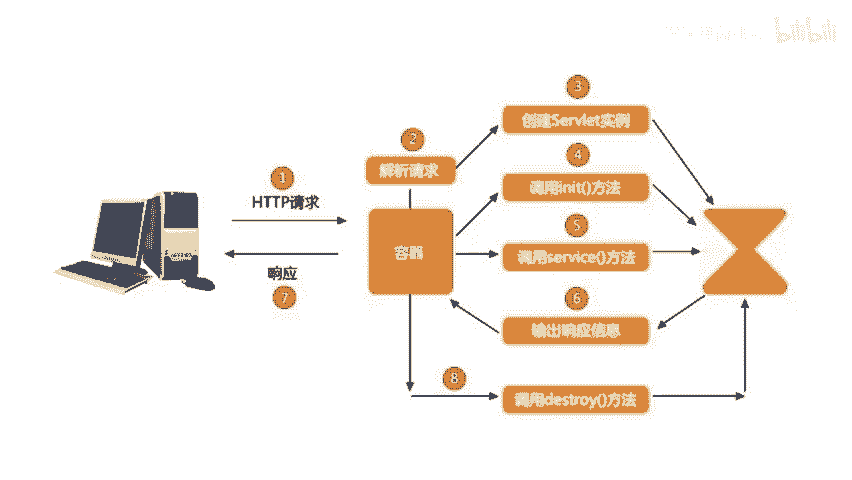

# 亚马逊有多个运营模式，哪个才适合你？希望这个视频可以帮到你（请忽略视频内容，只听文案） - P1 - 跨境电商vlog - BV1u9mAYnEij

🎼FBM和FBA各有各的优势，它们之间并不是绝对的对立关系。如果仅仅从模式的角度来考虑，那么显然选择FBA会更加合适。因为它具有时效快、流量大以及利润高等优势。然而，在实际操作中。

我们需要综合考虑各种因素，例如投入成本、风险大小以及运营选品要求等。相比之下，FBM模式种类繁多，各自具有不同的成本和风险。例如，精品模式注重产品的质量和定位，追求更高的利润。

精铺模式则通过广泛的铺货来覆盖更多的潜在客户，铺货模式则是针对亚马逊平台的自然搜索和流量优势，帮助卖家快速销售产品，而跟卖模式则是通过模拟购买行为来获取竞争优势。

要根据自己的实际情况来选择适合自己的FBM模式，不能盲目的听信别人的言论。😊。

🎼认为FBA才是正规军，亚马逊运营只能选择FBA否则，如果你自己的能力和资源达不到，就有可能成为炮灰或者韭菜。同样也不要因为某种模式似乎赚不到钱，就对其进行抵制，任何模式都有其合理性。

我们应该理性的看待并选择最适合自己的运营方式。此外，有些人依靠软件来亚马逊运营，进行无货源销售或者进行跟卖等活动。这些行为很可能就是欺诈行为，属于割韭菜的一种。然而，这些模式本身也存在一定的简单性。

只要能够精心操作，仍然可以取得合理的利润。最后，在进行FBM模式选择时，我们需要明确自己的初衷和目的。一、想要赚取零花钱，通过兼职来完成。2、想要建立自己的产品品牌，拥有自己的货源。3。

🎼希望深入耕耘亚马逊市场，实现多元化发展，不同的目的将会导致不同的运营策略和模式。所以我们要根据自己的实际情况来做出明智的选择，希望这篇文章能够帮助大家更加理性的看待FBM模式。

找到最适合自己的运营方式，如果您对这篇文章有什么看法或者疑问，欢迎在评论区留言。我们将在后续的文章中进行解答。😊。

