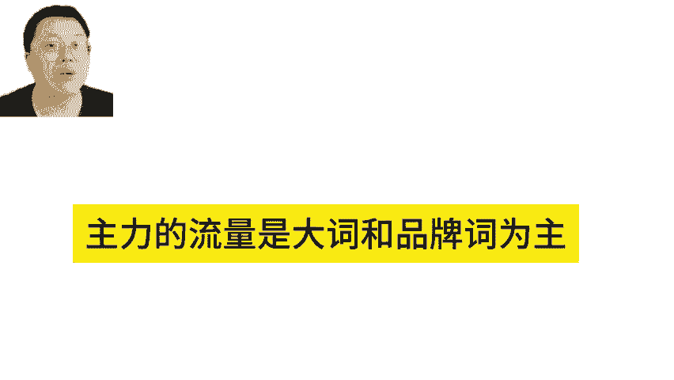
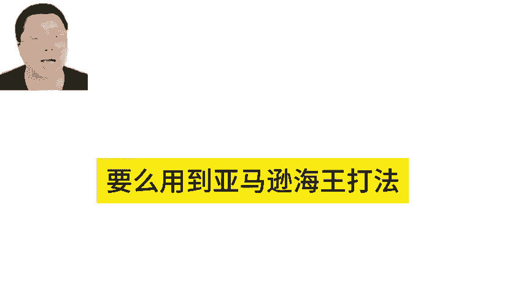
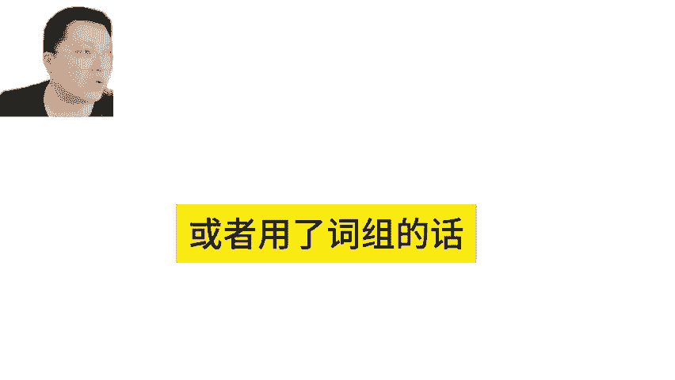
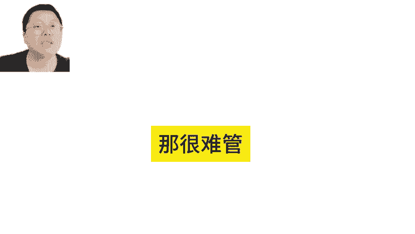
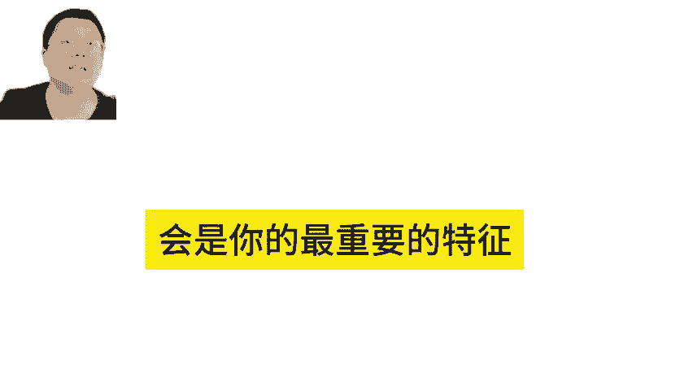
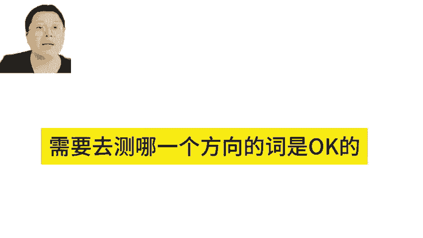
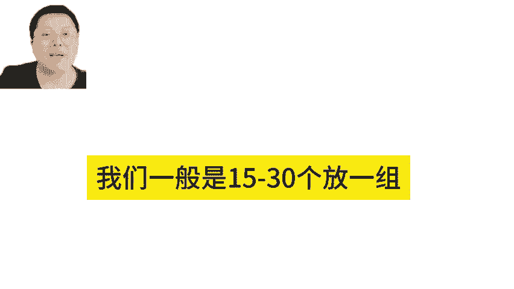
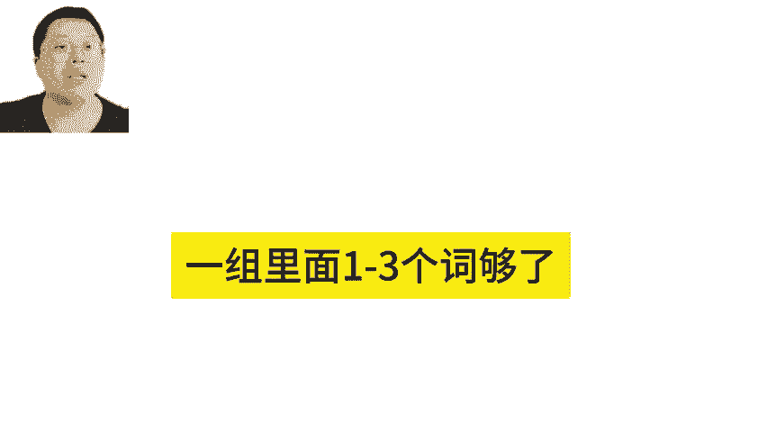

# 亚马逊服装类目的广告关键词运营技巧！亚马逊广告 - P1 - MoonSees - BV1wJ2PYzE5M

因为服装确实词很多，所以服装词很多，你会发现大部分的流量会集中在大使或品牌词上，对不对？所以主要主力的流量是大词和品牌词为主。那么这个打法的话，要么用到海王打法，要么是大词的精准。

然后打商品页面在新商品页面上加价的打法，这样流量都会准。但是呃如果大使你用了广泛或者用了词组的话，那你的A块词撑不住的那很难管啊啊，所以说服装词很多没有错，那家有方向。

颜色词嘛？对，是的，大词品牌是颜色词。你还有其他词。所以这个时候你一定要想哪一个是你的主力，可能碎花这个词会是你的最重要的特征，是不是是需要去测哪一个方向的词是OK的。其他的方向。

你可以去把它放到一组里面去。这样子我。

啊，每一个组开一个词，不是这样常委的关键词，我们一般是15到30个放一组。

这15到430个放一组跑出来的，留着跑不出来的，开另外一组是这么答的。大词和主主要的流量值。我们说大词是一级值或者二级值。这种词的话，我们就一个广告活动，一组，一组里面1到3个词够了。

