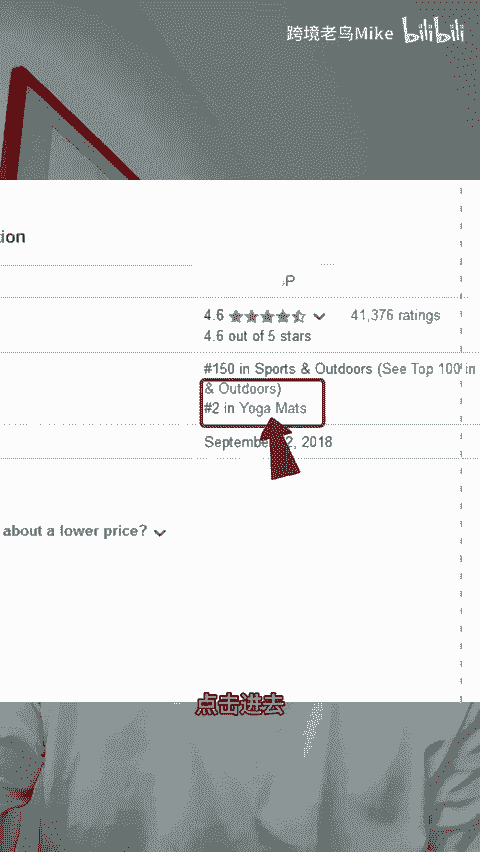

# 亚马逊查看销量前1000名的产品列表 #亚马逊运营 #亚马逊开店 #亚马逊选品 - P1 - 跨境老鸟Mike - BV1P32wYTEag

亚马逊销量排行榜100名之后的产品怎么查看？其实三步就可以实现。第一步，我们打开一个产品，找到list性界面的小类目排名，点击进去。第二步，在这个界面找到上方的小类目节点的编号复制下来。第三步。

把这个小类目节点编号复制到这个网址里面，替换掉网址里面的黄色部分，点击回车，我们就会看到新的类目产品界面，我们把后面的排序调整为按照be seller进行排序，就可以看到整个类目里面。

按照销量进行排序的界面了。当然，如果你没有看懂这个流程，可以留言3个6，有详细的操作教程发给你。很香哎呀。

