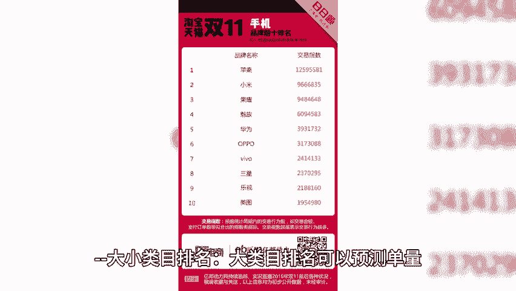
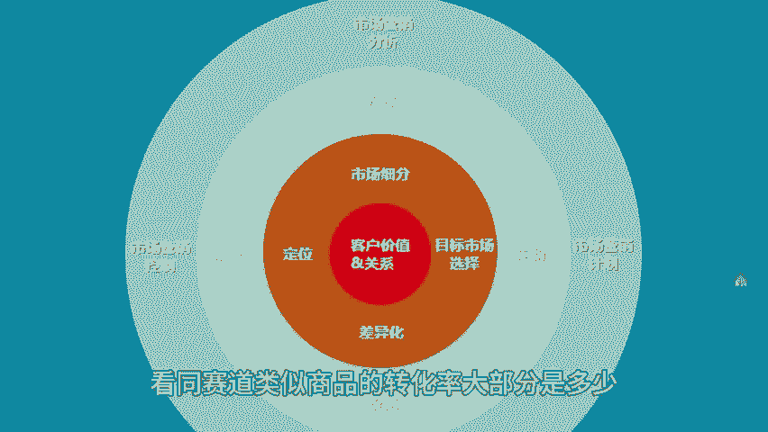
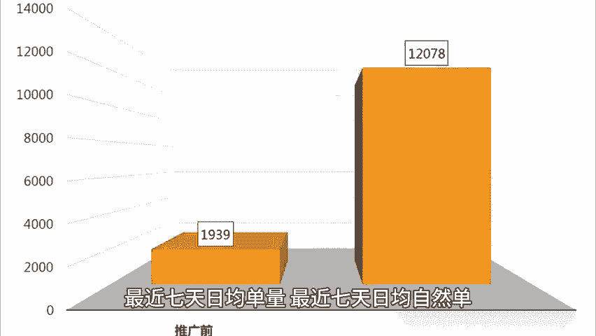
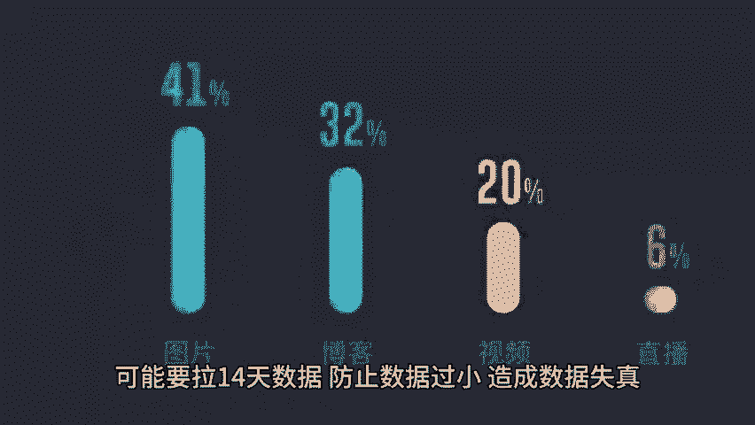

# 亚马逊核心链接诊断方法 - P1 - 小猛龙跨境俱乐部 - BV1HxxkejEf2

🎼当我们遇到一条问题链接的时候，我们应该把它的各项数据指标写下来，链接基本信息、销售数据、广告数据。本期小猛龙给大家分享亚马逊核心链接诊断方法，同时为大家准备了提升亚马逊链接转化率实操模板。

老规矩回复亚马逊，我来安排。其实通过产品基本信息里的核心指标。我们可以知晓产品的站点是美国站，是欧洲站还是其他小站点，不同站点体量有区别，调整方法不一样，促销折扣情况，优惠券专享折扣力度是大还是小。

促销是否有吸引力。

🎼通过对比同行看我们设置的是否有问题，是否需要调整市场主流价格，同赛道的商品，他们是如何定价的？我们定价是不是偏离市场了？我们做了改良是伪需求，客户不接受利润率不考虑广告破损仓储费。

如果连30点的利润率都没有这个品基本没法推，如果你是工厂主要正是工厂端利润，我们另当别论，使用场景和受众人群，我们的产品是什么人在什么时候什么场合使用，我们的产品定位，受众群体用户画像基本一目了然了。

大小类目排名，大类目排名可以预测单量，小类目可以看我们链接排位，看链接是属于头部腰部尾部的哪个区间，这个区间内同类商品的竞争关系是怎样的。同赛道商品综合转化率。看同赛道类似商品的转化率大部分。

🎼是多少？我们是多少转化率有没有问题？其次，通过销售数据看链接表现情况。最近7天销售额，最近7天总单量，最近7天日均单量，最近7天日均自燃单，看7天数据是因为商品推广广告是7天归因期，另一方面。

最近一周比较符合当前链接现状，同时也积累了足够数据。当然，有些卖家数据比较小，7天连30单都不到，可能要拉14天数据，防止数据过小，造成数据失真。看LDBD历史表现，跑没跑过LDBD有没有跑出效果。

是大家都效果差，还是我们自身操作问题。如果LDBD没有推荐每天各位数单量上属于链接的不稳定期，站外能放量的折扣力度，一方面在外看市场，另一方面，看我们需要先站外。

🎼后BD推品方法时，合适的折扣力度。如果一个产品很大折扣力度，如50%，甚至有些人是组个各种促销，叠加到70%都送不出去，各种渠道都试了都不行。基本上这个产品就不行。要么是市场特别来，受众很小。

要么市场血害，烂大街没人要的品，新品榜单第一名日均单量，看新品有没有机会，如果新品榜第一名，日均个位数单量，基本上这类目对新品是特别不友好的。新品榜第一名都推不起来，你凭什么推起来？

标品非标品这个主要影响转化率，大多情况下，同等客单的标品转化率远高于非标品，不同类型产品根据诊断表调整的方法也有差异。篇幅有限，获取提高亚马逊实操转化率的模板，以及更多亚马逊运营小技巧点赞关注评论带。

🎼你出海不迷路。