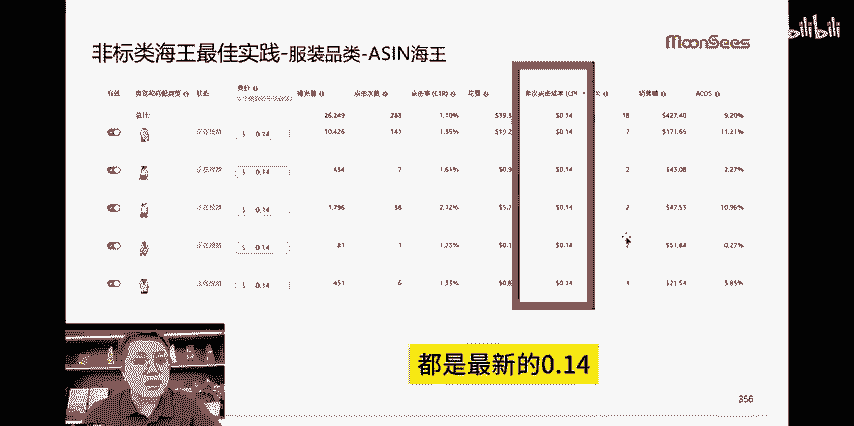
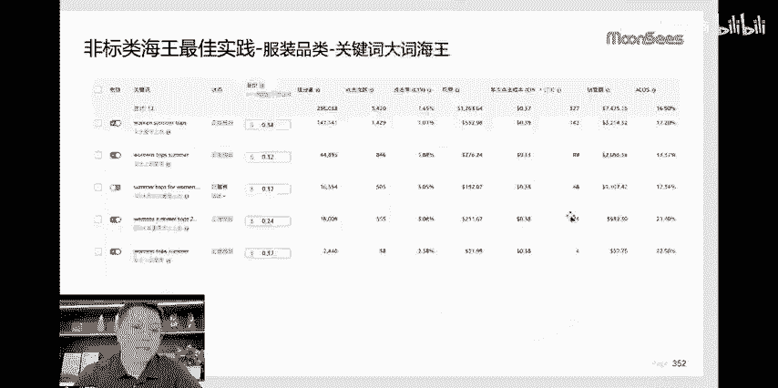
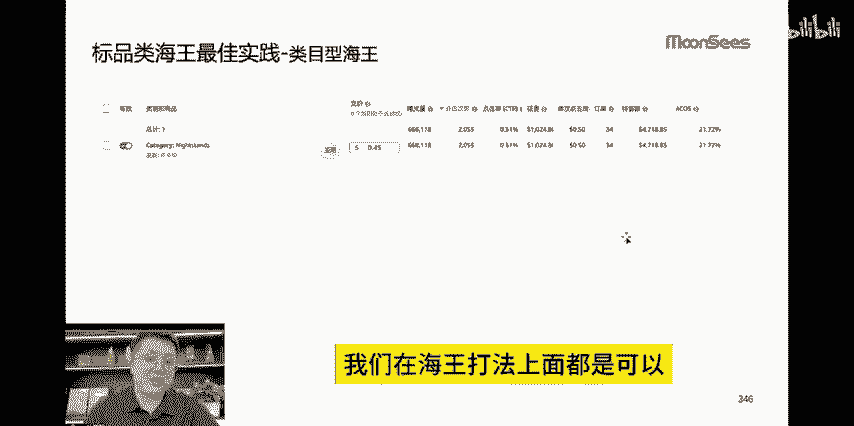

# 亚马逊海王打法广告转化案例！亚马逊广告运营技巧 - P1 - MoonSees跨境电商 - BV1Su2QYDELB

🎼海王打法看看CPC才0。2服装类的。我们这比如说用海王打法算下来的，很多的广告。你看CPC都是0。2都是最新的0。14，这都是服装0。250。3，更离谱的是一个卖家，它长期它的GPC都在你0。050。

06左右，其实并不是选词的问题。而是你这个词选完以后如何匹配，然后能够贴到什么标签的问题。哎，也就是我们标签打法，加上比如说你另外的打法语你到底是CCCPC打打大流量，比如说海王这种打法。

那么给你带来的效果可能会更好一点。那这些我们投放出来的案例来讲呢，你不管标品还非标品，我们在海王打版上面都是可以。比在这个light stand床头柜，你CPC才多少。

这算下来是际上0。3几，按正常的逻辑你要在0。9到1点多左右，对不对？从打法来说的话，它有很多的这种小技巧在里面。我们也说自动型的海王，类目的海王，关键词的海王，这样这个喷的海王都可以用。

