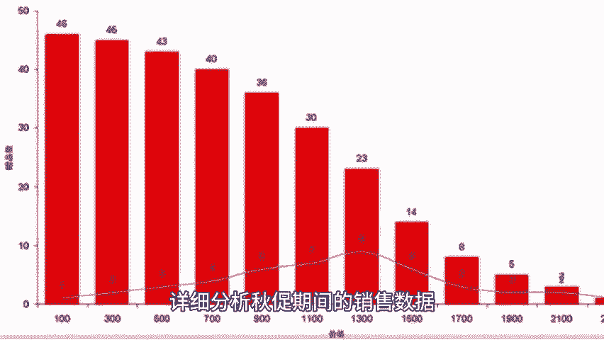
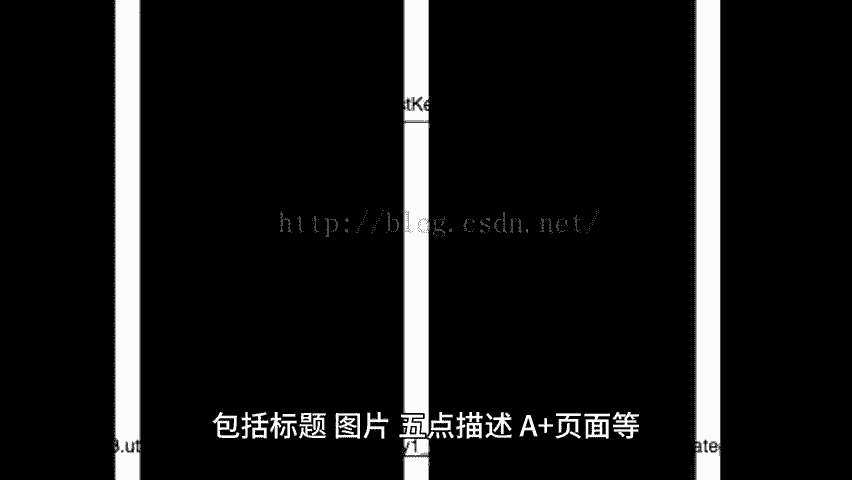
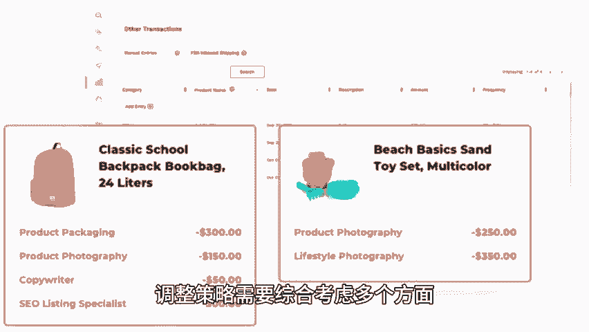

# 亚马逊秋季大促后，运营策略必做的这些事！ - P1 - 小猛龙跨境俱乐部 - BV1B9mwYhE7V

🎼亚马逊秋促后，为了确保店铺的持续稳定运营和未来的增长，商家需要进行一系列的运营调整。本期小猛龙给大家分享亚马逊秋季大促后，运营策略必做的这些事。同时为大家准备了亚马逊店铺运营表格，老规矩回复运营表格。

我来安排。首先需要评估秋促表现，详细分析秋促期间的销售数据，包括销售额、订单量、转化率等关键指标，以了解哪些产品表现良好、哪些产品需要改进，回顾广告活动的效果，包括广告花费、点击率、转化率等。

以确定哪些广告策略有效，哪些需要调整。优化产品页面，对于表现不佳的产品页面，进行AB测试，通过对比不同版本的标题，图片、描述等找到更优的版本，根据测试结果，优化产品页面的内容，包括标。

🎼题图片5点描述A加页面等，以提高产品的吸引力和转化率。在调整促销策略，秋促结束后，不要立即关闭所有折扣，而应维持一段时间的会员专享折扣或优惠券，以承接触秋促期间的流量，设置多样化的促销类型。

如定购省多件购买折扣等，从视觉上给客户较大的促销冲击力，提升客户购买意愿，但也要注意限制叠加使用，避免亏损。应稳定广告活动，维持日常广告架构，根据秋促期间的表现，调整广告预算和竞价，对于高绩效活动。

应增加预算。对于低花费广告，应提升竞价以抢占优势位置，针对秋促增加广告量，利用流量闭环中的出单词，进行在投放并开展简漏广告，秋促结束后关闭大部分临时活动，但保留表现优异的部分，分析。

🎼产品在促销期间和促销之后的核心关键词位置和权重变化。对于排名下降的核心关键词，要进行复盘，并针对这些关键词进行操作，如提高CPC切换策略，增加b等，根据销售情况清算剩余库存，对于报单的产品。

根据活动前最近3天，7天，30天的销量数据制定备货计划，并按照销量的1。2倍到15备之间进行备货。同时，为黑吾网易期间单独备货，对于销量不好的产品，建议保持观望态度。

按照平时销量的100到120之间进行备货，以避免库存积压。如果出现到货情况，应及时补货，空运加海运紧急补货或海外货盘现货现发，针对看过产品单位购买以及加入购物车，但位购买的客群设置定向优惠券投放。

以提高转化率，积极收集客户反馈。🎼了解客户对产品的满意度和改进建议，以便后续优化产品和服务。综上所述，亚马逊秋促后的运营调整策略需要综合考虑多个方面，包括评估秋搐表现，优化产品页面，调整促销策略。

管理广告活动，关键词优化库存管理和客户关系管理等，通过实施这些策略，商家可以确保店铺的持续稳定运营和未来的增长，篇幅有限，获取亚马逊运营表格，以及更多亚马逊小技巧，点赞关注评论，带你出海不迷路。

