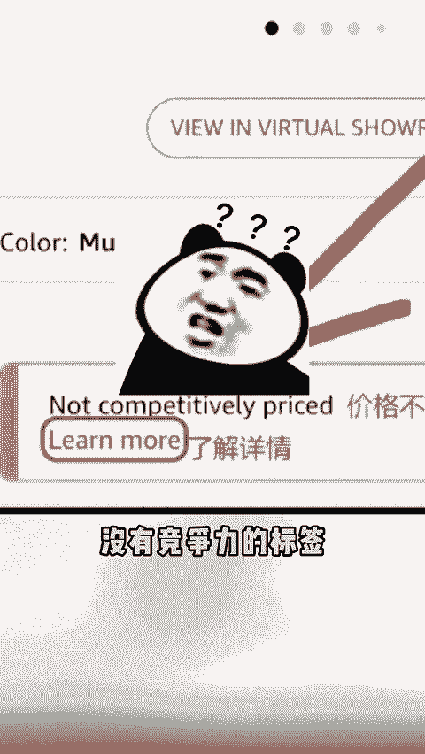

# 亚马逊秋季大促惨遭滑铁卢！亚马逊还“逼”卖家降价？ - P1 - 紫鸟浏览器 - BV1EP22YSEtn

🎼亚马逊秋季大促就这么悄无声息的结束了。不少卖家表示，比去年差的不是一点半点。更离谱的是，在秋促期间，亚马逊还在倒逼卖家降价。

不少卖家都反馈自己的产品被亚马逊谈成了notcomp priced及产品的定价没有竞争力的标签，这不明晃晃的劝退消费者，让消费者去找其他更便宜的链接吗？同时这也是在逼卖家降价卷价格，不少卖家的话权证。

这比特务还恶心。前者起码还是劝你降价，这个直接逼你降价，不降价就没单处，你不去前台看，还发现不了他这一刀操作，直接把价格内卷抬到新高。不得不说，近年来全球经济环境面临挑战。

加之特务新等廉价跨境电商平台的崛起，让原本专注于中高端市场的亚马逊也压力山大，不仅推出了低价商店，现在开始还逼卖家卷价格。这以后或许是越来越难啊。😡。

