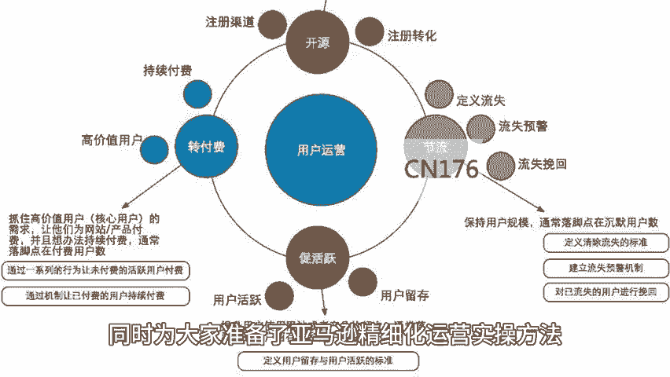
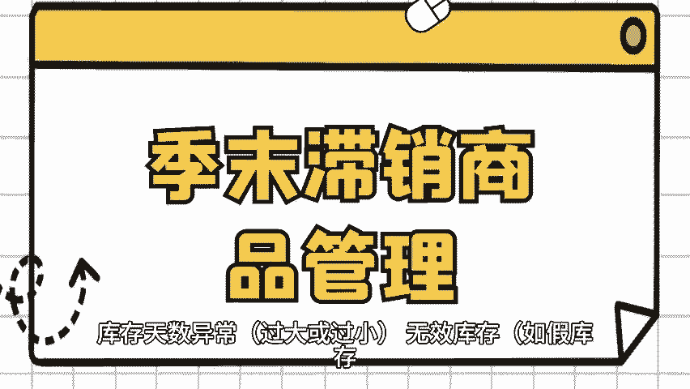

# 亚马逊精细化运营有效管控物流仓储成本 - P1 - 小猛龙跨境俱乐部 - BV1HN2EYLEvj

🎼关于库存管理，尤其是备货，如何通过精细化运营，有效管控物流仓储成本，对整个运营来说是一大挑战。本期小猛龙给大家分享亚马逊精细化运营，有效管控物流仓储成本，同时为大家准备了亚马逊精细化运营实操方法。

老规矩回复亚马逊运营。我来安排备货不足，可能导致缺货，影响销售，备货过多，则可能导致库存积压，带来高昂的仓储成本，进而影响整体运营利润，如果能够通过数据分析，找到最优的备货数量，在库存成本和缺货成本。

直接找到并保持一个平衡点，那么可以大幅节约运输费用，降低库存积压，节省一大笔成本，正确分析亚马逊库存，是确保电商业务顺畅运行和成本控制的关键环节，以下是从几个关键维度出发，进行亚马逊库存分析的方法。

将库存结构优化到最优，并将受信率。

🎼和周转天数的指标都控制在合理的范围内，反映库存产品的销售速度。高售信率意味着库存周转快、资金回笼快，库存从入库到售出的平均时间，低周转天数表明库存效率高。

利用库存报表模板如数跨境BI提供的分析各个店铺各个SKU的FB库存情况，FBA变动FB物流索赔等，以评估库存结构是否合理。库零关系到库存周转能够反映企业供应链的效率，根据企业实际情况。

将库零划分为不同的时间段，如0到30天30到60天，60到90天等，以便精细化管理，分析不同库龄段的库存与销售情况的关系，找到最优的备货数量，统计不同库龄段下的库存数量，库存成本。

成本金额等监控库存价值的变化。包括但不限于零销售库存。🎼存库存天数异常，过大或过小，无效库存如假库存。

🎼使库存、季节性库存、促销库存等分析流量和转化率，判断是否因营销策略不当导致。分析库存天数异常的原因，如需求预测不准确，促销活动影响等，识别并处理无效库存，减少资金占用和仓储成本，根据季节变化。

提前规划库存，避免库存积压或短缺，分析促销前后的库存情况，评估促销效果并调整库存策略。🎼手动跟踪库存容易出错，且效率低下。使用库存管理软件可以提高效率和准确性，跟踪库存水平和采购需求。

🎼实时了解库存状况，避免缺货或积压。根据历史销售数据，预测未来销售趋势，知道库存采购与所有在线销售渠道集成。🎼实现库存数据的实时同步，可靠的供应商对业务增长至关重要，良好的合作关系。

有助于确保库存供应的稳定性和及致性，与供应商建立长期稳定的合作关系。

🎼获得专属服务和优惠价格，深入了解供应商的交货时间，以便更好的掌握库存水平，避免缺货或滞销，定期对库存情况进行审核。包括库存结构、库零、异常库存等方面，根据审核结果，调整库存策略，如优化库存结构。

调整备货数量，处理异常库存等。综上所述，正确分析亚马逊库存需要从多个维度出发，结合实际情况，采取合适的分析方法和管理策略，以确保库存的高效运作和成本的有效控制，篇幅有限，获取亚马逊运营实操攻略。

以及更多亚马逊运营小技巧，点赞关注评论，带你出海不迷路。