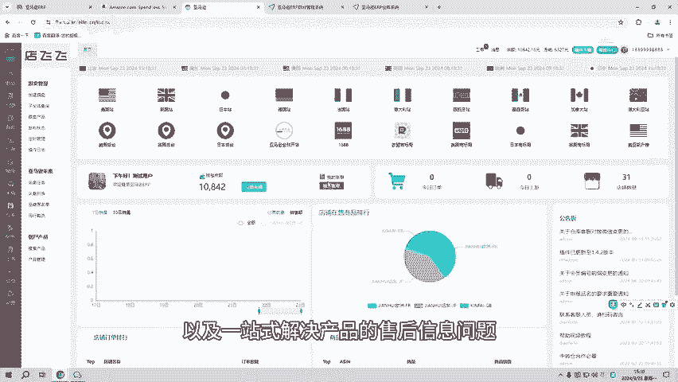
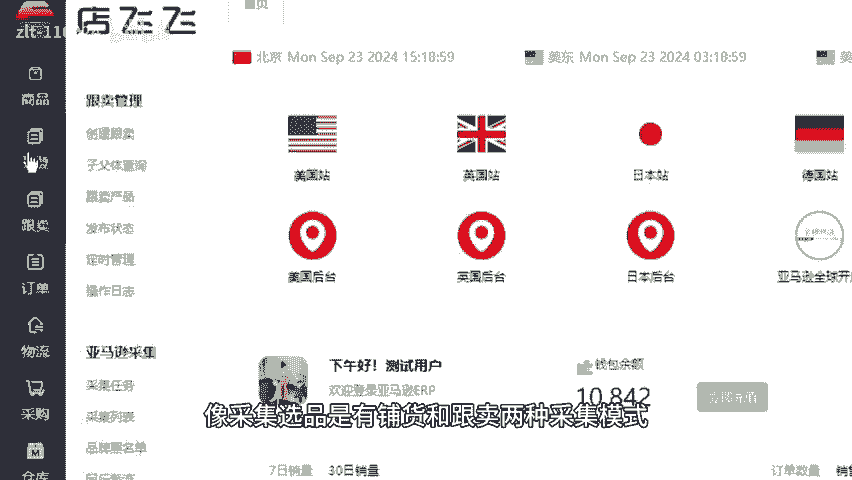
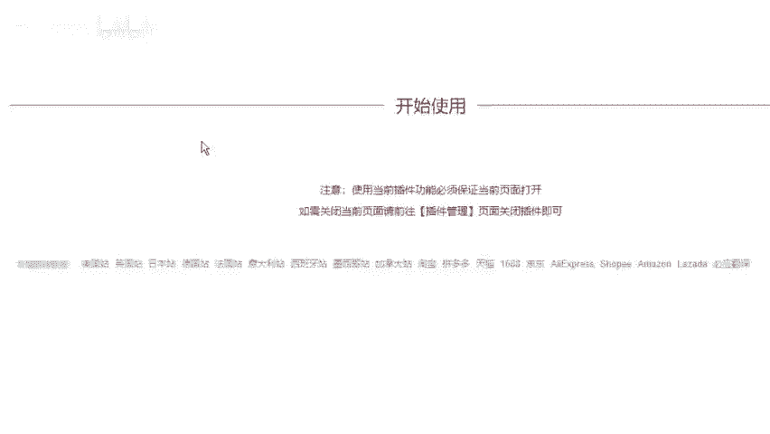
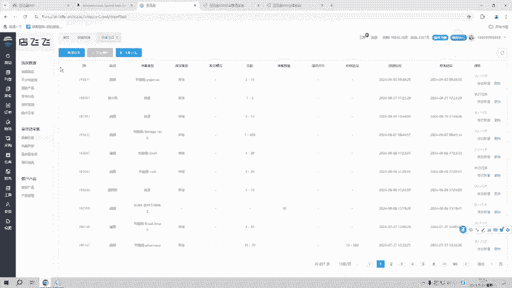
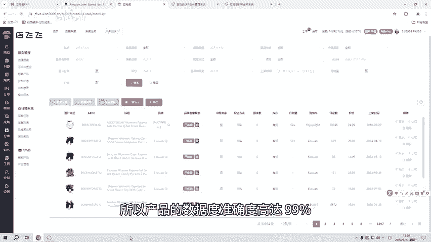
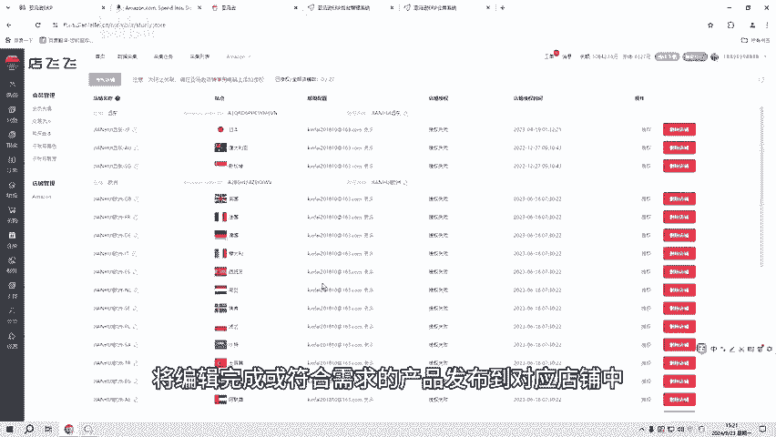
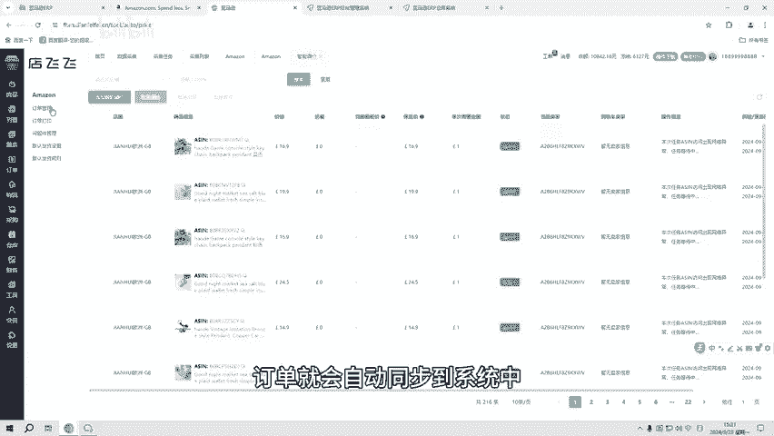
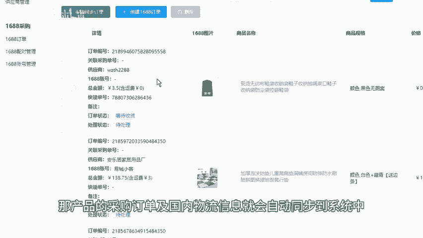
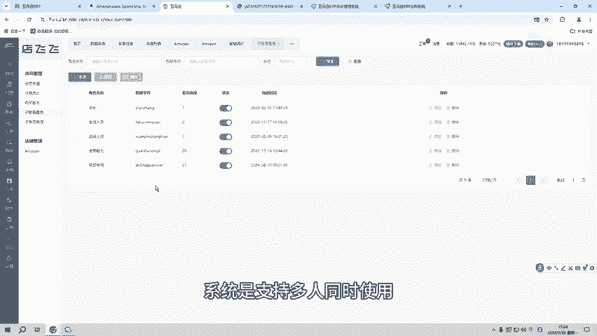
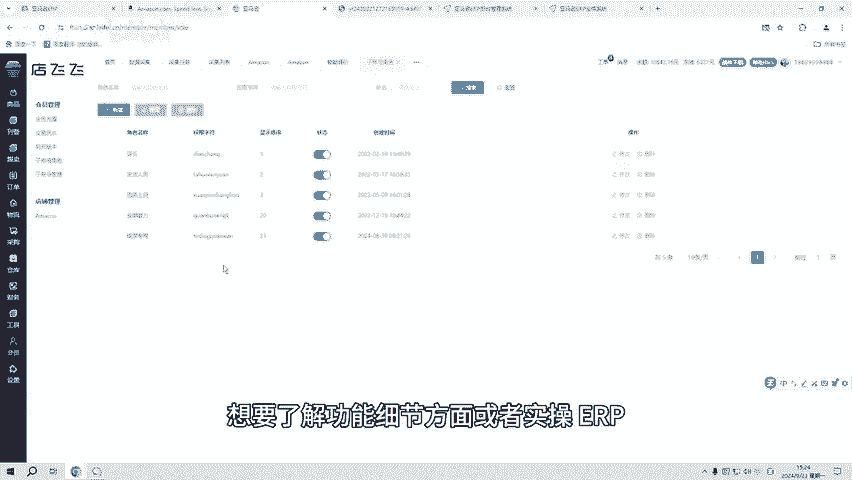

# 亚马逊自发货erp，功能不受限支持独立部署 - P1 - 洋少AL885918 - BV1tBsUeBECg

大家好，今天给亚马逊卖家们介绍一道适合亚马逊自发货初创团队的ERP系统，超高性价比。无论是价格还是功能方面，这套亚马逊自发货ERP可以从采集选品到订单发货，再到客服信息一体化的管理。

像很多初创团队会有多套ERP系统或者使用手工excel选品等等。这不仅成本高，还增加了工作的场索度。那想要实现铺货和跟卖刷模式的裁学购发售后一体化的简单操作，我们就可以用这套ERP系统。

可以将所有数据打通。同时，简单操作不再需要多套系统来维导数据，以及一站式解决产品的售后信息问题。这套系统是完全实现采选购发售后一体化的。像采集选品是由铺货和跟卖两种采集模式。

那像铺货采集的话是支持国内外多频台采集。采到的产品可以导出及无限制的编辑产品的文本和图片。跟买采集是支持所有站边采集，多种采集类型随意选择。采集到的产品数据都是实时数据。

备案状态也是对应站点商标局的实时数据，所以产品的数据度准确度高达99%。在系统中授权店铺之后，将编辑完成或符合需求的产品发布到对应店铺中，可以对在售的产品进行定时上下架及智能抢占购物车等等操作。

当店铺中有产品出单时，订单就会自动同步到系统中，可以对订单进行发货。那产品的采购就可以在采购功能去绑定1688账号。

再去1688上采购产品，那产品的采购订单及国内物流信息就会自动同步到系统中。订单发货的订单可以在订单功能的订单打印中打印订单的国际面单。

在订单管理的已发货，找到订单的店铺信息，点击国际物流单号后的按钮，可以查看物流信息。产品的售后在工具功能的邮件信息中可以收发所有站点的邮箱。最后，在会员功能的整账号管理，可以添加及管理子账号。

子账号角色可以分配账号的功能。并同时支持多人同时使用，可以合理分配员工的工作内容，高效完成工作任务，想要了解能细节方面或者实操ERP可以关注我或者私信6666。

