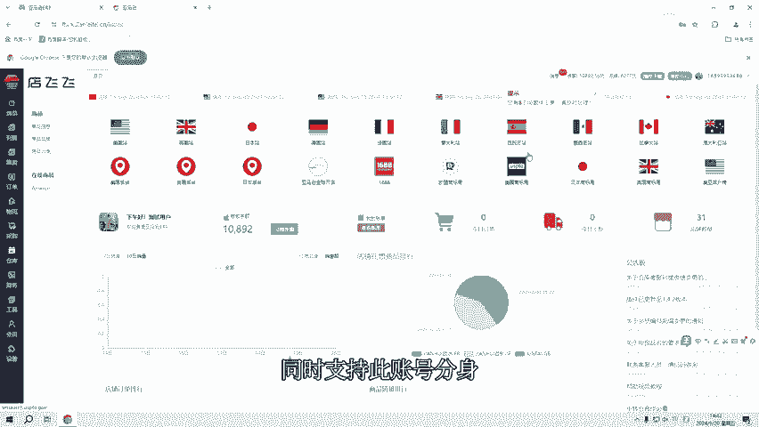
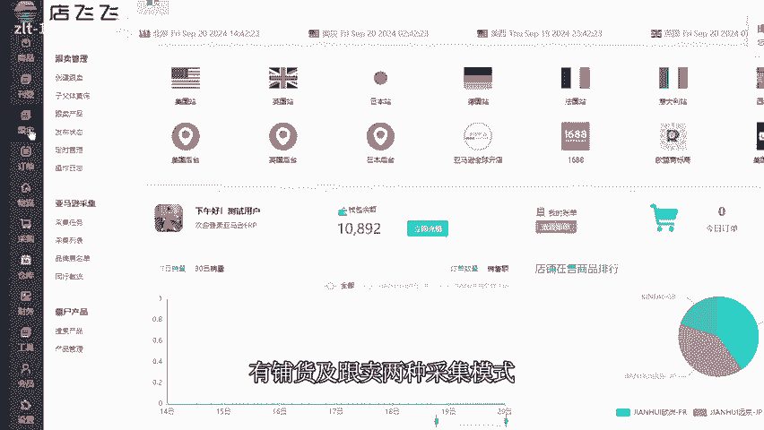
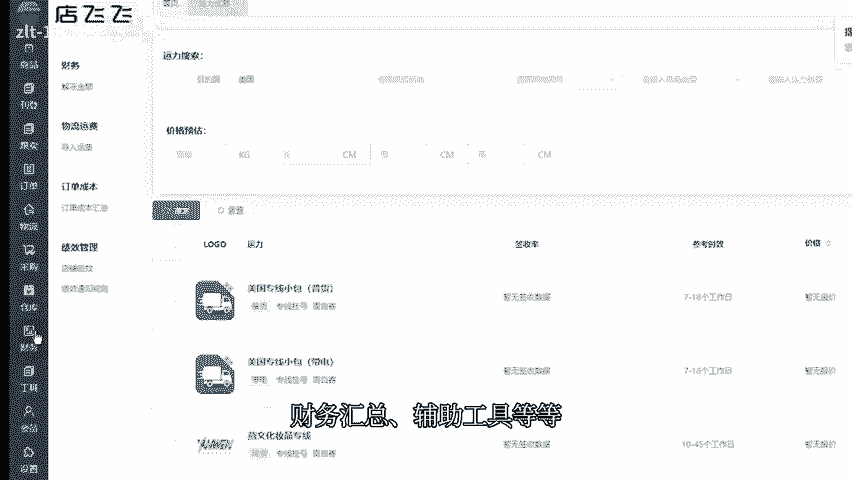
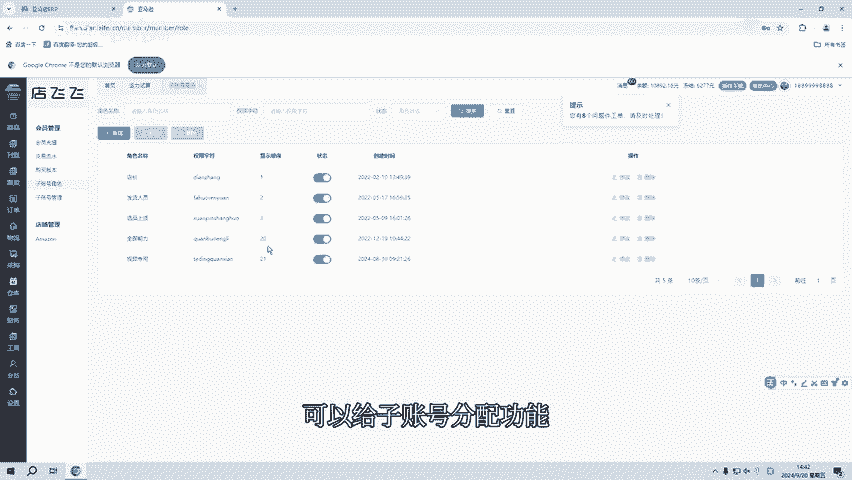
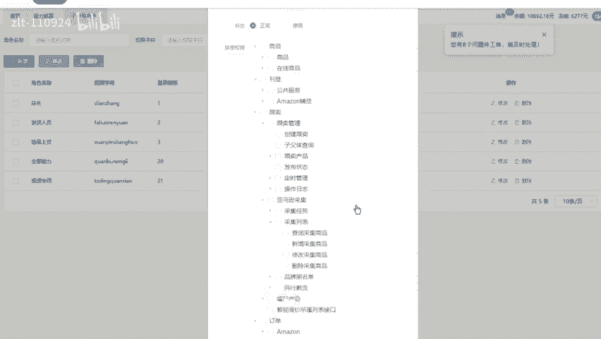
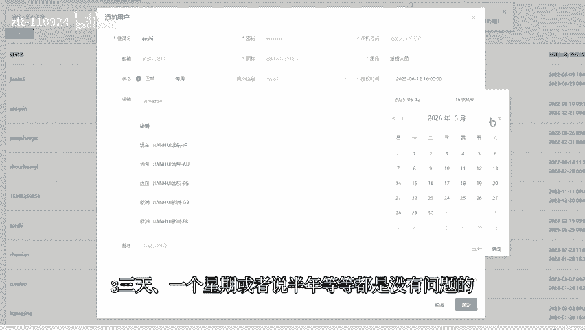

# 亚马逊自发货erp，子账号无限制分身 - P1 - 洋少AL885918 - BV1zCbceeEmq

大家好，对于亚马逊3到5人的工作室来说，每人一套ERP系统，那面临的是成本数据、信息整合等等一系列问题。那今天就给大家推荐一款ERP系统只需付一次费用，就可终身使用，且无任何隐藏收费。

同时支持子账号分身，可供百人同时使用。

有铺货及跟买两种采集模式，功能方面有订单发货、采购同步运费试算、财务汇总、补助工具等等。那在会员功能中的子账号角色里，可以给子账号分配功能。这里有上百种功能权限是自由去分配选择的。

可以根据负责的工作内容不同，分配不同的功能权限，像子账号之间的数据是互不相通的。但是主账号可以查看到此账号的所有数据是不需要单独的对数据进行整合，同时还能保障数据的安全，分配完子账号的功能之后。

就可以在此账号管理中添加账号，这里按需求填写信息角色这里是选择提前创建好的角色，那角色分配的是什么功能。此账号就只写示分配的功能。授权时间可以自由选择3天一个星期或者说半年等等，都是没问题的。

全部填写完之后就可以点击确定，那子账号的分身就创建好了1RP系统的子账号分身是无限制的。所以除了自己的工作适用之外，也是可以给亲朋好有去使用的，同时也可以去对外出售子账号。

如果说测试ERP期间有任何问题，或者想测试ERP都可以关注我或者私信666分享免费测试链接及远程讲解。

